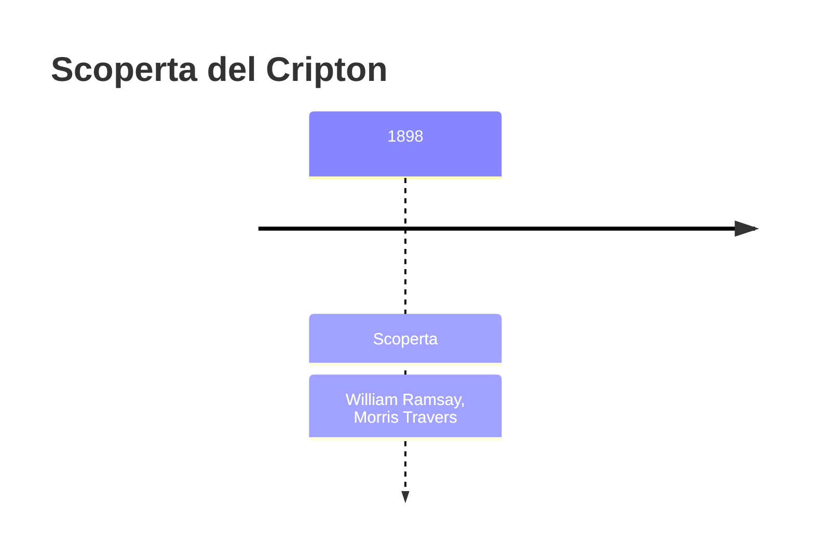
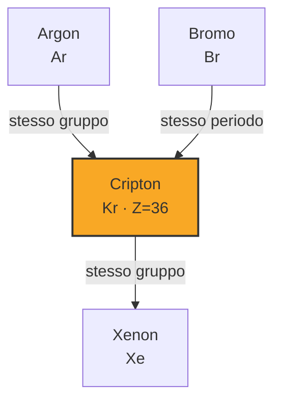

# Cripton (Kr)

> [!abstract] 78° elemento scoperto — 1898
> 

## Cronologia della scoperta

## Storia della scoperta

## Posizione nella tavola periodica

## Caratteristiche

### Dati fisico-chimici

| Proprietà | Valore |
|---|---|
| Numero atomico | 36 |
| Massa atomica | 83,7982 u |
| Categoria | Gas nobile |
| Gruppo | 18 |
| Periodo | 4 |
| Blocco | p |
| Configurazione elettronica | [Ar] 3d¹⁰ 4s² 4p⁶ |
| Punto di fusione | -157,4 °C |
| Punto di ebollizione | -153,2 °C |
| Densità | 3,749 g/cm³ |
| Stati di ossidazione | — |

## Struttura atomica

![[atomo-Cripton.svg]]

## Usi e presenza in natura

## Nella cronologia

← Precedente: [[Neon]] (1898)
→ Successivo: [[Xenon]] (1898)

Epoca: [[Spettroscopia e radioattività]] · Scopritore: [[William Ramsay]], [[Morris Travers]]

## Fonti

