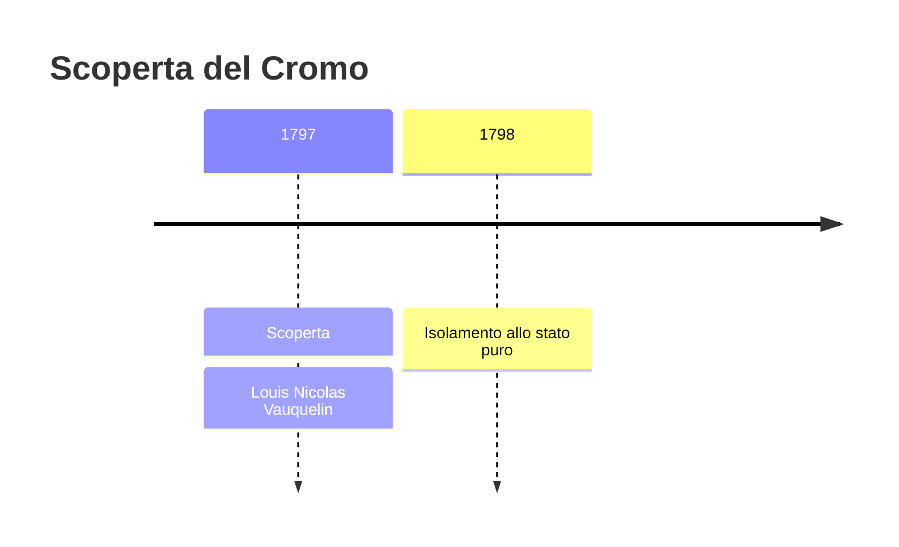
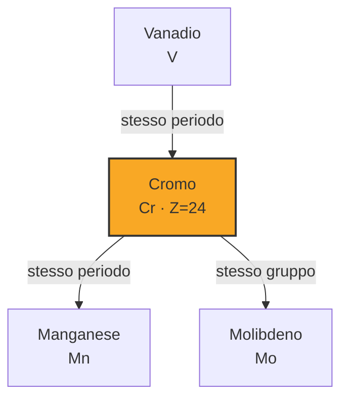

# Cromo (Cr)

> [!abstract] 38° elemento scoperto — 1797
> 

## Cronologia della scoperta

## Storia della scoperta

## Posizione nella tavola periodica

## Caratteristiche

### Dati fisico-chimici

| Proprietà | Valore |
|---|---|
| Numero atomico | 24 |
| Massa atomica | 51,99616 u |
| Categoria | Metallo di transizione |
| Gruppo | 6 |
| Periodo | 4 |
| Blocco | d |
| Configurazione elettronica | [Ar] 3d⁵ 4s¹ |
| Punto di fusione | 1906,9 °C |
| Punto di ebollizione | 2670,9 °C |
| Densità | 7,19 g/cm³ |
| Stati di ossidazione | — |

## Struttura atomica

![[atomo-Cromo.svg]]

## Usi e presenza in natura

## Nella cronologia

← Precedente: [[Ittrio]] (1794)
→ Successivo: [[Berillio]] (1798)

Epoca: [[Chimica pneumatica]] · Scopritore: [[Louis Nicolas Vauquelin]]

## Fonti

