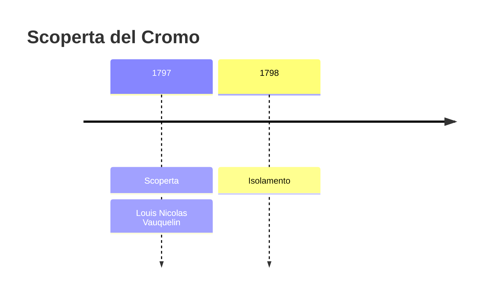
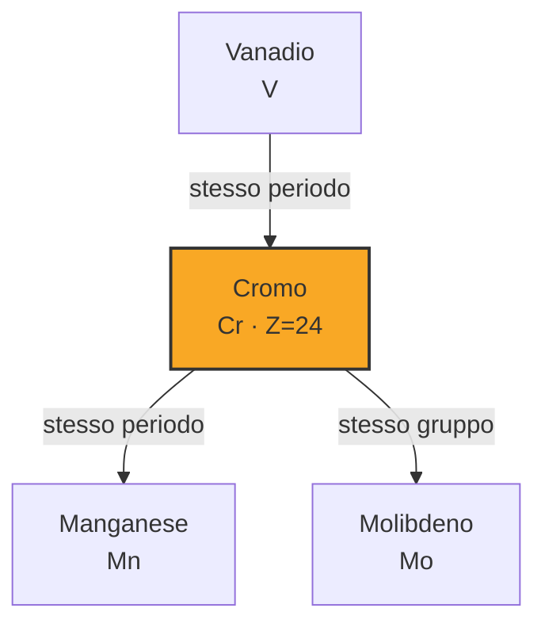
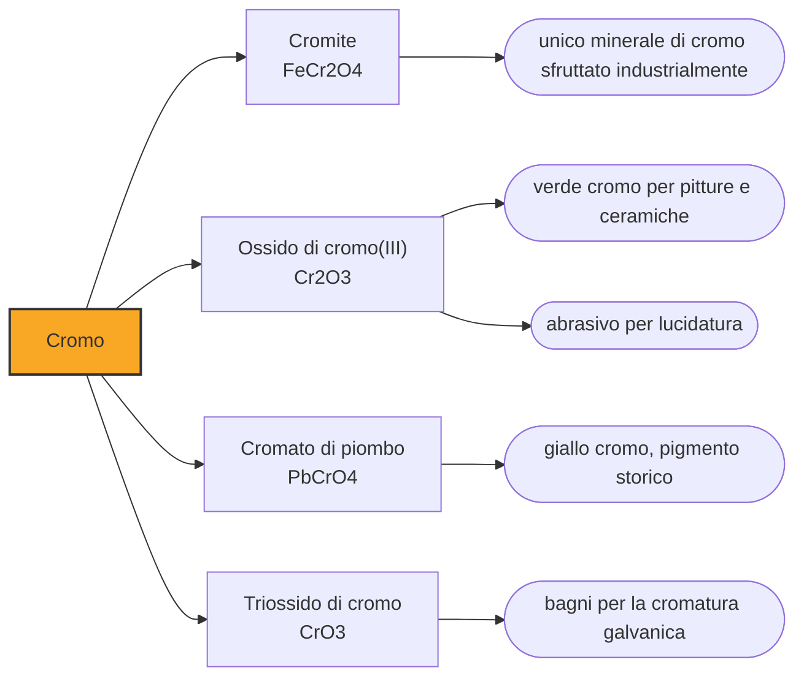

# Cromo (Cr)

> [!abstract] 38° elemento scoperto — 1797
> Il rosso dei rubini, il verde degli smeraldi e il giallo degli scuolabus americani sono la stessa cosa: un elemento che i greci avrebbero chiamato semplicemente colore.

Il cromo è un metallo grigio-acciaio durissimo e lucentissimo, che resiste alla corrosione con una tenacia che nessun altro elemento comune gli avvicina. È il motivo per cui l'acciaio inossidabile è inossidabile e per cui i paraurti degli anni Cinquanta brillavano. Il suo nome, però, non parla né di durezza né di lucentezza: parla di colore, perché quando fu scoperto era soprattutto questo che sapeva fare.

## Cronologia della scoperta

> [!info] Nota sulla cronologia
> Vauquelin riceve campioni di crocoite siberiana nel 1794 e nel 1797 stabilisce che il minerale contiene un metallo non ancora descritto, ottenendone l'ossido; l'anno successivo riduce l'ossido con il carbone in un forno a carbonella e ottiene il metallo. Il minerale era noto in Europa dal 1761, quando Johann Gottlob Lehmann lo descrisse come piombo rosso di Siberia.

## Storia della scoperta

Nel 1761, sugli Urali, il mineralogista Johann Gottlob Lehmann descrive un minerale arancio-rosso di una bellezza insolita e lo chiama piombo rosso di Siberia. Un decennio dopo Peter Simon Pallas visita lo stesso giacimento e capisce che quella pietra vale come pigmento: macinata, dà un arancione intenso che i pittori pagano caro. Il minerale, che oggi chiamiamo crocoite, comincia a viaggiare verso i laboratori europei per essere capito.

I campioni arrivano nel 1794 sul banco di Louis Nicolas Vauquelin, a Parigi. Figlio di un fattore normanno, entrato in chimica come garzone di farmacia e poi come assistente di Antoine François de Fourcroy, Vauquelin non è un teorico: è probabilmente il miglior analista del suo tempo, uno che nella carriera firmerà centinaia di memorie fatte quasi tutte della stessa cosa, cioè smontare pazientemente una sostanza per vedere di che è composta. La crocoite è esattamente il suo genere di problema.

Vauquelin trova il piombo che il nome del minerale prometteva, ma trova anche qualcos'altro che non corrisponde a nulla di noto. Nel 1797 stabilisce che si tratta di un metallo nuovo e ne isola l'ossido; l'anno dopo scalda quell'ossido con il carbone in un forno a carbonella e ne cava un metallo grigio, fragile e refrattario. È uno dei rari casi in cui la stessa persona scopre l'elemento e lo isola, a dodici mesi di distanza.

A colpire Vauquelin e i colleghi non è il metallo, che è opaco e poco maneggevole, ma quello che i suoi composti sanno fare. Passando da un sale all'altro si ottengono gialli squillanti, aranci, verdi profondi, viola, rossi: una tavolozza intera da un solo elemento. Di qui il nome, dal greco chroma, colore, che è una scelta insolita perché descrive non la sostanza ma il suo repertorio. Vauquelin riconobbe il cromo anche nel rubino e nello smeraldo.

## Posizione nella tavola periodica

## Caratteristiche

La tavolozza ha una spiegazione precisa. Il cromo è capace di reggere un numero insolito di stati di ossidazione, dai negativi fino a più sei, e i più comuni sono più tre e più sei; a ogni stato e a ogni intorno chimico corrisponde una diversa disposizione degli elettroni nei suoi orbitali, che assorbe una porzione diversa della luce visibile e lascia passare il resto. Quel resto è il colore che vediamo. In pratica, ogni volta che il cromo cambia abito, cambia tinta.

La stessa chimica spiega due gemme che sembrano non avere nulla in comune. Il corindone puro è incolore; se qualche atomo di alluminio viene sostituito da cromo, diventa rosso e si chiama rubino, mentre altre impurezze lo fanno azzurro e lo chiamano zaffiro. Il berillo puro è anch'esso incolore; con tracce di cromo diventa verde e si chiama smeraldo. Il rosso più celebre e il verde più celebre della gioielleria escono dallo stesso elemento in due matrici diverse.

Quel che rende il cromo indispensabile all'industria, invece, non si vede affatto. Esposto all'aria il metallo si sigilla da sé sotto una pellicola di ossido spessa pochi atomi, talmente compatta da fermare ogni ulteriore attacco e capace di riformarsi all'istante dove viene graffiata. Basta superare l'undici per cento di cromo in una lega di ferro perché quella corazza invisibile si estenda a tutta la superficie, e il risultato porta un nome che tutti conoscono: acciaio inossidabile.

### Dati fisico-chimici

| Proprietà | Valore |
|---|---|
| Numero atomico | 24 |
| Massa atomica | 51,99616 u |
| Categoria | Metallo di transizione |
| Gruppo | 6 |
| Periodo | 4 |
| Blocco | d |
| Configurazione elettronica | [Ar] 3d⁵ 4s¹ |
| Punto di fusione | 1906,9 °C |
| Punto di ebollizione | 2670,9 °C |
| Densità | 7,19 g/cm³ |
| Stati di ossidazione | -4, -2, -1, 0, +1, +2, +3, +4, +5, +6 |

## Struttura atomica

![[atomo-Cromo.svg]]

## Usi e presenza in natura

La stragrande maggioranza del cromo estratto finisce in metallurgia, negli acciai inossidabili e negli acciai speciali da utensile, che la sua presenza rende insieme più duri e più resistenti al calore. Segue la cromatura galvanica, diffusasi dopo i perfezionamenti degli anni Venti, che deposita sul metallo un rivestimento lucido e resistente all'usura. La materia prima è quasi sempre la cromite, e la produzione mondiale è dominata dal Sudafrica, seguito da Turchia e Kazakistan.

I pigmenti sono l'uso più antico e quello in ritirata. Il giallo cromo ha colorato per un secolo gli scuolabus americani e le cassette postali, il verde cromo le facciate e le divise, e furono i colori che permisero agli impressionisti gialli e verdi che prima non esistevano in tubetto. Oggi sono in gran parte sostituiti, perché il piombo di alcuni e la forma esavalente di altri li hanno resi indifendibili sul piano sanitario e ambientale.

## Curiosità

Fra le forme del cromo corre una differenza enorme: allo stato più tre è un oligoelemento innocuo e presente nella dieta, allo stato più sei è tossico e cancerogeno, e attraversa le membrane cellulari con facilità. Il cromo esavalente è la sostanza al centro del caso di Hinkley, in California, dove fra il 1952 e il 1966 una compagnia elettrica scaricò oltre un miliardo di litri di acque contaminate in bacini non impermeabilizzati, avvelenando la falda del paese.

La vicenda è finita al cinema. Un'impiegata di studio legale di nome Erin Brockovich, che nel 1993 stava riordinando pratiche immobiliari, notò che fra i documenti c'erano cartelle cliniche, tirò il filo e organizzò gli abitanti in una causa collettiva. Nel 1996 la compagnia accettò di pagare trecentotrentatré milioni di dollari a più di seicento ricorrenti, la transazione più alta della storia americana fino a quel momento. Il film del 2000 fece del cromo esavalente una questione di dominio pubblico.

## Nella cronologia

← Precedente: [[Ittrio]] (1794)
→ Successivo: [[Berillio]] (1798)

Epoca: [[Chimica pneumatica]] · Scopritore: [[Louis Nicolas Vauquelin]]

## Fonti

- [Chromium](https://en.wikipedia.org/wiki/Chromium) — consultata il 07/09/2026
- [Louis Nicolas Vauquelin](https://en.wikipedia.org/wiki/Louis_Nicolas_Vauquelin) — consultata il 07/09/2026
- [Hinkley groundwater contamination](https://en.wikipedia.org/wiki/Hinkley_groundwater_contamination) — consultata il 07/09/2026
- [Timeline of chemical element discoveries](https://en.wikipedia.org/wiki/Timeline_of_chemical_element_discoveries) — consultata il 07/09/2026

---

> [!warning] Avvertenza
> Questo progetto è stato realizzato con l'assistenza di sistemi di
> intelligenza artificiale. I contenuti sono verificati sulle fonti citate,
> ma **possono contenere errori e imprecisioni**: prima di riutilizzarli,
> controlla la fonte.
