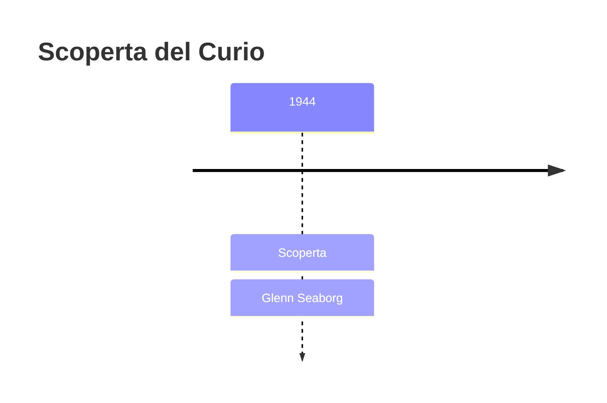
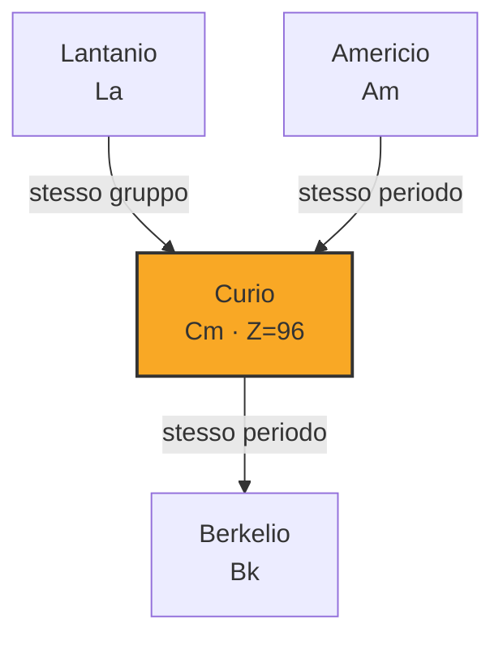

# Curio (Cm)

> [!abstract] 95° elemento scoperto — 1944
> 

## Cronologia della scoperta

## Storia della scoperta

## Posizione nella tavola periodica

## Caratteristiche

### Dati fisico-chimici

| Proprietà | Valore |
|---|---|
| Numero atomico | 96 |
| Massa atomica | 247,0 u |
| Categoria | Attinide |
| Gruppo | 3 |
| Periodo | 7 |
| Blocco | f |
| Configurazione elettronica | [Rn] 5f⁷ 6d¹ 7s² |
| Punto di fusione | 1339,9 °C |
| Punto di ebollizione | 3109,9 °C |
| Densità | 13,51 g/cm³ |
| Stati di ossidazione | — |

## Struttura atomica

![[atomo-Curio.svg]]

## Usi e presenza in natura

## Nella cronologia

← Precedente: [[Americio]] (1944)
→ Successivo: [[Promezio]] (1945)

Epoca: [[Era nucleare]] · Scopritore: [[Glenn Seaborg]]

## Fonti

