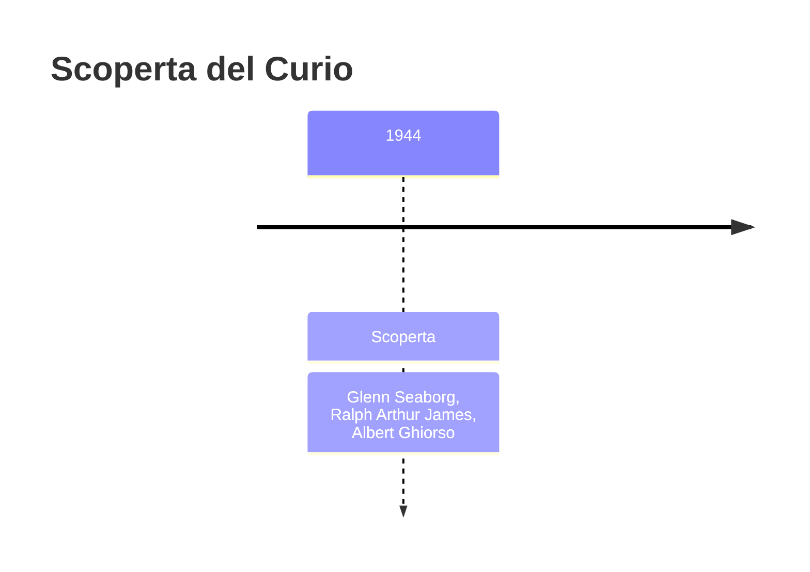
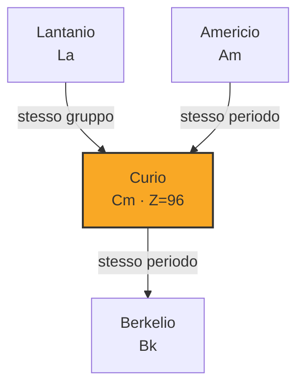
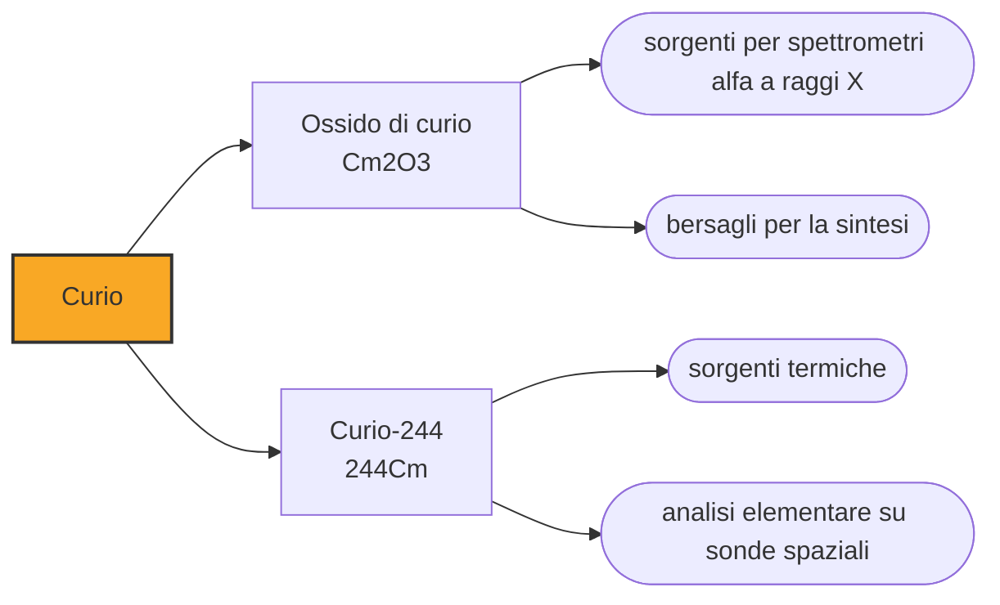

# Curio (Cm)

> [!abstract] 95° elemento scoperto — 1944
> Fu prodotto prima dell'americio ma numerato dopo, e per mesi i suoi scopritori lo chiamarono «delirio» perché non riuscivano a separarlo dal gemello. Poi gli diedero il nome dei Curie.

Il curio è uno dei pochi elementi che si vedono brillare: i suoi composti emettono una fluorescenza giallo-arancio sotto ultravioletto, e un campione abbastanza attivo si illumina da solo di viola per la ionizzazione dell'aria. Scalda anche: un grammo di curio-242 produce tre watt di potenza termica.

## Cronologia della scoperta

> [!info] Nota sulla cronologia
> Il curio fu prodotto nell'estate del 1944, prima dell'americio, e annunciato insieme a lui alla fine del 1945. In questo racconto compare comunque dopo, perché a parità d'anno l'ordine segue il numero atomico. Anche qui la cronologia di riferimento comprimeva la squadra in «Seaborg et al.».

## Storia della scoperta

Nell'estate del 1944, a Berkeley, Glenn Seaborg, Ralph James e Albert Ghiorso bombardarono plutonio-239 con particelle alfa nel ciclotrone da sessanta pollici e ottennero il curio-242. L'elemento 96 arrivò così prima del 95, che sarebbe stato prodotto qualche mese dopo: la numerazione della tavola periodica e l'ordine delle scoperte non coincidono quasi mai.

Separare i due elementi nuovi dal resto e l'uno dall'altro fu l'ostacolo vero, e il soprannome che il gruppo diede al 96 lo dice: delirium. Solo la teoria degli attinidi, che Seaborg stava formulando proprio in quei mesi, permise di prevedere come si sarebbero comportati e di progettare le separazioni invece di tentarle alla cieca.

Il nome fu scelto per analogia: nella serie dei lantanidi, la posizione corrispondente è quella del gadolinio, che porta il nome di Johan Gadolin. Al posto suo, fra gli attinidi, andava un altro scienziato, e la scelta cadde su Marie e Pierre Curie, che della radioattività erano stati i fondatori. È il primo elemento dedicato a persone di cui si conosca il volto.

Come l'americio, il curio fu prodotto dentro il progetto Manhattan e annunciato solo alla fine del 1945, quando la segretezza fu allentata: due elementi nuovi resi pubblici insieme, a guerra finita, da un programma che era nato per fare tutt'altro.

Il metallo puro arrivò nel 1950, ottenuto riducendo il fluoruro di curio con bario da W. W. T. Crane, J. C. Wallmann e B. B. Cunningham. Sono i tempi tipici di questa epoca: dalla prima produzione dell'elemento al primo pezzo di metallo passano anni, e le quantità restano microscopiche.

## Posizione nella tavola periodica

## Caratteristiche

Il curio-242 ha un'emivita di 163 giorni e genera circa tre watt di calore per grammo; il curio-244, con diciotto anni di emivita, ne genera meno ma dura di più. Un campione sufficientemente concentrato si scalda visibilmente e brilla di viola: è l'aria attorno che si ionizza, come per l'attinio.

I composti di curio mostrano una fluorescenza giallo-arancio intensa e stabile sotto luce ultravioletta, e questa proprietà si usa per riconoscerne la presenza: in radiochimica, dove le quantità sono invisibili, il modo in cui un elemento emette luce è spesso l'unico modo pratico di dire che c'è.

In soluzione sta quasi sempre nello stato +3, come i lantanidi, e questa è stata la conferma sperimentale più netta dell'ipotesi degli attinidi: se il curio fosse un metallo di transizione pesante, come la tavola periodica dell'epoca lo collocava, si comporterebbe come l'iridio; invece si comporta come il gadolinio, il suo omologo della serie f, con cui condivide il guscio semipieno di sette elettroni. Sono stati proprio l'americio e il curio a dimostrare che Seaborg aveva ragione.

Ingerito o inalato, il curio si accumula nelle ossa, nei polmoni e nel fegato, dove la sua radiazione alfa agisce a contatto: è uno degli elementi con la tossicità radiologica più alta, ed è maneggiato esclusivamente in celle schermate con manipolatori a distanza.

### Dati fisico-chimici

| Proprietà | Valore |
|---|---|
| Numero atomico | 96 |
| Massa atomica | 247,0 u |
| Categoria | Attinide |
| Gruppo | 3 |
| Periodo | 7 |
| Blocco | f |
| Configurazione elettronica | [Rn] 5f⁷ 6d¹ 7s² |
| Punto di fusione | 1339,9 °C |
| Punto di ebollizione | 3109,9 °C |
| Densità | 13,51 g/cm³ |
| Stati di ossidazione | +3, +4, +6 |

## Struttura atomica

![[atomo-Curio.svg]]

## Usi e presenza in natura

Il calore del curio è stato studiato per i generatori termoelettrici delle sonde spaziali, come alternativa al plutonio-238. L'impiego che ha davvero volato è però un altro: gli spettrometri alfa a raggi X montati sui rover marziani Sojourner, Spirit, Opportunity e Curiosity, e sul lander Philae posato sulla cometa Churyumov-Gerasimenko, usano sorgenti di curio per determinare la composizione chimica delle rocce. Lo strumento appoggia la sorgente sul terreno, le particelle alfa colpiscono i nuclei e la radiazione che ne torna indietro dice quali elementi ci sono: è analisi chimica fatta a duecento milioni di chilometri, senza reagenti e senza laboratorio.

In laboratorio il curio serve come materiale di partenza per fabbricare elementi ancora più pesanti: bombardando bersagli di curio si sono ottenuti il berkelio, il californio e diversi isotopi degli elementi successivi. È il primo anello di una catena in cui ogni elemento nuovo serve a fare quello dopo, e in cui la disponibilità di qualche milligrammo di materiale raro decide che cosa si può tentare: la sintesi degli elementi superpesanti dipende, ancora oggi, da quanti bersagli i pochi reattori adatti riescono a produrre.

## Curiosità

L'analogia con i lantanidi ha guidato non solo la chimica ma anche i battesimi: americio come europio (un continente), curio come gadolinio (uno scienziato), e più tardi berkelio come terbio (il luogo della scoperta). Per una manciata di elementi, il modo di dare i nomi è stato un modo di dichiarare una teoria.

Marie Curie aveva scelto per il polonio il nome del proprio paese; il curio porta il nome di lei e del marito, scelto da altri. Nella tavola periodica i Curie compaiono così due volte, e sono l'unica coppia di coniugi a cui sia dedicato un elemento.

## Nella cronologia

← Precedente: [[Americio]] (1944)
→ Successivo: [[Promezio]] (1945)

Epoca: [[Era nucleare]] · Scopritori: [[Glenn Seaborg]], [[Ralph Arthur James]], [[Albert Ghiorso]]

## Fonti

- [Curium](https://en.wikipedia.org/wiki/Curium) — consultata il 09/09/2026
- [Curium — Royal Society of Chemistry](https://periodic-table.rsc.org/element/96/curium) — consultata il 09/09/2026
- [Alpha particle X-ray spectrometer](https://en.wikipedia.org/wiki/Alpha_particle_X-ray_spectrometer) — consultata il 09/09/2026
