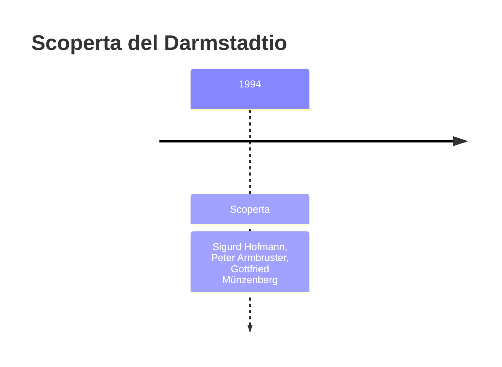
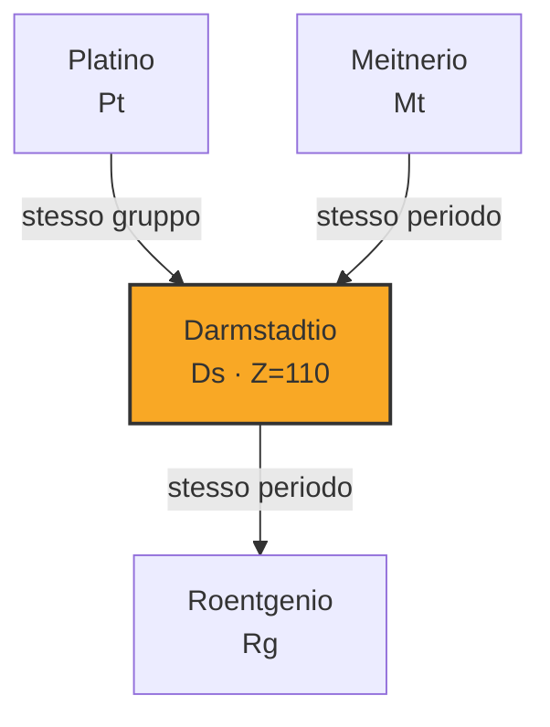
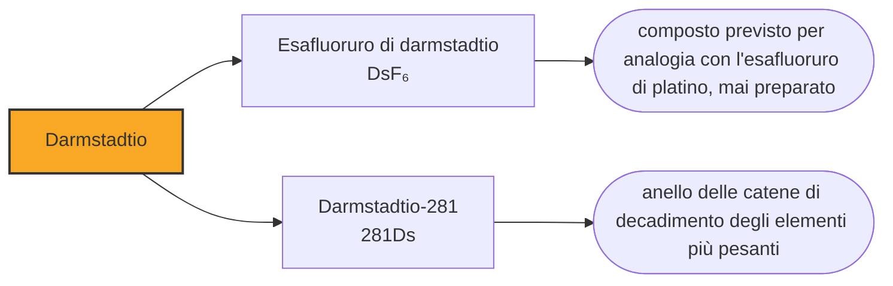

# Darmstadtio (Ds)

> [!abstract] 110° elemento scoperto — 1994
> Nel novembre del 1994 a Darmstadt comparvero tre atomi dell'elemento 110, il 9, il 12 e il 17 del mese. Ne fu annunciato un quarto, che non era mai esistito: i dati erano stati fabbricati da un membro del gruppo.

Il darmstadtio è l'elemento che porta il nome della città in cui è stato fatto, ed è il quarto delle sei caselle consecutive che quel laboratorio si è aggiudicato. È anche l'elemento su cui si vede meglio che cosa significhi lavorare con un atomo alla volta: quando la scoperta è fatta di tre eventi, distinguere un evento vero da uno inventato diventa un problema pratico e non filosofico.

## Cronologia della scoperta

> [!info] Nota sulla cronologia
> La cronologia di riferimento comprimeva gli scopritori in «Hofmann et al.»: l'articolo del 1995 è firmato da tredici autori, e qui restano i tre nomi che le fonti secondarie isolano sempre. Victor Ninov, secondo firmatario, resta fuori dal campo perché il quarto evento annunciato per il 9 novembre 1994 si basava su dati da lui fabbricati ed è stato ritirato. Il nome è ufficiale dal 16 agosto 2003.

## Storia della scoperta

La campagna del novembre 1994 usava piombo-208 come bersaglio e ioni di nichel-62 come proiettili. Il 9 novembre il gruppo guidato da Sigurd Hofmann, con Peter Armbruster e Gottfried Münzenberg, registrò un atomo di darmstadtio-269; ne seguirono un secondo il 12 e un terzo il 17. Con un fascio di nichel-64, nella stessa serie di esperimenti, si ottennero poi nove atomi di darmstadtio-271, riconosciuti dalla correlazione con i decadimenti dei figli già noti.

Nell'annuncio comparve anche un quarto evento, riferito allo stesso 9 novembre. Quell'evento non c'era: i dati erano stati fabbricati da Victor Ninov, fisico del gruppo e secondo firmatario dell'articolo, e il risultato è stato in seguito ritirato. Ninov sarebbe poi finito al centro di un caso più clamoroso in un altro laboratorio, e le tre osservazioni autentiche del 1994 restano valide: la scoperta del darmstadtio non dipendeva da quel quarto atomo.

Vale la pena capire perché in questo campo una falsificazione è particolarmente insidiosa. Un esperimento di sintesi produce pochissimi eventi, ciascuno descritto da una manciata di numeri — posizione, energia, tempo — e non esiste un campione da conservare né una misura ripetibile a piacere. La difesa non è l'evidenza materiale ma la coerenza interna della catena di decadimenti e la riproduzione indipendente in un altro laboratorio, che è esattamente ciò che ha poi confermato gli atomi veri.

L'elemento era stato cercato a lungo. Dubna ci aveva provato nel 1986 e nel 1987 senza successo, il GSI stesso aveva fallito nel 1990, e negli anni immediatamente successivi al 1994 arrivarono un tentativo sovietico e uno americano che non portarono a conclusioni. La casella 110 è stata inseguita per quasi un decennio prima di cedere.

Sul nome il gruppo esitò a lungo. Fu presa in considerazione la forma wixhausium, dal sobborgo di Darmstadt in cui sorge il laboratorio, e circolò per scherzo policium, perché in Germania il 110 è il numero telefonico della polizia; gli americani avevano proposto hahnium e i russi becquerelium. Alla fine il laboratorio scelse la città, e la IUPAC ufficializzò darmstadtium il 16 agosto 2003.

## Posizione nella tavola periodica

## Caratteristiche

Della chimica del darmstadtio non si è misurato nulla, e i valori che compaiono nella tabella di questa nota sono calcoli. Il posto che occupa lo colloca nel gruppo 10, sotto nichel, palladio e platino, e le previsioni gli attribuiscono gli stati di ossidazione +2, +4 e +6, con un comportamento da metallo nobile.

Se un giorno si riuscirà a farne chimica, il candidato più probabile è l'esafluoruro, DsF₆, che dovrebbe assomigliare molto all'esafluoruro di platino: un composto volatile, quindi trasportabile in un flusso di gas e studiabile con le stesse tecniche che hanno funzionato per il bohrio e per l'hassio. Il problema non è il metodo, è avere abbastanza atomi che durino abbastanza a lungo.

Si conoscono una decina di isotopi del darmstadtio. Il più longevo è il darmstadtio-281, che arriva a una quindicina di secondi e non si produce per fusione diretta: compare nelle catene di decadimento degli elementi più pesanti. Quelli ottenuti sparando nichel sul piombo, come gli atomi del 1994, durano frazioni di millesimo di secondo.

### Dati fisico-chimici

| Proprietà | Valore |
|---|---|
| Numero atomico | 110 |
| Massa atomica | 281,0 u |
| Categoria | Metallo di transizione |
| Gruppo | 10 |
| Periodo | 7 |
| Blocco | d |
| Configurazione elettronica | [Rn] 5f¹⁴ 6d⁹ 7s¹ |
| Punto di fusione | dato non disponibile |
| Punto di ebollizione | dato non disponibile |
| Densità | 34,8 g/cm³ |
| Stati di ossidazione | +2, +4, +6 |

## Struttura atomica

![[atomo-Darmstadtio.svg]]

## Usi e presenza in natura

Il darmstadtio non ha usi e non ne avrà: non esiste in natura, se ne sono prodotti in tutto pochi atomi e ciascuno di essi è durato meno di un battito di ciglia.

Il valore di questa casella sta in quello che ha mostrato sui limiti del metodo. La probabilità che due nuclei si fondano invece di rimbalzare cala in modo ripidissimo man mano che si sale di numero atomico, e attorno alla casella 110 quel calo diventa il problema principale: servono mesi di fascio per qualche atomo. La tecnica avrebbe retto ancora per due caselle, ma il darmstadtio è il punto in cui è diventato chiaro che per arrivare in fondo alla riga sarebbe servito qualcos'altro.

## Curiosità

Policium, il nome proposto per scherzo, aveva una sua logica: in Germania il numero di emergenza della polizia è il 110, e l'elemento 110 nasceva in Germania. Non è mai stata una candidatura seria, ma è finita comunque negli atti, e racconta qualcosa dell'atmosfera di un gruppo che nell'arco di tredici anni aveva riempito sei caselle della tavola periodica.

Wixhausen, il sobborgo scartato, è dove il laboratorio si trova materialmente. Chiamare un elemento con il nome di un quartiere sarebbe stato il grado più fine di una scala che nella tavola periodica scende dai continenti — l'americio, l'europio — agli stati, alle regioni, alle città. Il darmstadtio si è fermato un gradino sopra.

## Nella cronologia

← Precedente: [[Hassio]] (1984)
→ Successivo: [[Roentgenio]] (1994)

Epoca: [[Era nucleare]] · Scopritori: [[Sigurd Hofmann]], [[Peter Armbruster]], [[Gottfried Münzenberg]]

## Fonti

- [Darmstadtium](https://en.wikipedia.org/wiki/Darmstadtium) — consultata il 10/09/2026
- [Darmstadtium — Royal Society of Chemistry](https://periodic-table.rsc.org/element/110/darmstadtium) — consultata il 10/09/2026
- [GSI Helmholtz Centre for Heavy Ion Research](https://en.wikipedia.org/wiki/GSI_Helmholtz_Centre_for_Heavy_Ion_Research) — consultata il 10/09/2026
