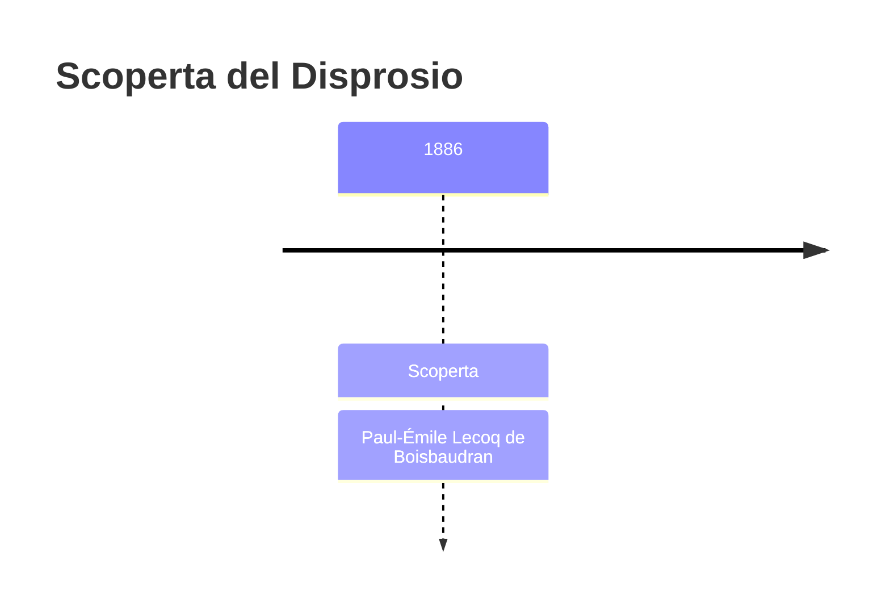
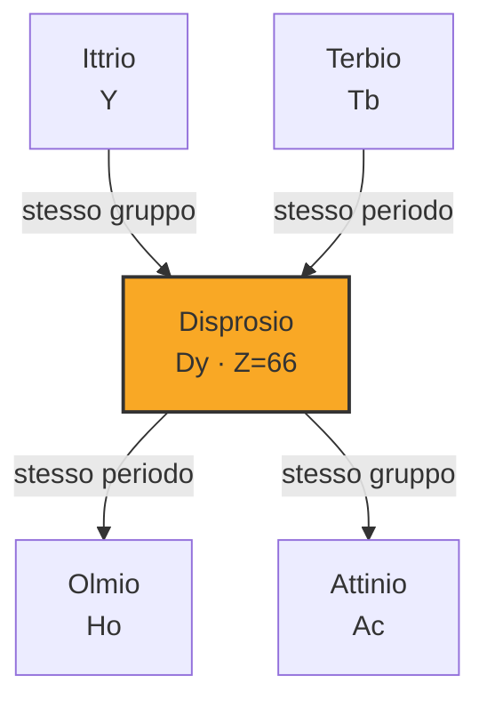

# Disprosio (Dy)

> [!abstract] 75° elemento scoperto — 1886
> 

## Cronologia della scoperta

## Storia della scoperta

## Posizione nella tavola periodica

## Caratteristiche

### Dati fisico-chimici

| Proprietà | Valore |
|---|---|
| Numero atomico | 66 |
| Massa atomica | 162,5001 u |
| Categoria | Lantanide |
| Gruppo | 3 |
| Periodo | 6 |
| Blocco | f |
| Configurazione elettronica | [Xe] 4f¹⁰ 6s² |
| Punto di fusione | 1406,9 °C |
| Punto di ebollizione | 2566,9 °C |
| Densità | 8,54 g/cm³ |
| Stati di ossidazione | — |

## Struttura atomica

![[atomo-Disprosio.svg]]

## Usi e presenza in natura

## Nella cronologia

← Precedente: [[Germanio]] (1886)
→ Successivo: [[Argon]] (1894)

Epoca: [[Spettroscopia e radioattività]] · Scopritore: [[Paul-Émile Lecoq de Boisbaudran]]

## Fonti

