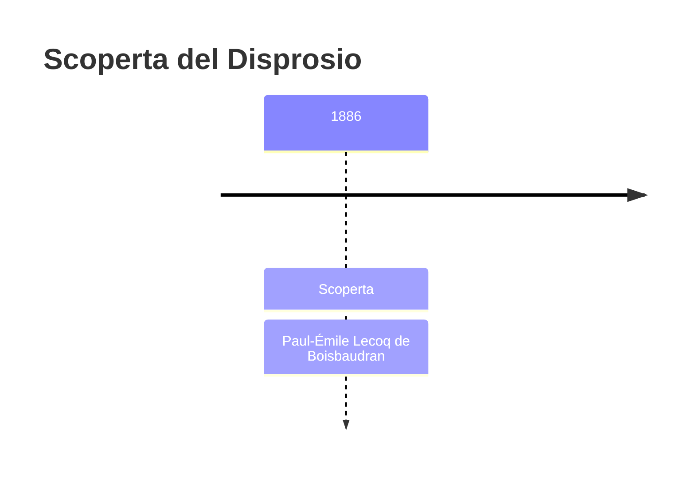
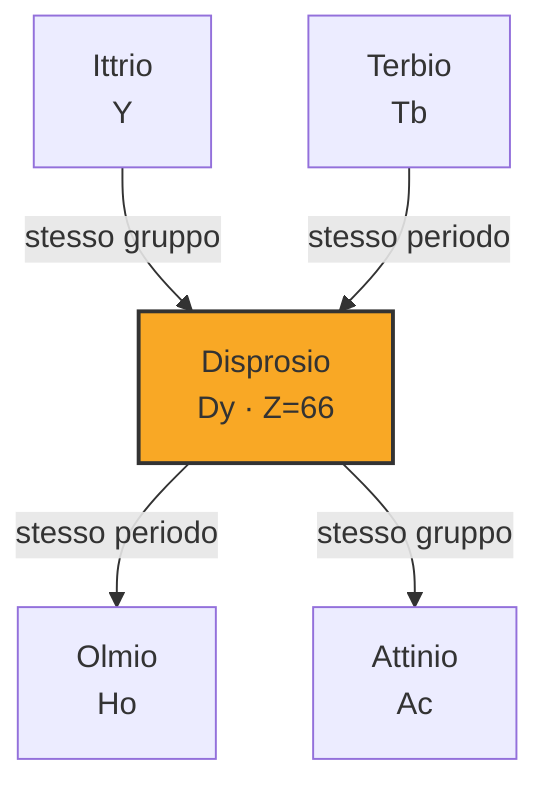
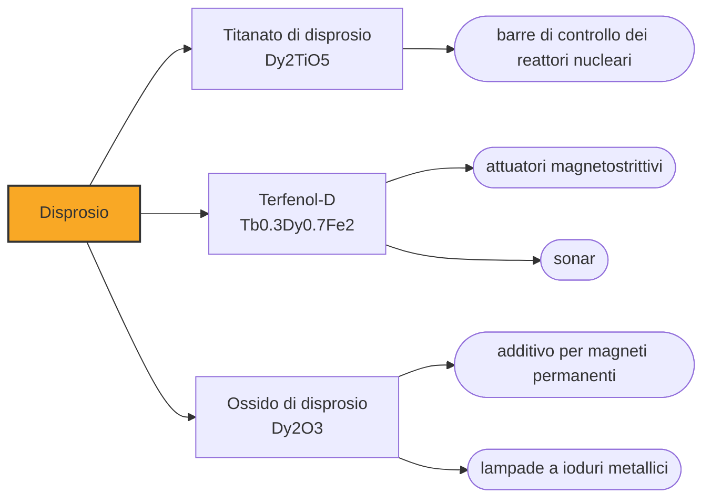

# Disprosio (Dy)

> [!abstract] 75° elemento scoperto — 1886
> Ci vollero più di trenta tentativi per cavarlo dal suo ossido, e chi ci riuscì lo chiamò con la parola greca che significa «difficile da raggiungere».

Il disprosio è l'elemento che tiene i magneti in funzione quando si scaldano: sostituendone qualche punto percentuale al neodimio si alza la temperatura alla quale il magnete perde le proprie proprietà, e senza quella sostituzione i motori delle automobili elettriche si smagnetizzerebbero sotto carico.

## Cronologia della scoperta

## Storia della scoperta

Alla metà degli anni Ottanta dell'Ottocento la caccia alle terre rare aveva preso una forma precisa: si partiva da un ossido considerato puro, lo si sottoponeva a separazioni sempre più fini, e si guardava se le proprietà del residuo restavano costanti. Quasi mai lo restavano. L'olmio, annunciato nel 1878, era uno di quegli ossidi apparentemente definitivi.

Nel 1886, a Parigi, Paul-Émile Lecoq de Boisbaudran lavorava sull'ossido di olmio quando si accorse che conteneva ancora qualcosa. Separarlo fu una faccenda estenuante: procedette per precipitazioni successive con ammoniaca, ripetendo l'operazione più di trenta volte prima di avere in mano un ossido che si comportasse in modo coerente.

Il nome lo prese da quella fatica: dysprositos, in greco, significa «difficile da raggiungere». È l'unico elemento della tavola periodica battezzato non per un luogo, un mito, un colore o una persona, ma per la difficoltà che ha dato a chi lo cercava.

Con il disprosio, Lecoq de Boisbaudran arrivava al terzo elemento trovato da solo, dopo il gallio nel 1875 e il samario nel 1879, e in mezzo aveva anche separato il gadolinio che Marignac aveva soltanto intravisto. Nessun altro chimico dell'Ottocento ha messo insieme un bottino simile con il solo spettroscopio e una pazienza da certosino.

L'elemento puro, però, restò irraggiungibile per settant'anni. Ci vollero le tecniche di scambio ionico sviluppate da Frank Spedding all'Iowa State University nei primi anni Cinquanta: fu quel metodo, nato dentro il progetto Manhattan per separare i prodotti di fissione, a rendere disponibili in quantità utili tutte le terre rare, disprosio compreso.

## Posizione nella tavola periodica

## Caratteristiche

Il disprosio ha una delle suscettività magnetiche più alte fra gli elementi, e sotto i settantacinque kelvin diventa ferromagnetico con un ordinamento complesso. A temperatura ambiente resta paramagnetico, ma il suo contributo all'interno di una lega è quello di irrigidire l'orientamento magnetico degli altri atomi, che è esattamente ciò che serve per resistere al calore.

Insieme al terbio e al ferro forma il Terfenol-D, la lega con la magnetostrizione più alta a temperatura ambiente fra quelle conosciute: si allunga e si accorcia in modo misurabile quando la si immerge in un campo magnetico, e su questo si fanno attuatori di precisione e trasduttori per i sonar.

Il metallo è argenteo e abbastanza tenero da lasciarsi tagliare con un coltello; all'aria si ossida lentamente a temperatura ambiente e brucia con facilità se scaldato, e in acqua reagisce liberando idrogeno. Nei composti sta stabilmente nello stato +3 e i suoi sali sono giallo pallido. La sua concentrazione nella crosta terrestre è di circa cinque parti per milione, il doppio del terbio: fra i lantanidi pesanti è uno dei più comuni, il che non gli impedisce di essere fra i più contesi.

Assorbe bene i neutroni termici, e per questo entra nelle barre di controllo dei reattori nucleari in forma di titanato di disprosio, un materiale che non si gonfia e non si degrada sotto irraggiamento come fanno altri assorbitori.

### Dati fisico-chimici

| Proprietà | Valore |
|---|---|
| Numero atomico | 66 |
| Massa atomica | 162,5001 u |
| Categoria | Lantanide |
| Gruppo | 3 |
| Periodo | 6 |
| Blocco | f |
| Configurazione elettronica | [Xe] 4f¹⁰ 6s² |
| Punto di fusione | 1406,9 °C |
| Punto di ebollizione | 2566,9 °C |
| Densità | 8,54 g/cm³ |
| Stati di ossidazione | +3 |

## Struttura atomica

![[atomo-Disprosio.svg]]

## Usi e presenza in natura

L'impiego che ne consuma di più è la sostituzione parziale del neodimio nei magneti Nd₂Fe₁₄B: fino a qualche punto percentuale di disprosio alza la coercitività, cioè la resistenza del magnete a essere smagnetizzato, e permette di lavorare a temperature che altrimenti rovinerebbero il componente. Motori elettrici, generatori eolici e attuatori aeronautici dipendono da questa aggiunta.

Proprio per questo il disprosio compare in cima a tutte le liste dei materiali critici per la transizione energetica. La domanda cresce con i motori elettrici e con l'eolico, la produzione dipende quasi interamente dalle argille ad adsorbimento ionico della Cina meridionale, e le previsioni di penuria si sono ripetute a ogni revisione dei piani industriali degli ultimi quindici anni. È anche uno degli elementi su cui si concentra la ricerca di sostituti: magneti che facciano a meno delle terre rare pesanti sono studiati da vent'anni, e finora nessuno regge il confronto quando la temperatura sale.

Gli altri impieghi sono piccoli ma stabili: i dosimetri personali a termoluminescenza usano solfato o fluoruro di calcio drogato al disprosio, che immagazzina l'energia della radiazione e la restituisce come luce quando lo si scalda; alcune lampade a ioduri metallici contengono ioduro di disprosio per avvicinare lo spettro a quello della luce naturale.

## Curiosità

Il disprosio è anche uno dei metalli che rendono difficile riciclare un motore elettrico: sta disperso in pochi punti percentuali dentro magneti sinterizzati, incollati e rivestiti, e recuperarlo costa più di quanto valga finché il prezzo resta quello che è. È un problema di ingegneria che nessuno ha ancora risolto in modo convincente.

Frank Spedding, che con lo scambio ionico rese ottenibili le terre rare pure, aveva sviluppato quel metodo per il progetto Manhattan, dove serviva separare gli elementi delle scorie di fissione. La chimica delle terre rare, ferma da un secolo alle cristallizzazioni frazionate, si è sbloccata come effetto collaterale della bomba atomica.

## Nella cronologia

← Precedente: [[Germanio]] (1886)
→ Successivo: [[Argon]] (1894)

Epoca: [[Spettroscopia e radioattività]] · Scopritore: [[Paul-Émile Lecoq de Boisbaudran]]

## Fonti

- [Dysprosium](https://en.wikipedia.org/wiki/Dysprosium) — consultata il 09/09/2026
- [Dysprosium — Royal Society of Chemistry](https://periodic-table.rsc.org/element/66/dysprosium) — consultata il 09/09/2026
- [Terfenol-D](https://en.wikipedia.org/wiki/Terfenol-D) — consultata il 09/09/2026
