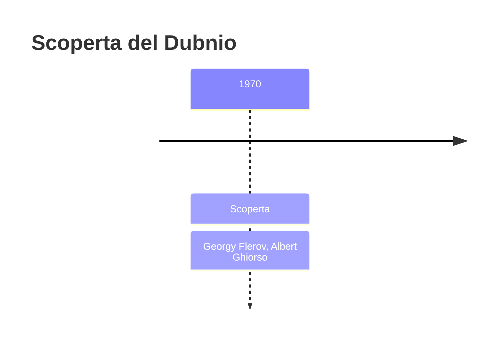
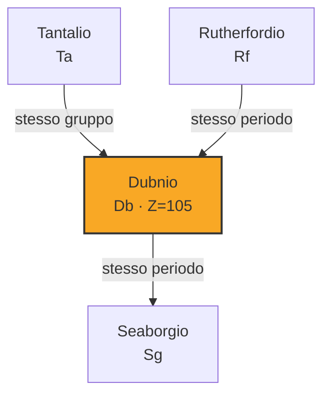

# Dubnio (Db)

> [!abstract] 105° elemento scoperto — 1970
> 

## Cronologia della scoperta

## Storia della scoperta

## Posizione nella tavola periodica

## Caratteristiche

### Dati fisico-chimici

| Proprietà | Valore |
|---|---|
| Numero atomico | 105 |
| Massa atomica | 268,0 u |
| Categoria | Metallo di transizione |
| Gruppo | 5 |
| Periodo | 7 |
| Blocco | d |
| Configurazione elettronica | *[Rn] 5f¹⁴ 6d³ 7s² |
| Punto di fusione | dato non disponibile |
| Punto di ebollizione | dato non disponibile |
| Densità | 29,3 g/cm³ |
| Stati di ossidazione | — |

## Struttura atomica

![[atomo-Dubnio.svg]]

## Usi e presenza in natura

## Nella cronologia

← Precedente: [[Rutherfordio]] (1969)
→ Successivo: [[Seaborgio]] (1974)

Epoca: [[Era nucleare]] · Scopritori: [[Georgy Flerov]], [[Albert Ghiorso]]

## Fonti

