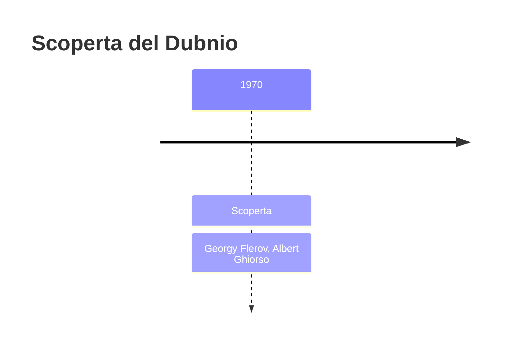
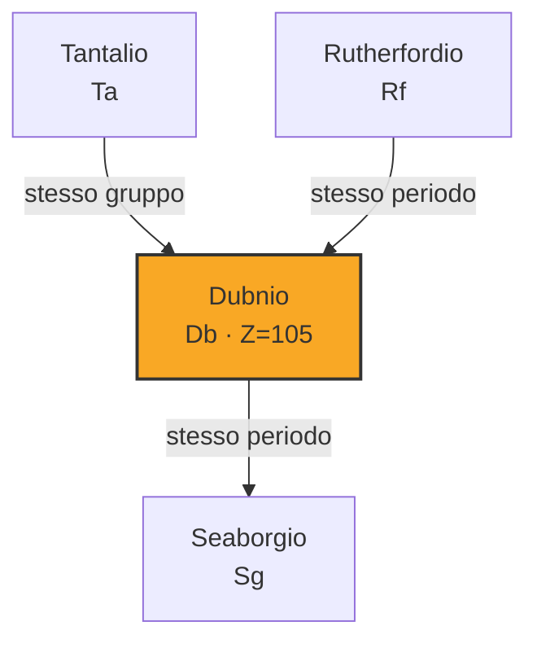
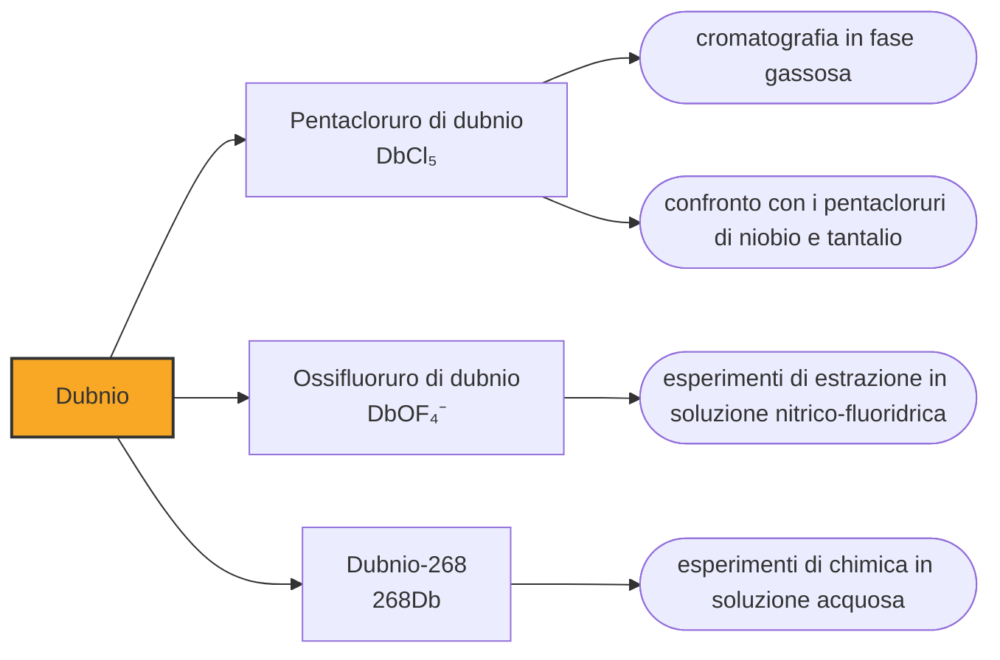

# Dubnio (Db)

> [!abstract] 105° elemento scoperto — 1970
> Per quasi trent'anni la chimica americana ha chiamato hahnio la casella 105. La faccenda si è chiusa non per decreto, ma perché il direttore di una rivista ha smesso di accettare articoli che non usavano il nome ufficiale.

Il dubnio porta il nome di una città, come il berkelio e il californio prima di lui, ma con una differenza sostanziale: quel nome non l'hanno scelto i suoi scopritori. Gliel'ha assegnato una commissione internazionale alla fine di trent'anni di disputa, dopo che almeno altri tre nomi erano stati proposti e respinti, e non per premiare una scoperta ma per riconoscere un laboratorio.

## Cronologia della scoperta

> [!info] Nota sulla cronologia
> Credito condiviso, come per il rutherfordio. La cronologia di riferimento comprime le due squadre in «Flerov et al.» e «Ghiorso et al.»: qui restano i due capi, perché la commissione congiunta ha riconosciuto nel 1993 che il primo esperimento decisamente riuscito fu quello di Berkeley dell'aprile 1970, seguito da vicino da quello di Dubna del giugno successivo, e le fonti non isolano un elenco simmetrico di nomi per le due parti. La casella ha avuto quattro nomi proposti — hahnium da Berkeley, bohrium e poi nielsbohrium da Dubna, joliotium dalla IUPAC nel 1994 — prima che nel 1997 fosse chiamata dubnium in riconoscimento della sede dell'istituto sovietico.

## Storia della scoperta

Le rivendicazioni furono due e vicinissime. Dubna dichiarò l'elemento nel 1968, bombardando americio-243 con ioni di neon-22; Berkeley nell'aprile del 1970, con californio-249 e ioni di azoto-15, riconoscendo il nuovo nucleo dai figli già noti. La commissione internazionale stabilì poi che il primo esperimento decisamente riuscito fosse quello di Berkeley, seguito a giugno da quello di Dubna, e assegnò il credito a entrambi.

Berkeley propose di chiamare l'elemento hahnium, simbolo Ha, in onore di Otto Hahn, il chimico tedesco che nel 1938 aveva scoperto la fissione nucleare e che veniva chiamato il padre della chimica nucleare. Era una scelta di prestigio e senza secondi fini nazionali: Hahn era tedesco, non americano, e nessuno dei due laboratori aveva motivo di opporsi al nome in sé.

Dubna aveva però proposto per la stessa casella il nome di Niels Bohr — prima bohrium, poi nielsbohrium per non confonderlo con il boro — e la IUPAC, cercando una via d'uscita, nel 1994 avanzò una terza ipotesi ancora: joliotium. Nessuno dei tre nomi è sopravvissuto: fra hahnium, bohrium, nielsbohrium e joliotium, la casella 105 ha collezionato quattro candidature respinte prima di ricevere quella buona.

La sistemazione del 1997 assegnò al 105 il nome della città che ospita l'istituto sovietico, Dubna. Era esplicitamente un contrappeso: le caselle 102, 103, 104 e 106 avevano preso i nomi voluti dalla parte americana, e il dubnio serviva a riconoscere il laboratorio che su tutte le altre caselle contese aveva perso. La spartizione fu politica quanto scientifica, e nessuno ha mai preteso il contrario.

Gli americani protestarono su tre punti. I nomi che Berkeley aveva proposto per il 104 e il 105 — rutherfordium e hahnium — venivano spostati su altre caselle, la 106 e la 108; le due caselle in questione andavano ai nomi voluti da Dubna benché il credito fosse condiviso; e la commissione, nel far quadrare i conti, aveva trattato i nomi come merce di scambio invece che come riconoscimenti.

Il nome ufficiale non ha fatto sparire l'altro. Il laboratorio di Berkeley ha continuato a scrivere hahnium nei propri materiali fino al 2014, e generazioni di manuali americani hanno insegnato la casella 105 con quel nome. Nella letteratura scientifica la questione si è chiusa per una via molto più prosaica: Jens Volker Kratz, direttore della rivista Radiochimica Acta, smise di accettare articoli che non usassero la nomenclatura del 1997, e nel giro di pochi anni tutti si adeguarono.

## Posizione nella tavola periodica

## Caratteristiche

Il dubnio sta nel gruppo 5, sotto vanadio, niobio e tantalio, e l'unico stato di ossidazione che gli si sia mai osservato è il +5. Negli esperimenti di estrazione il dubnio pentavalente si comporta come i suoi omologhi, mentre le forme a stato più basso non si estraggono affatto: il +3 e il +4, che i modelli gli attribuiscono come possibili, restano previsioni.

L'ordine della colonna, però, non regge fino in fondo. Ci si aspetterebbe che il dubnio somigli soprattutto al tantalio, che gli sta appena sopra; negli esperimenti di estrazione da acido cloridrico, invece, si comporta come il niobio e come il protoattinio, che nella tavola sta altrove. La spiegazione è che quassù la carica del nucleo cambia la forma degli orbitali abbastanza da modificare quali complessi l'elemento riesce a formare, e la somiglianza di famiglia si sposta di conseguenza.

Che di questo elemento si conosca qualcosa si deve a una scorciatoia. Nel 2004-2005 un gruppo di Dubna e Livermore si accorse che il dubnio-268 è ciò che resta dell'elemento 115 dopo cinque decadimenti alfa consecutivi: invece di fabbricare direttamente il 105, conviene fabbricare il 115 e aspettare. L'isotopo che se ne ricava dura circa sedici ore, un tempo enorme per questa parte della tavola, e ha reso possibili esperimenti di chimica in soluzione impensabili con isotopi da pochi secondi.

Nella pratica il lavoro è meno solenne di quanto sembri: nell'esperimento del 2004 lo strato sottile che conteneva il dubnio fu raschiato via dalla superficie del bersaglio e sciolto in acqua regia, e la chimica cominciò da lì. Anche così gli atomi disponibili per ciascun esperimento sono pochissimi, e ogni misura è una statistica su una manciata di eventi.

### Dati fisico-chimici

| Proprietà | Valore |
|---|---|
| Numero atomico | 105 |
| Massa atomica | 268,0 u |
| Categoria | Metallo di transizione |
| Gruppo | 5 |
| Periodo | 7 |
| Blocco | d |
| Configurazione elettronica | [Rn] 5f¹⁴ 6d³ 7s² |
| Punto di fusione | dato non disponibile |
| Punto di ebollizione | dato non disponibile |
| Densità | 29,3 g/cm³ |
| Stati di ossidazione | +5 |

## Struttura atomica

![[atomo-Dubnio.svg]]

## Usi e presenza in natura

Il dubnio non ha usi e non ne avrà: non esiste in natura, se ne producono singoli atomi e la quantità totale mai esistita sulla Terra non si vedrebbe nemmeno al microscopio. Serve agli esperimenti che lo riguardano, e a nient'altro.

Il gruppo 5 è però una delle colonne in cui si vede meglio dove la tavola periodica comincia a piegarsi. Sapere che il dubnio segue il niobio invece del tantalio non è un dettaglio da collezionisti: è la misura di quanto la relatività riordini le proprietà chimiche a numeri atomici alti, e serve a calibrare i modelli che dovranno prevedere il comportamento degli elementi ancora più pesanti, per i quali esperimenti come questi non saranno possibili.

## Curiosità

Dubna è una città costruita attorno al proprio laboratorio: nasce come insediamento per chi lavorava all'acceleratore e ottiene lo status di città solo nel 1956, sul Volga a un centinaio di chilometri a nord di Mosca. La Russia la classifica come naukograd, città della scienza. Dare il suo nome a un elemento significa aver intitolato la casella non a una persona ma a un luogo di lavoro: è la stessa logica del berkelio e del californio, e poi del hassio, del darmstadtio, del livermorio e del moscovio. In fondo alla tavola periodica c'è la geografia dei pochi posti al mondo in cui questi elementi si possono fabbricare.

Otto Hahn, alla fine, è rimasto senza elemento. Il nome hahnium fu proposto per la casella 105, poi spostato dalla IUPAC sulla 108 e infine abbandonato in favore di hassium. È una sorte curiosa per lo scopritore della fissione nucleare, in una riga della tavola dove figurano Niels Bohr, Lise Meitner, Ernest Rutherford e Glenn Seaborg: la disputa fra i due laboratori ha finito per lasciare fuori proprio il nome su cui nessuno dei due aveva obiezioni.

## Nella cronologia

← Precedente: [[Rutherfordio]] (1969)
→ Successivo: [[Seaborgio]] (1974)

Epoca: [[Era nucleare]] · Scopritori: [[Georgy Flerov]], [[Albert Ghiorso]]

## Fonti

- [Dubnium](https://en.wikipedia.org/wiki/Dubnium) — consultata il 10/09/2026
- [Dubnium — Royal Society of Chemistry](https://periodic-table.rsc.org/element/105/dubnium) — consultata il 10/09/2026
- [Transfermium Wars](https://en.wikipedia.org/wiki/Transfermium_Wars) — consultata il 10/09/2026
