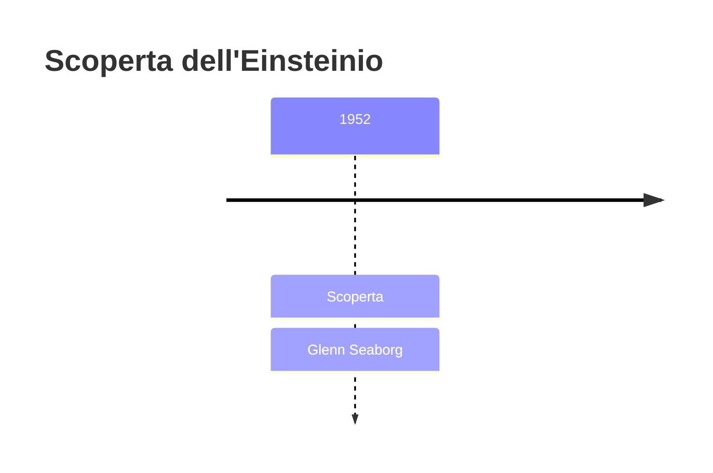
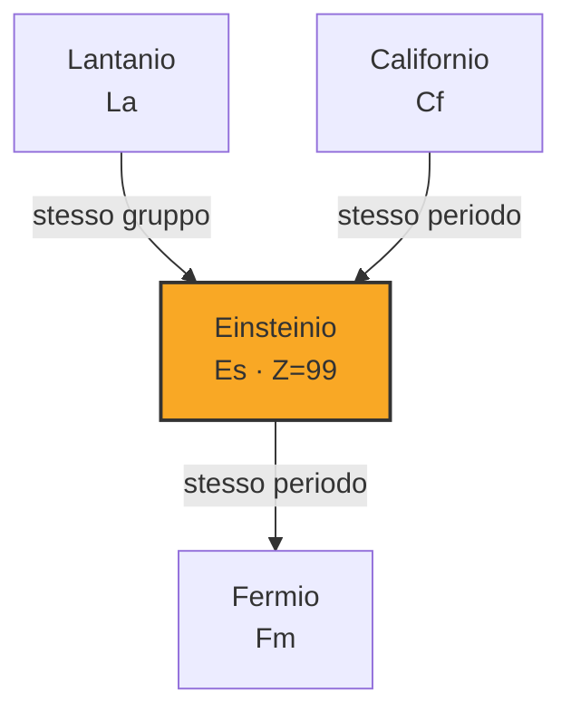

# Einsteinio (Es)

> [!abstract] 99° elemento scoperto — 1952
> 

## Cronologia della scoperta

## Storia della scoperta

## Posizione nella tavola periodica

## Caratteristiche

### Dati fisico-chimici

| Proprietà | Valore |
|---|---|
| Numero atomico | 99 |
| Massa atomica | 252,0 u |
| Categoria | Attinide |
| Gruppo | 3 |
| Periodo | 7 |
| Blocco | f |
| Configurazione elettronica | [Rn] 5f¹¹ 7s² |
| Punto di fusione | 859,9 °C |
| Punto di ebollizione | 995,9 °C |
| Densità | 8,84 g/cm³ |
| Stati di ossidazione | — |

## Struttura atomica

![[atomo-Einsteinio.svg]]

## Usi e presenza in natura

## Nella cronologia

← Precedente: [[Californio]] (1950)
→ Successivo: [[Fermio]] (1952)

Epoca: [[Era nucleare]] · Scopritore: [[Glenn Seaborg]]

## Fonti

