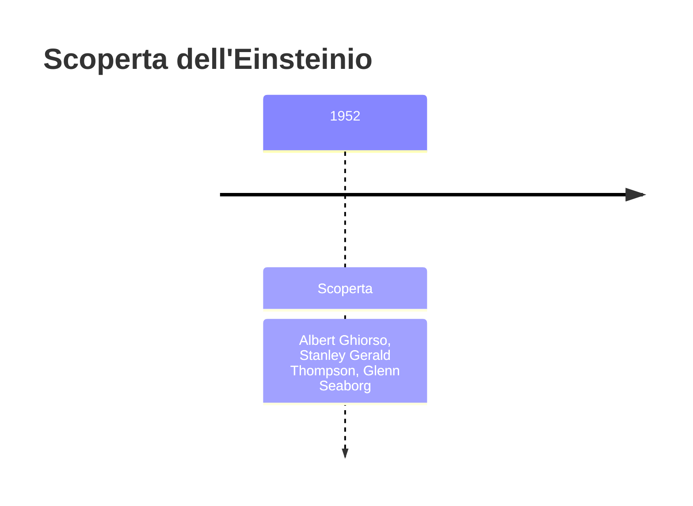
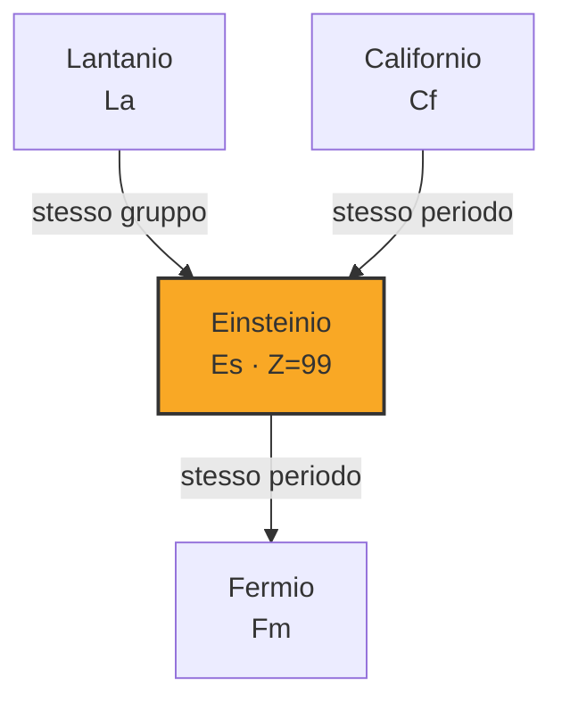
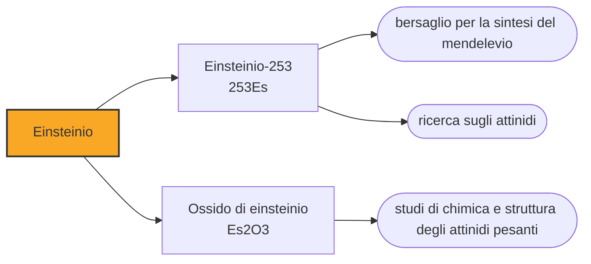

# Einsteinio (Es)

> [!abstract] 99° elemento scoperto — 1952
> Il 1° novembre 1952 un'isola del Pacifico smise di esistere. Fra i detriti raccolti dagli aerei che attraversarono la nube c'erano due elementi che nessuno aveva mai visto.

L'einsteinio è il settimo transuranico e il più pesante di cui si sia mai prodotta una quantità pesabile: si misura in milligrammi, se ne fabbrica circa un milligrammo l'anno, e la sua radioattività è tale che un campione brilla e si distrugge da solo, danneggiando il proprio reticolo cristallino mentre lo si studia.

## Cronologia della scoperta

## Storia della scoperta

Il 1º novembre 1952 gli Stati Uniti fecero esplodere a Enewetak, nelle isole Marshall, il primo ordigno termonucleare della storia: il test Ivy Mike, dieci megatoni, quasi mille volte la bomba di Hiroshima. L'isola di Elugelab scomparve, lasciando un cratere sott'acqua largo due chilometri. Dentro la palla di fuoco l'uranio del dispositivo si trovò immerso in un flusso di neutroni così intenso che alcuni nuclei ne catturarono una quindicina ciascuno in una frazione di secondo, per poi risalire la tavola periodica decadendo.

I detriti furono raccolti con carte filtro montate su aerei che attraversarono la nube, e più tardi dai coralli dell'atollo. Ad analizzarli fu il gruppo di Albert Ghiorso a Berkeley, insieme ai laboratori di Argonne e Los Alamos: nelle tracce trovarono due elementi nuovi, il 99 e il 100.

La scoperta restò classificata per ordine dei militari: rivelarla avrebbe significato dire quanti neutroni aveva prodotto l'ordigno, cioè informazioni sul progetto della bomba. L'annuncio pubblico arrivò solo nell'agosto del 1955, alla prima conferenza di Ginevra sugli usi pacifici dell'energia atomica, e lo fece Ghiorso.

I nomi furono proposti quando entrambi i dedicatari erano ancora vivi, e annunciati quando nessuno dei due lo era più: Enrico Fermi morì nel novembre 1954, Albert Einstein nell'aprile 1955, e la conferenza di Ginevra fu in agosto. Sono i primi elementi intitolati a scienziati che avrebbero potuto vedere il proprio nome nella tavola periodica, e non ce l'hanno fatta per pochi mesi.

La dedica a Einstein ha un'ironia che all'epoca non sfuggì a nessuno: l'elemento usciva dai detriti di una bomba all'idrogeno, e Einstein aveva firmato nel 1939 la lettera che spingeva Roosevelt a costruire l'arma atomica, salvo poi definirla l'errore più grande della propria vita e passare gli ultimi anni a battersi contro le armi nucleari.

## Posizione nella tavola periodica

## Caratteristiche

L'isotopo che si produce, l'einsteinio-253, ha un'emivita di venti giorni e un'attività così alta da scaldare visibilmente il campione e da renderlo luminoso. La radiazione danneggia il reticolo cristallino del metallo alla velocità con cui lo si forma: le misure di struttura vanno fatte in fretta, perché il materiale si autodistrugge mentre lo si osserva.

Chimicamente sta nello stato +3 come gli attinidi vicini, e in condizioni riducenti scende al +2. È l'ultimo elemento della tavola periodica di cui esistano misure chimiche su quantità pesabili: nel 2021 un gruppo americano è riuscito a caratterizzarne un legame chimico partendo da meno di un microgrammo, e ha dovuto rifare l'esperimento perché il campione si consumava. Da qui in poi tutto ciò che si sa viene da esperimenti su pochi atomi, ed è per questo che l'einsteinio segna un confine.

Oggi si produce irraggiando per anni bersagli di plutonio e curio nei reattori ad alto flusso, e la resa mondiale è dell'ordine del milligrammo all'anno, praticamente tutta da Oak Ridge. Ogni campagna richiede di far salire i nuclei una casella alla volta, catturando neutroni e aspettando decadimenti beta: è la stessa cosa che Ivy Mike ha fatto in un microsecondo, ripetuta con pazienza per mesi.

### Dati fisico-chimici

| Proprietà | Valore |
|---|---|
| Numero atomico | 99 |
| Massa atomica | 252,0 u |
| Categoria | Attinide |
| Gruppo | 3 |
| Periodo | 7 |
| Blocco | f |
| Configurazione elettronica | [Rn] 5f¹¹ 7s² |
| Punto di fusione | 859,9 °C |
| Punto di ebollizione | 995,9 °C |
| Densità | 8,84 g/cm³ |
| Stati di ossidazione | +2, +3 |

## Struttura atomica

![[atomo-Einsteinio.svg]]

## Usi e presenza in natura

L'einsteinio non ha usi pratici e non può averne: dura settimane, costa quantità di lavoro sproporzionate, si distrugge da solo e non se ne produce abbastanza perché qualcuno possa progettarci sopra qualcosa. Serve però a fare altro, ed è così che è entrato nella storia della tavola periodica.

Nel 1955 un bersaglio di un miliardo di atomi di einsteinio-253 — una quantità invisibile — fu bombardato con particelle alfa e produsse diciassette atomi di mendelevio, l'elemento 101. È l'unico impiego che l'einsteinio abbia mai avuto, e ha permesso di aggiungere una casella alla tavola.

Il resto del materiale prodotto serve alla ricerca di base: misurare i raggi ionici, i potenziali di ossidazione e le proprietà spettroscopiche degli attinidi pesanti, per capire fino a che punto la serie si comporta come previsto e dove comincia a discostarsene.

## Curiosità

Einsteinio e fermio sono gli unici due elementi della tavola periodica scoperti in un'esplosione nucleare. La stessa reazione che li ha prodotti — un nucleo pesante che cattura molti neutroni in un istante e poi decade risalendo la tavola — è quella che nelle stelle produce gli elementi più pesanti del ferro, e che in laboratorio nessuno riesce a riprodurre con la stessa efficienza.

Il simbolo proposto all'inizio era E, e solo più tardi divenne Es per evitare confusioni. È uno dei diversi casi, in questa parte della tavola, in cui il simbolo di un elemento è cambiato dopo l'annuncio: nella chimica dei transuranici anche le convenzioni tipografiche hanno dovuto adattarsi in corsa, mentre le caselle si riempivano più in fretta di quanto i manuali riuscissero a stampare.

## Nella cronologia

← Precedente: [[Californio]] (1950)
→ Successivo: [[Fermio]] (1952)

Epoca: [[Era nucleare]] · Scopritori: [[Albert Ghiorso]], [[Stanley Gerald Thompson]], [[Glenn Seaborg]]

## Fonti

- [Einsteinium](https://en.wikipedia.org/wiki/Einsteinium) — consultata il 09/09/2026
- [Einsteinium — Royal Society of Chemistry](https://periodic-table.rsc.org/element/99/einsteinium) — consultata il 09/09/2026
- [Ivy Mike](https://en.wikipedia.org/wiki/Ivy_Mike) — consultata il 09/09/2026
