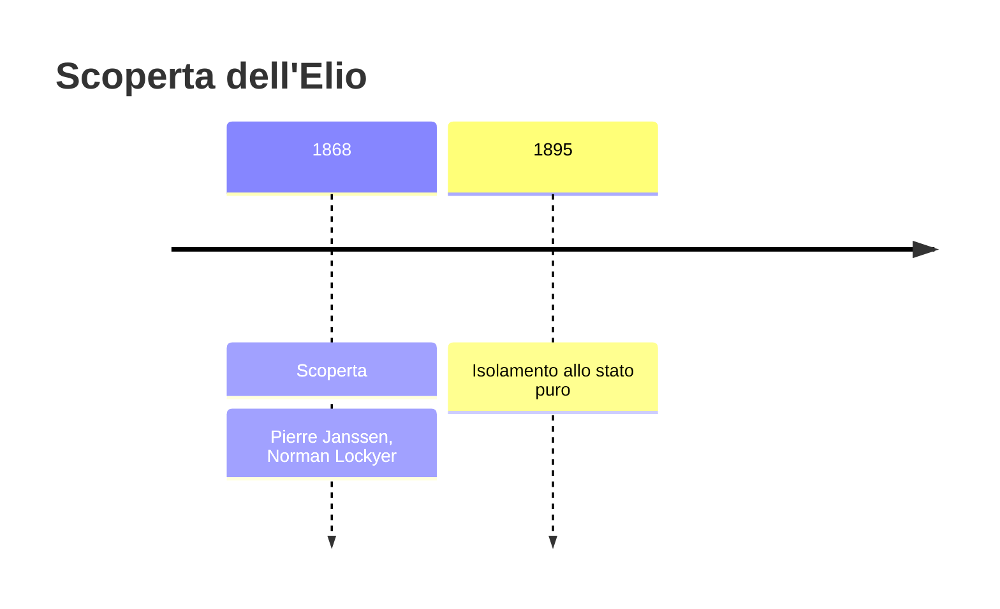
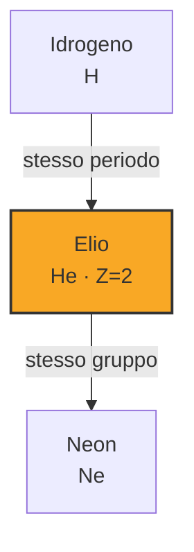

# Elio (He)

> [!abstract] 65° elemento scoperto — 1868
> 

## Cronologia della scoperta

## Storia della scoperta

## Posizione nella tavola periodica

## Caratteristiche

### Dati fisico-chimici

| Proprietà | Valore |
|---|---|
| Numero atomico | 2 |
| Massa atomica | 4,0026022 u |
| Categoria | Gas nobile |
| Gruppo | 18 |
| Periodo | 1 |
| Blocco | s |
| Configurazione elettronica | 1s² |
| Punto di fusione | -272,2 °C |
| Punto di ebollizione | -268,9 °C |
| Densità | 0,1786 g/cm³ |
| Stati di ossidazione | — |

## Struttura atomica

![[atomo-Elio.svg]]

## Usi e presenza in natura

## Nella cronologia

← Precedente: [[Indio]] (1863)
→ Successivo: [[Gallio]] (1875)

Epoca: [[Spettroscopia e radioattività]] · Scopritore: [[Pierre Janssen]], [[Norman Lockyer]]

## Fonti

