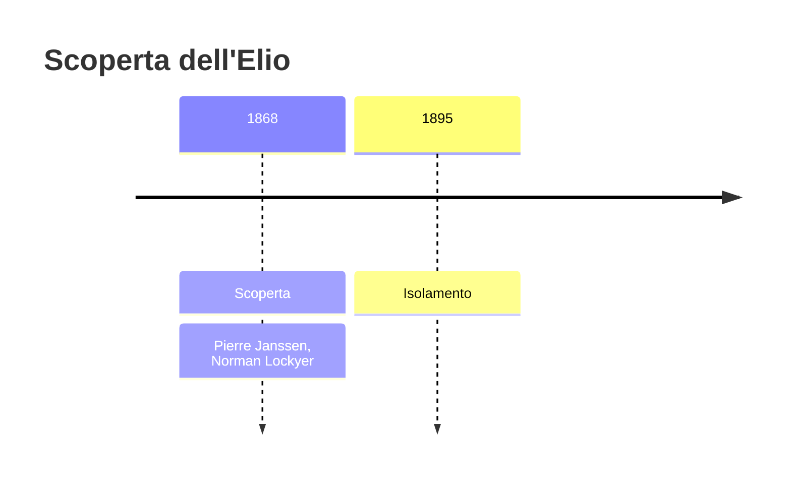
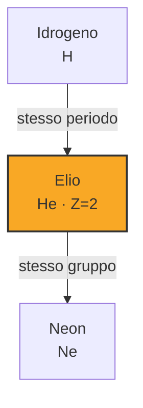
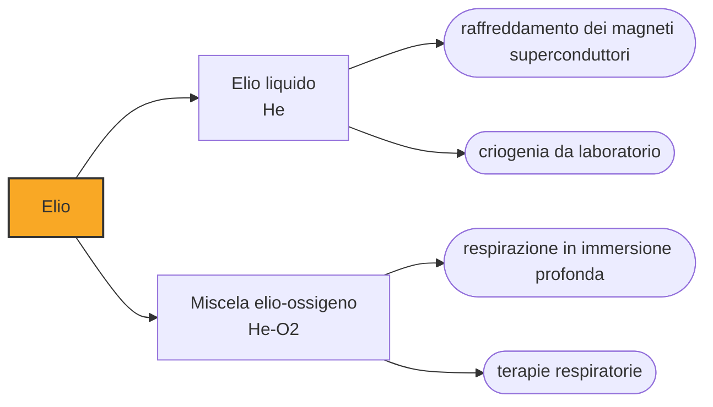

# Elio (He)

> [!abstract] 65° elemento scoperto — 1868
> Il 18 agosto 1868, durante un'eclissi totale in India, una riga gialla comparve nello spettro del Sole dove non doveva esserci nulla. Ci vollero ventisette anni per trovarne l'origine sulla Terra.

L'elio è il secondo elemento più abbondante dell'universo e uno dei più rari nell'atmosfera terrestre, perché è talmente leggero che sfugge alla gravità del pianeta e se ne va nello spazio. È l'unica sostanza che non solidifica per quanto la si raffreddi, a meno di comprimerla, e l'unica che alla temperatura giusta scorre senza attrito.

## Cronologia della scoperta

> [!info] Nota sulla cronologia
> Individuato nello spettro della cromosfera solare durante l'eclissi del 18 agosto 1868 da Pierre Jules César Janssen, e riconosciuto come elemento nuovo da Norman Lockyer, che gli diede il nome. La cronologia adotta quel 1868 e non il 1895 in cui l'elio fu trovato sulla Terra: l'elemento è stato riconosciuto nello spettro del Sole ventisette anni prima che quaggiù.

## Storia della scoperta

Il 18 agosto 1868 l'astronomo francese Jules Janssen osservò l'eclissi totale di Sole dall'India, puntando lo spettroscopio sulla cromosfera, lo strato di gas che l'eclissi rende visibile attorno al disco. Nello spettro trovò una riga gialla brillante alla lunghezza d'onda di 587,49 nanometri, molto vicina alle righe del sodio ma non coincidente con nessuna delle due.

Pochi mesi dopo, a Londra, Norman Lockyer osservò la stessa riga con un metodo che gli permetteva di studiare la cromosfera anche senza eclissi, e la chiamò D3 perché cadeva accanto alle righe D1 e D2 del sodio. Fu Lockyer a fare il passo che gli altri esitavano a fare: quella riga non apparteneva a nessun elemento conosciuto, quindi apparteneva a un elemento nuovo, e lo chiamò elio, dal greco helios, «Sole».

L'annuncio era di un genere che la chimica non conosceva: un elemento che nessuno aveva toccato, pesato o isolato, la cui unica prova era una riga di luce arrivata da centocinquanta milioni di chilometri. Per anni la comunità scientifica lo trattò con scetticismo, e il nome stesso, con quella desinenza in -io da metallo, restò a testimoniare che all'inizio si pensava a un metallo.

Il 26 marzo 1895 William Ramsay trattò con acidi minerali un campione di clevite, un minerale di uranio, per cercarvi l'argon che aveva scoperto l'anno prima. Il gas che ne uscì mostrò una riga gialla nella posizione della D3: l'elemento del Sole era anche nelle rocce, intrappolato dal decadimento radioattivo dell'uranio. Ramsay mandò i campioni a Londra per la conferma, e nello stesso periodo Per Teodor Cleve e Nils Abraham Langlet, a Uppsala, arrivarono allo stesso risultato.

L'elio utile, però, non è nell'aria né nei minerali: è nel gas naturale. Nel 1903 un pozzo in Kansas produsse un gas che non bruciava, e l'analisi ne rivelò quasi il due per cento di elio, accumulato in milioni di anni dal decadimento di uranio e torio nelle rocce sottostanti. Da allora l'elio commerciale viene da lì, separato per distillazione criogenica dal metano.

## Posizione nella tavola periodica

## Caratteristiche

Il nucleo dell'elio-4, due protoni e due neutroni, è una delle configurazioni più stabili che esistano, ed è per questo che l'universo ne è pieno: si è formato nei primi minuti dopo il Big Bang e continua a formarsi nelle stelle, dove la fusione dell'idrogeno lo produce liberando l'energia che le tiene accese. È anche la particella alfa della radioattività, cioè un nucleo di elio sparato fuori da un atomo pesante.

Con i due elettroni che completano il primo guscio, l'elio è l'elemento meno reattivo della tavola periodica: non forma composti stabili con nulla, e richiede più energia di qualunque altro atomo per cedere un elettrone. Questa indifferenza chimica è ciò che lo rende utile ovunque serva un'atmosfera che non partecipi a quello che succede dentro.

Bolle a 4,2 kelvin, il punto di ebollizione più basso di qualunque sostanza, e a pressione ordinaria non solidifica nemmeno allo zero assoluto: per farlo diventare solido servono venticinque atmosfere. Sotto i 2,17 kelvin diventa un superfluido, un liquido senza viscosità che risale le pareti del contenitore, passa attraverso fessure impossibili e conduce il calore meglio di qualunque altra sostanza conosciuta.

### Dati fisico-chimici

| Proprietà | Valore |
|---|---|
| Numero atomico | 2 |
| Massa atomica | 4,0026022 u |
| Categoria | Gas nobile |
| Gruppo | 18 |
| Periodo | 1 |
| Blocco | s |
| Configurazione elettronica | 1s² |
| Punto di fusione | -272,2 °C |
| Punto di ebollizione | -268,9 °C |
| Densità | 0,1786 g/cm³ |
| Stati di ossidazione | 0 |

## Struttura atomica

![[atomo-Elio.svg]]

## Usi e presenza in natura

L'elio liquido è il refrigerante di tutto ciò che deve stare vicino allo zero assoluto, e questo impiego da solo assorbe circa un quarto della produzione mondiale. I magneti superconduttori delle risonanze magnetiche in ospedale, quelli degli acceleratori di particelle e quelli dei laboratori di ricerca funzionano perché immersi in elio liquido: senza, non ci sarebbe superconduttività e non ci sarebbero quelle macchine.

La sua inerzia lo rende il gas di protezione della saldatura ad arco e della crescita dei cristalli di silicio, il gas di trasporto della gascromatografia, il gas di rivelazione delle fughe — un atomo così piccolo passa dove nient'altro passa, e i cercafughe a elio trovano microfori che nessun altro metodo vede — e il gas che sostituisce l'azoto nelle miscele respiratorie dei subacquei, dove l'azoto in profondità diventa narcotico.

L'elio è l'unica risorsa terrestre davvero non rinnovabile nel senso stretto: quello che si libera nell'atmosfera sfugge nello spazio e non torna. Si accumula sottoterra in tempi geologici, si consuma in decenni, e la produzione dipende da un pugno di giacimenti di gas naturale abbastanza ricchi da renderne conveniente la separazione.

## Curiosità

La voce stridula di chi respira elio non dipende dalle corde vocali, che vibrano come sempre, ma dalla velocità del suono nel gas: in elio è quasi tre volte quella in aria, e le risonanze della cavità orale si spostano verso l'alto. È una modifica del timbro, non dell'altezza, ed è anche il motivo per cui i sommozzatori che respirano miscele a elio hanno bisogno di correttori vocali per farsi capire.

I dirigibili tedeschi degli anni Trenta erano progettati per l'elio, ma gli Stati Uniti, che ne erano allora l'unico produttore, ne vietarono l'esportazione: lo Hindenburg volò a idrogeno, che è più leggero e infiammabile, e nel 1937 bruciò in trentasette secondi. È uno dei casi in cui la disponibilità di un elemento ha deciso la storia di una tecnologia.

## Nella cronologia

← Precedente: [[Indio]] (1863)
→ Successivo: [[Gallio]] (1875)

Epoca: [[Spettroscopia e radioattività]] · Scopritori: [[Pierre Janssen]], [[Norman Lockyer]]

## Fonti

- [Helium](https://en.wikipedia.org/wiki/Helium) — consultata il 09/09/2026
- [Helium — Royal Society of Chemistry](https://periodic-table.rsc.org/element/2/helium) — consultata il 09/09/2026
- [Superfluid helium-4](https://en.wikipedia.org/wiki/Superfluid_helium-4) — consultata il 09/09/2026

---

> [!warning] Avvertenza
> Questo progetto è stato realizzato con l'assistenza di sistemi di
> intelligenza artificiale. I contenuti sono verificati sulle fonti citate,
> ma **possono contenere errori e imprecisioni**: prima di riutilizzarli,
> controlla la fonte.
