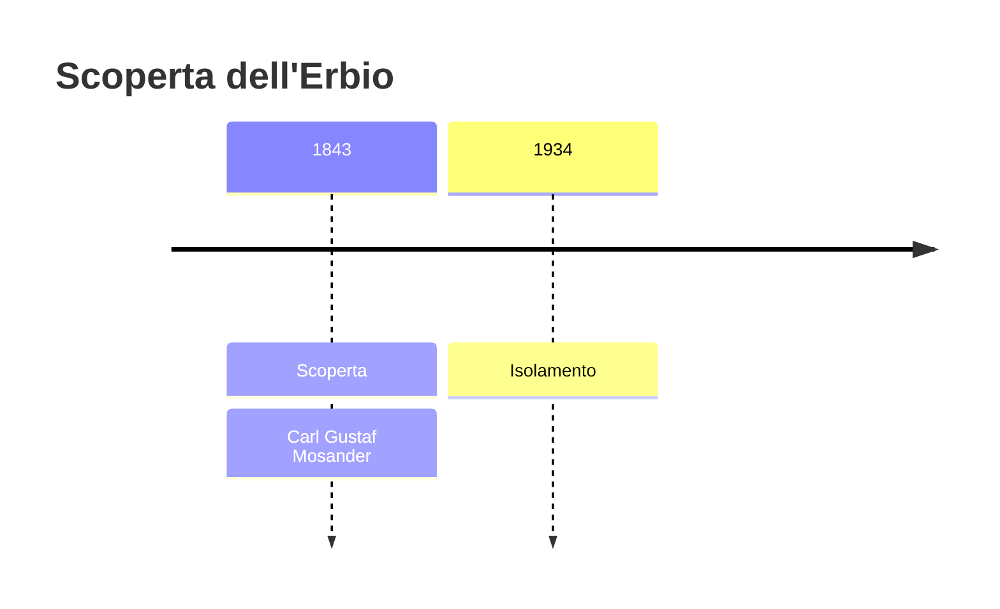
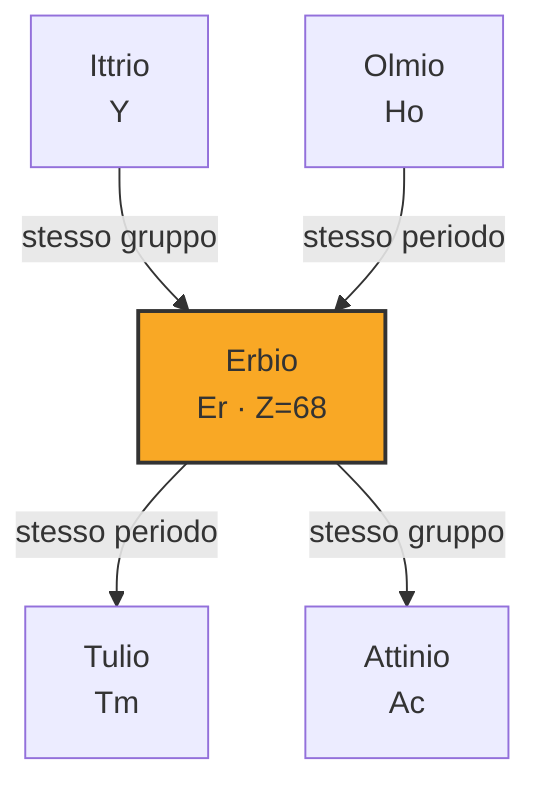
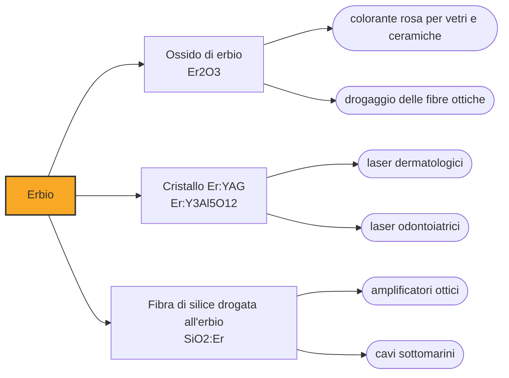

# Erbio (Er)

> [!abstract] 59° elemento scoperto — 1843
> L'elemento che porta la fibra ottica oltre l'oceano fu trovato in una cava svedese di feldspato, e per trent'anni ha portato il nome del proprio gemello.

L'erbio è il lantanide su cui poggia il traffico intercontinentale di dati: drogato dentro il vetro di una fibra ottica, amplifica la luce esattamente alla lunghezza d'onda in cui la fibra è più trasparente, e permette di rilanciare un segnale senza mai riconvertirlo in elettricità. I suoi sali, e i vetri che ne contengono, sono di un rosa tenue.

## Cronologia della scoperta

## Storia della scoperta

L'erbio esce dalla stessa vicenda del terbio. Nel 1843 Carl Gustaf Mosander sottopose l'ittria — la terra ricavata cinquant'anni prima dalla pietra nera di Ytterby — a precipitazioni ripetute con ammoniaca, e concluse che non era una sostanza sola ma tre: l'ittria vera e propria, e due frazioni minori che chiamò erbia e terbia.

Le due frazioni erano scarse e sporche, e distinguerle richiedeva strumenti che non c'erano ancora. Quando la spettroscopia arrivò a mettere ordine, lo svizzero Marc Delafontaine pubblicò i risultati con i nomi delle due invertiti, e l'inversione entrò nell'uso: quello che Mosander aveva chiamato erbia oggi si chiama terbio, e viceversa. Nessuno rimise le cose a posto perché rimetterle a posto avrebbe reso illeggibile tutta la letteratura precedente.

Nemmeno l'erbia era finita. Negli anni Settanta e Ottanta dell'Ottocento, con lo spettroscopio, se ne staccarono altri elementi: il gadolinio, l'olmio, il tulio, il disprosio. Ogni volta il residuo si chiamava ancora erbia, e ogni volta era meno di prima. Delle terre di Mosander, quello che resta oggi con quel nome è la parte che nessuno è più riuscito a dividere.

L'ossido ragionevolmente puro arrivò nel 1905, ottenuto in modo indipendente da Georges Urbain e Charles James; il metallo, ancora dopo. Wilhelm Klemm e Heinrich Bommer lo ridussero dal cloruro anidro con vapori di potassio nel 1934, novantun anni dopo l'annuncio di Mosander, e ottennero un campione ancora lontano dalla purezza che si raggiungerà con lo scambio ionico.

## Posizione nella tavola periodica

## Caratteristiche

In soluzione l'erbio è lo ione trivalente Er³⁺, di un rosa che vira al pesca, e il colore non dipende dalla luce come nel neodimio ma resta stabile: per questo l'ossido di erbio è un colorante affidabile per vetri, porcellane e zirconia cubica. Il metallo è argenteo, tenero, e all'aria si ossida lentamente formando uno strato che lo protegge.

Quel che rende utile l'erbio non è il colore ma la precisione con cui assorbe ed emette. Gli elettroni del guscio f stanno schermati dai gusci esterni e risentono poco di ciò che li circonda: le loro transizioni danno righe strette e sempre alla stessa lunghezza d'onda, che il vetro attorno sia amorfo o cristallino. È il motivo per cui un lantanide può fare da amplificatore dentro un materiale disordinato come il vetro.

Nella crosta terrestre è a 2,8 parti per milione, il doppio del terbio, e nell'acqua di mare a meno di un nanogrammo per litro. Si estrae dalle stesse sabbie e argille di tutte le terre rare, ed è fra i lantanidi pesanti, la parte della famiglia che le argille ad adsorbimento ionico della Cina meridionale hanno reso disponibile a costi accettabili.

### Dati fisico-chimici

| Proprietà | Valore |
|---|---|
| Numero atomico | 68 |
| Massa atomica | 167,2593 u |
| Categoria | Lantanide |
| Gruppo | 3 |
| Periodo | 6 |
| Blocco | f |
| Configurazione elettronica | [Xe] 4f¹² 6s² |
| Punto di fusione | 1528,9 °C |
| Punto di ebollizione | 2867,9 °C |
| Densità | 9,066 g/cm³ |
| Stati di ossidazione | +3 |

## Struttura atomica

![[atomo-Erbio.svg]]

## Usi e presenza in natura

L'amplificatore in fibra drogata all'erbio è la ragione per cui esistono i cavi sottomarini moderni. L'erbio, eccitato da un laser di pompa, restituisce energia al segnale intorno ai 1550 nanometri, che è esattamente la finestra in cui la fibra di silice perde meno luce: il segnale si rinforza restando luce, senza essere convertito in corrente e ricreato. Prima di questi amplificatori ogni tratta richiedeva un ripetitore elettronico, con tutta la sua elettronica da guastarsi in fondo al mare.

Il numero che conta è 1550 nanometri. Una fibra monomodale di silice, a quella lunghezza d'onda, perde meno luce che a qualunque altra: è una finestra fissata dalla fisica del vetro, non dalla tecnologia, e chi progetta una dorsale ottica deve starci dentro. Che l'erbio amplifichi proprio lì è una coincidenza fortunata su cui si è costruita l'intera rete in fibra, dai cavi transatlantici alle dorsali continentali.

Il laser a erbio-YAG emette a 2940 nanometri, una lunghezza d'onda che l'acqua assorbe fortissimamente: il colpo si scarica nei primi micrometri di tessuto e vaporizza solo quelli, lasciando quasi intatto ciò che sta sotto. È il principio dei laser usati in dermatologia e in odontoiatria, dove serve togliere strati sottili senza scaldare il resto.

Fuori dall'ottica gli impieghi sono minori ma vecchi: l'ossido colora vetri e smalti di rosa, filtra alcune lunghezze d'onda negli occhiali di protezione, e in metallurgia piccole aggiunte di erbio rendono più lavorabile il vanadio abbassandone la durezza.

## Curiosità

L'erbio assorbe bene i neutroni, e per questo entra nei materiali di controllo dei reattori nucleari: mescolato al combustibile, tiene sotto controllo la reattività nei primi tempi di vita di una carica, quando l'uranio fresco ne avrebbe troppa.

Quattro elementi portano nel nome pezzi della parola Ytterby — ittrio, itterbio, terbio ed erbio — e altri cinque — scandio, olmio, tulio, gadolinio e tantalio — furono individuati per la prima volta in minerali di quel giacimento. Nessun altro posto al mondo ha lasciato una traccia simile nella tavola periodica.

## Nella cronologia

← Precedente: [[Terbio]] (1843)
→ Successivo: [[Rutenio]] (1844)

Epoca: [[L'età dell'elettrolisi]] · Scopritore: [[Carl Gustaf Mosander]]

## Fonti

- [Erbium](https://en.wikipedia.org/wiki/Erbium) — consultata il 09/09/2026
- [Erbium — Royal Society of Chemistry](https://periodic-table.rsc.org/element/68/erbium) — consultata il 09/09/2026
- [Erbium-doped optical fiber amplifier](https://en.wikipedia.org/wiki/Erbium-doped_optical_fiber_amplifier) — consultata il 09/09/2026
