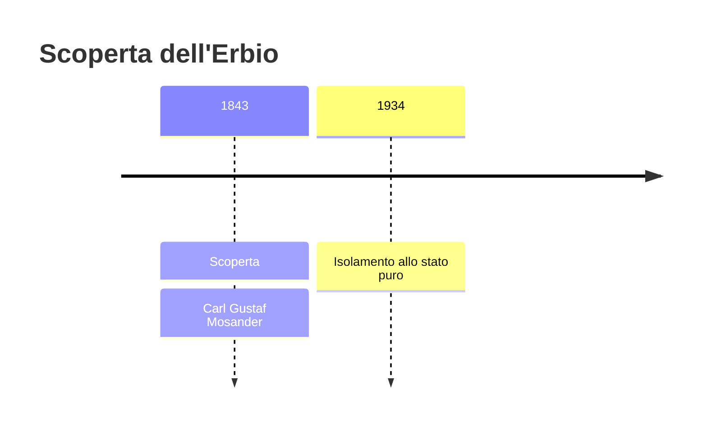
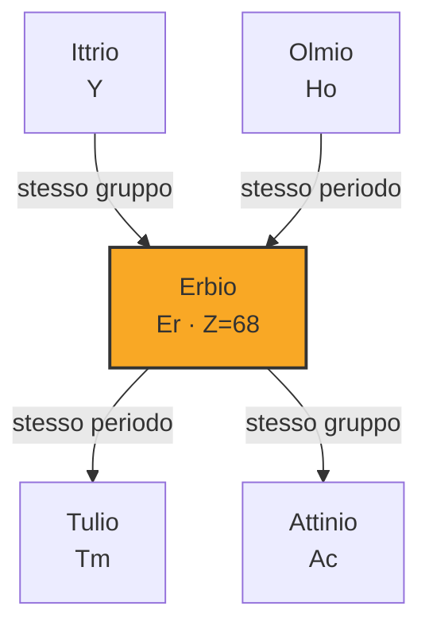

# Erbio (Er)

> [!abstract] 59° elemento scoperto — 1843
> 

## Cronologia della scoperta

## Storia della scoperta

## Posizione nella tavola periodica

## Caratteristiche

### Dati fisico-chimici

| Proprietà | Valore |
|---|---|
| Numero atomico | 68 |
| Massa atomica | 167,2593 u |
| Categoria | Lantanide |
| Gruppo | 3 |
| Periodo | 6 |
| Blocco | f |
| Configurazione elettronica | [Xe] 4f¹² 6s² |
| Punto di fusione | 1528,9 °C |
| Punto di ebollizione | 2867,9 °C |
| Densità | 9,066 g/cm³ |
| Stati di ossidazione | — |

## Struttura atomica

![[atomo-Erbio.svg]]

## Usi e presenza in natura

## Nella cronologia

← Precedente: [[Terbio]] (1843)
→ Successivo: [[Rutenio]] (1844)

Epoca: [[L'età dell'elettrolisi]] · Scopritore: [[Carl Gustaf Mosander]]

## Fonti

