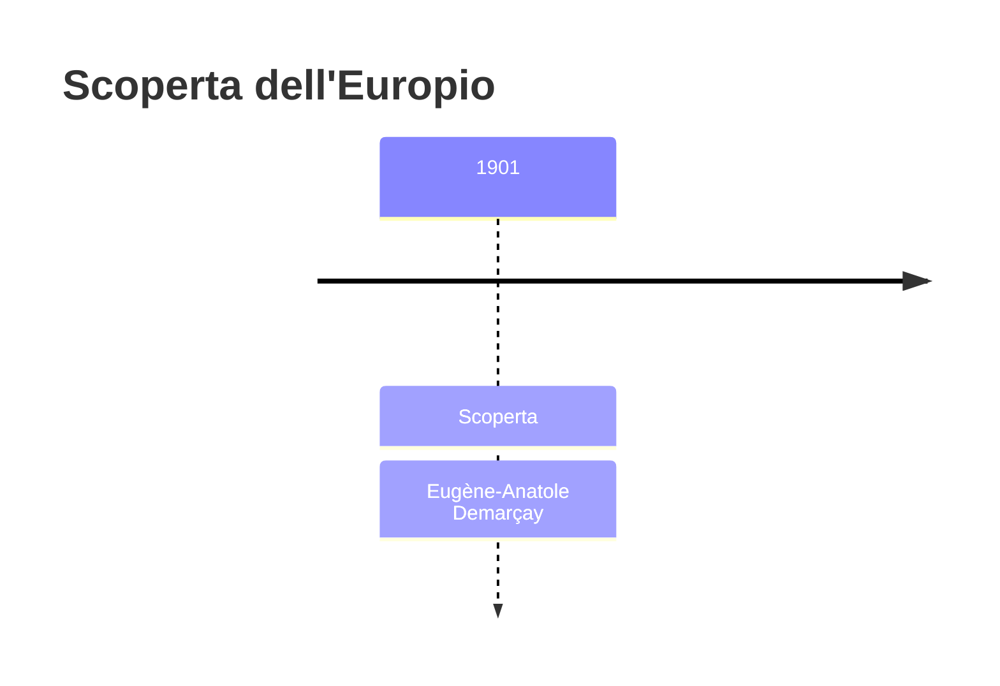
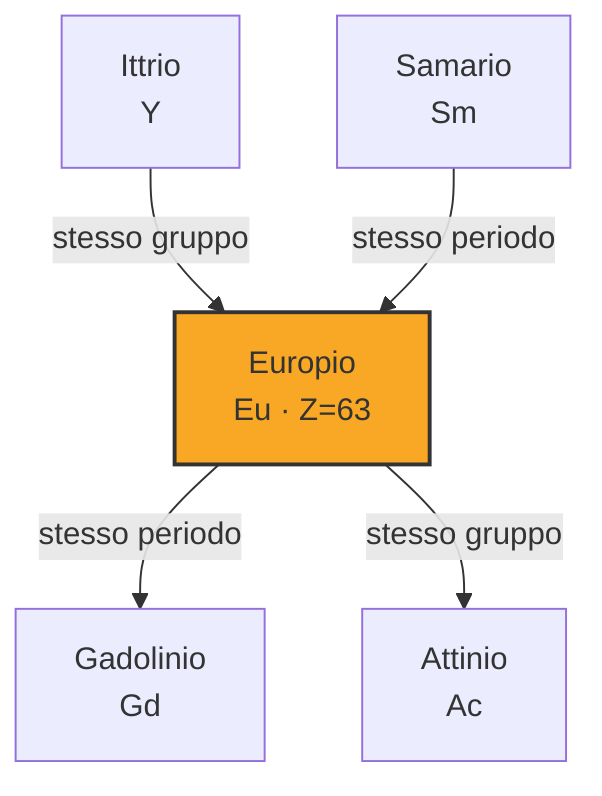
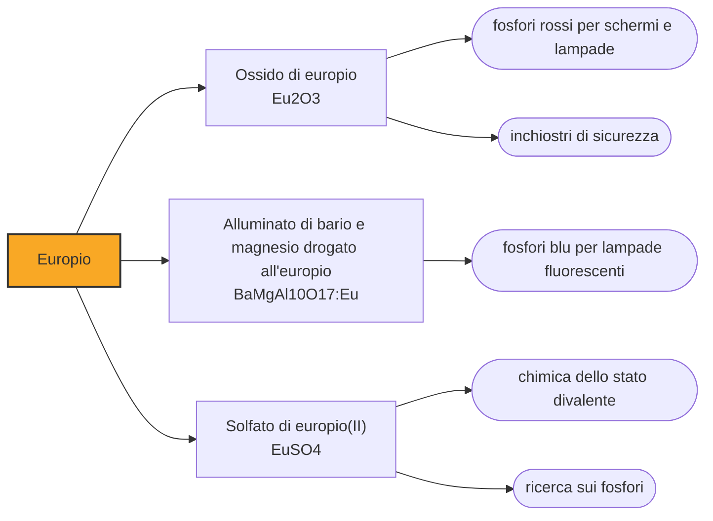

# Europio (Eu)

> [!abstract] 84° elemento scoperto — 1901
> Per anni fu solo un sospetto: certe righe nei campioni di samario che non tornavano. Chi le vide ci mise cinque anni a dimostrare che appartenevano a un elemento, e lo intitolò a un continente.

L'europio è il più reattivo, il meno denso e il più tenero dei lantanidi, e l'unico che si comporti davvero bene in due stati di ossidazione diversi. Ma quello per cui lo si produce è la luce: i suoi composti sono i fosfori rossi e blu con cui hanno funzionato i televisori a colori, le lampade a risparmio energetico e gli inchiostri di sicurezza delle banconote.

## Cronologia della scoperta

> [!info] Nota sulla cronologia
> Demarçay sospettò l'esistenza dell'elemento già nel 1896, osservando righe che nei campioni di samario non tornavano, e riuscì a isolarlo solo nel 1901. È lo stesso spettroscopista che confermò ai coniugi Curie la presenza del radio nei loro campioni.

## Storia della scoperta

Nel 1896 Eugène-Anatole Demarçay, a Parigi, studiava allo spettroscopio i campioni di samario che circolavano fra i chimici e notò righe che al samario non appartenevano. Non annunciò un elemento: annunciò un sospetto, e si mise a lavorare per dimostrarlo.

Ci riuscì nel 1901, isolando la sostanza dopo cinque anni di separazioni, e la chiamò europio, dal nome del continente. È uno dei pochi elementi intitolati a un'entità geografica così grande, e arrivava in un momento in cui i nomi delle nuove terre rare erano già andati a villaggi svedesi, città e regioni.

Demarçay era l'uomo a cui, in quegli stessi anni, Pierre e Marie Curie mandavano i campioni ricavati dalla pechblenda perché ne leggesse lo spettro: fu la sua conferma spettroscopica a stabilire che nel materiale c'era davvero un elemento nuovo, il radio. Lo spettroscopio, in quel decennio, era il tribunale che decideva che cosa esisteva.

Come per tutte le terre rare, la disponibilità vera arrivò solo a metà Novecento, con lo scambio ionico. E fu allora che l'europio trovò il proprio mestiere: negli anni Sessanta, la ricerca sui fosfori per la televisione a colori scoprì che il rosso, il colore che gli schermi rendevano peggio, lo dava meglio di chiunque altro.

## Posizione nella tavola periodica

## Caratteristiche

L'europio è l'unico lantanide in cui lo stato +2 è comune quanto il +3: perdendo due elettroni raggiunge il guscio f semipieno, una configurazione particolarmente stabile. I due stati danno colori e comportamenti diversi — è il divalente a emettere in blu, il trivalente in rosso — ed è la ragione per cui lo stesso elemento serve a fare due fosfori opposti.

È il più reattivo della famiglia: si ossida immediatamente all'aria, reagisce con l'acqua come fa il calcio, e va conservato sotto olio o in atmosfera inerte. Un pezzo lasciato all'aria si ricopre in poche ore di una crosta giallastra e finisce per sbriciolarsi.

Le sue righe di emissione sono strettissime e cadono sempre alla stessa lunghezza d'onda, perché gli elettroni che le producono stanno schermati dai gusci esterni e non risentono di ciò che li circonda. Un fosforo all'europio dà quindi un rosso puro e ripetibile, che non cambia con il materiale che lo ospita: è esattamente quello che serve a uno schermo.

In geologia l'europio ha un comportamento unico fra i lantanidi: nello stato +2 ha carica e dimensioni simili a quelle dello stronzio e del calcio, e si infila nei feldspati che cristallizzano da un magma, mentre gli altri lantanidi restano fuori. Il risultato è che le rocce ricche di feldspato ne sono arricchite e i magmi da cui quei feldspati si sono separati ne sono impoveriti: questa «anomalia dell'europio» si legge come una conca o un picco nel diagramma delle terre rare, e serve ai geologi per ricostruire la storia di una roccia magmatica senza averla vista formarsi.

### Dati fisico-chimici

| Proprietà | Valore |
|---|---|
| Numero atomico | 63 |
| Massa atomica | 151,9641 u |
| Categoria | Lantanide |
| Gruppo | 3 |
| Periodo | 6 |
| Blocco | f |
| Configurazione elettronica | [Xe] 4f⁷ 6s² |
| Punto di fusione | 825,9 °C |
| Punto di ebollizione | 1528,9 °C |
| Densità | 5,264 g/cm³ |
| Stati di ossidazione | +2, +3 |

## Struttura atomica

![[atomo-Europio.svg]]

## Usi e presenza in natura

L'ossido di europio è il fosforo rosso degli schermi a tubo catodico e delle lampade fluorescenti tricromatiche, dove lavora insieme al verde del terbio e a un blu che è anch'esso spesso all'europio, nella forma divalente. È l'impiego che ha assorbito per decenni la maggior parte della produzione mondiale, e che il passaggio ai LED ha ridimensionato senza cancellarlo.

Le banconote in euro contengono composti di europio negli inchiostri di sicurezza: sotto la lampada ultravioletta compaiono disegni e fibre che a occhio nudo non ci sono, e la firma spettrale è difficile da riprodurre senza avere l'elemento giusto. È un caso in cui il nome dell'elemento e quello di ciò che protegge coincidono per caso.

L'europio assorbe bene i neutroni e per questo entra in alcune barre di controllo, soprattutto nei reattori veloci. È però un assorbitore che si consuma trasformandosi in isotopi che a loro volta assorbono, e questo rende il suo comportamento nel tempo meno prevedibile di quello del boro o del cadmio: un vantaggio quando serve un assorbimento che duri, uno svantaggio quando serve un controllo lineare.

## Curiosità

L'europio è stato scoperto e battezzato nel 1901, quando l'Europa politica di oggi non esisteva e la moneta comune era di là da venire. Che finisca proprio negli inchiostri di sicurezza delle banconote in euro è una coincidenza che i chimici raccontano volentieri, e che non ha nessuna ragione tecnica.

Il rosso è stato per anni il colore più difficile della televisione: i fosfori disponibili erano deboli e costringevano ad abbassare la resa degli altri due per bilanciare l'immagine. Quando negli anni Sessanta arrivò il fosforo all'europio, gli schermi diventarono di colpo più luminosi, e con loro tutte le immagini che una generazione ha visto.

## Nella cronologia

← Precedente: [[Radon]] (1900)
→ Successivo: [[Lutezio]] (1907)

Epoca: [[Spettroscopia e radioattività]] · Scopritore: [[Eugène-Anatole Demarçay]]

## Fonti

- [Europium](https://en.wikipedia.org/wiki/Europium) — consultata il 09/09/2026
- [Europium — Royal Society of Chemistry](https://periodic-table.rsc.org/element/63/europium) — consultata il 09/09/2026
- [Europium anomaly](https://en.wikipedia.org/wiki/Europium_anomaly) — consultata il 09/09/2026

---

> [!warning] Avvertenza
> Questo progetto è stato realizzato con l'assistenza di sistemi di
> intelligenza artificiale. I contenuti sono verificati sulle fonti citate,
> ma **possono contenere errori e imprecisioni**: prima di riutilizzarli,
> controlla la fonte.
