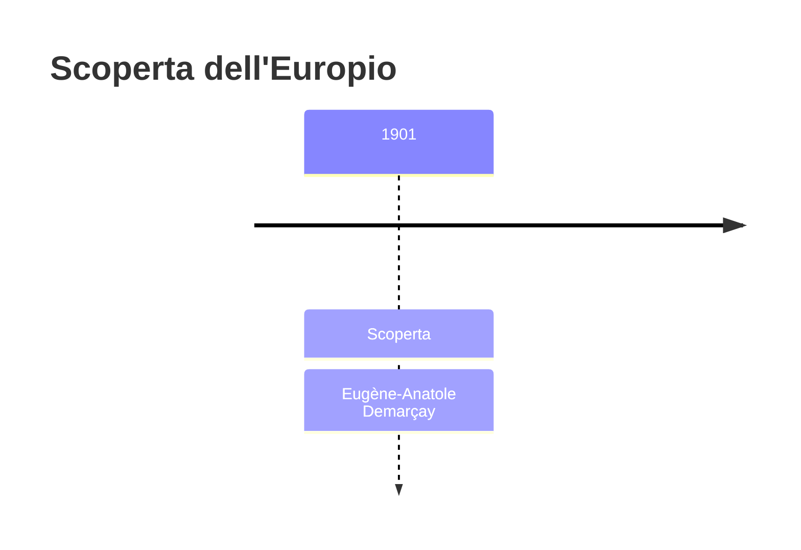
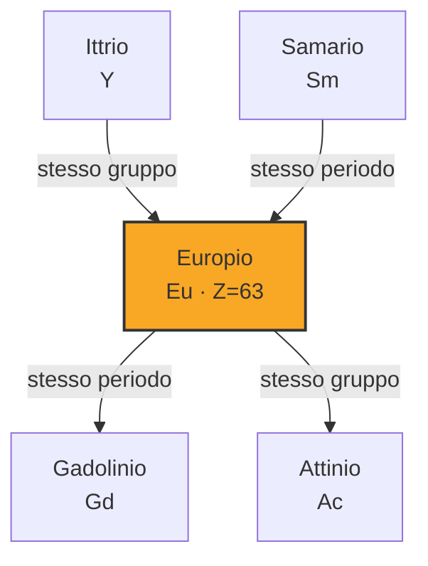

# Europio (Eu)

> [!abstract] 84° elemento scoperto — 1901
> 

## Cronologia della scoperta

## Storia della scoperta

## Posizione nella tavola periodica

## Caratteristiche

### Dati fisico-chimici

| Proprietà | Valore |
|---|---|
| Numero atomico | 63 |
| Massa atomica | 151,9641 u |
| Categoria | Lantanide |
| Gruppo | 3 |
| Periodo | 6 |
| Blocco | f |
| Configurazione elettronica | [Xe] 4f⁷ 6s² |
| Punto di fusione | 825,9 °C |
| Punto di ebollizione | 1528,9 °C |
| Densità | 5,264 g/cm³ |
| Stati di ossidazione | — |

## Struttura atomica

![[atomo-Europio.svg]]

## Usi e presenza in natura

## Nella cronologia

← Precedente: [[Radon]] (1900)
→ Successivo: [[Lutezio]] (1907)

Epoca: [[Spettroscopia e radioattività]] · Scopritore: [[Eugène-Anatole Demarçay]]

## Fonti

