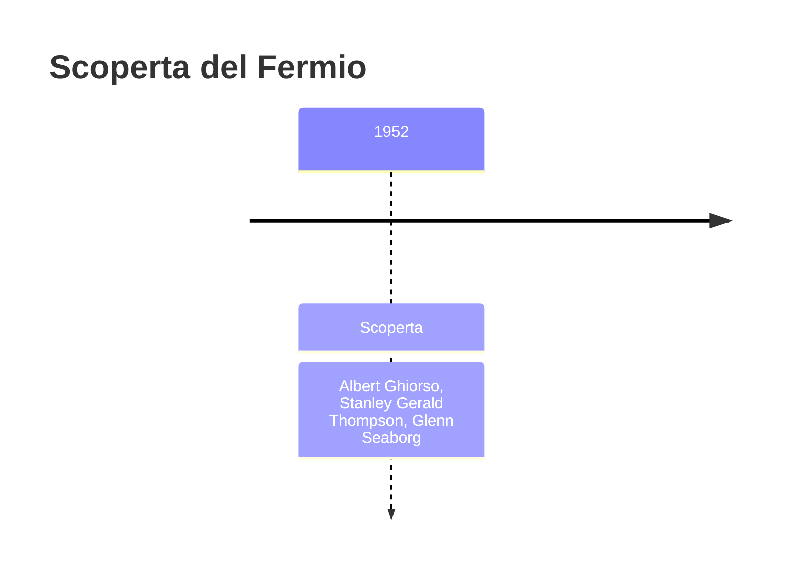
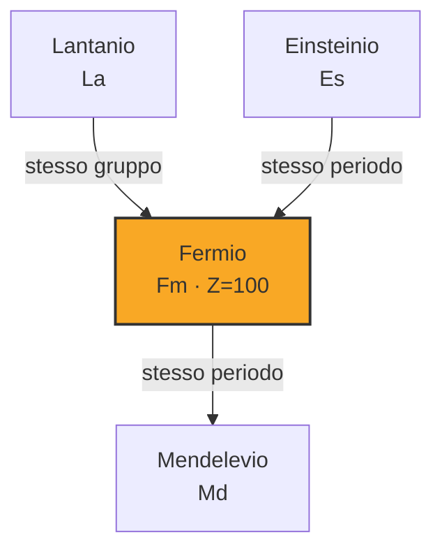
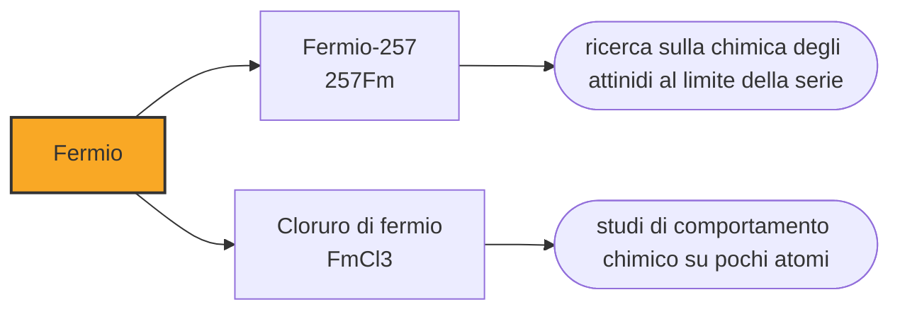

# Fermio (Fm)

> [!abstract] 100° elemento scoperto — 1952
> È l'ultimo elemento che si possa produrre catturando neutroni uno dopo l'altro. Oltre la casella 100 quella strada si chiude, e per andare avanti bisogna sparare nuclei contro nuclei.

Il fermio chiude la parte di tavola periodica raggiungibile con i reattori: oltre di lui la cattura di neutroni non porta più a elementi nuovi, perché gli isotopi che si formerebbero si spezzano prima di poter decadere. È il muro contro cui la chimica nucleare ha sbattuto negli anni Cinquanta, e che ha costretto a inventare un altro metodo.

## Cronologia della scoperta

## Storia della scoperta

Il fermio fu trovato insieme all'einsteinio, negli stessi detriti del test Ivy Mike del novembre 1952: la stessa palla di fuoco, le stesse carte filtro portate in volo attraverso la nube, la stessa collaborazione fra Berkeley, Argonne e Los Alamos. L'isotopo identificato fu il fermio-255, prodotto dall'uranio che aveva catturato diciassette neutroni.

Come per l'einsteinio, la scoperta fu tenuta segreta fino al 1955: dire quanti neutroni avevano catturato i nuclei significava dire quanto era stato intenso il flusso, cioè fornire dati sul progetto dell'ordigno. Nel frattempo, un gruppo svedese aveva prodotto in modo indipendente un isotopo del fermio bombardando uranio con ossigeno, senza sapere che l'elemento era già stato trovato.

Il nome è dedicato a Enrico Fermi, che aveva costruito il primo reattore nucleare nel 1942 sotto le tribune dello stadio di Chicago e che era morto nel novembre 1954, pochi mesi prima che il nome fosse reso pubblico. È il secondo elemento dedicato a uno scienziato scomparso da poco, e insieme all'einsteinio inaugura la tradizione dei nomi dei fisici del Novecento.

Con il fermio finisce una strada. Per fabbricare elementi fino a lui basta mettere un bersaglio in un reattore e aspettare: i nuclei catturano neutroni, decadono per via beta e salgono di una casella, e ripetendo il ciclo si arriva dal plutonio al fermio. Il fermio-258, però, si spezza spontaneamente in meno di un millisecondo, e la catena si interrompe lì: nessun bersaglio resiste abbastanza a lungo da catturare il neutrone successivo. È una barriera fisica, non tecnologica, e nessun reattore più potente potrebbe superarla.

Da lì in avanti si è passati alla fusione di nuclei: sparare ioni pesanti accelerati contro un bersaglio, sperando che ogni tanto due nuclei si fondano invece di rimbalzare. È il metodo con cui sono stati fatti tutti gli elementi successivi, ed è il motivo per cui dal mendelevio in poi le quantità si contano in atomi.

## Posizione nella tavola periodica

## Caratteristiche

L'isotopo più longevo è il fermio-257, con cento giorni di emivita; quello che si ottiene più facilmente, il fermio-255, ne dura venti ore. Non se n'è mai prodotta una quantità pesabile: le rese sono dell'ordine di miliardi di atomi, cioè miliardesimi di grammo, che si maneggiano solo in soluzione.

La sua chimica si studia con tecniche a scambio ionico su pochi atomi, e conferma le previsioni: sta nello stato +3 come gli attinidi vicini, e in condizioni riducenti forma anche il +2, come l'einsteinio. Il metallo non è mai stato preparato, e le proprietà fisiche che compaiono nelle tabelle sono estrapolazioni.

Attorno al fermio la fissione spontanea diventa il modo di decadimento dominante: i nuclei sono così carichi che la repulsione elettrica fra i protoni vince sulla forza che li tiene insieme. È la ragione fisica per cui la tavola periodica ha una fine, e per cui ogni elemento successivo dura meno del precedente — salvo dove intervengono i cosiddetti numeri magici.

Il fermio non esiste in natura. Se ne formano tracce nei giacimenti di uranio molto ricchi, per catture neutroniche successive, ma decadono immediatamente. Il reattore naturale di Oklo, in Gabon, che due miliardi di anni fa funzionò per centinaia di migliaia di anni, potrebbe averne prodotto: se è così, è scomparso da allora senza lasciare traccia.

### Dati fisico-chimici

| Proprietà | Valore |
|---|---|
| Numero atomico | 100 |
| Massa atomica | 257,0 u |
| Categoria | Attinide |
| Gruppo | 3 |
| Periodo | 7 |
| Blocco | f |
| Configurazione elettronica | [Rn] 5f¹² 7s² |
| Punto di fusione | 1526,9 °C |
| Punto di ebollizione | dato non disponibile |
| Densità | dato non disponibile |
| Stati di ossidazione | +2, +3 |

## Struttura atomica

![[atomo-Fermio.svg]]

## Usi e presenza in natura

Non ha usi al di fuori della ricerca, e nemmeno molti dentro: serve a studiare il comportamento chimico degli attinidi al limite della serie e a tarare i modelli che prevedono le proprietà degli elementi successivi, quelli che si producono un atomo alla volta e di cui non si può misurare quasi nulla.

La domanda a cui il fermio aiuta a rispondere è dove finisce la tavola periodica. Se la fissione spontanea diventa dominante oltre una certa carica nucleare, ci deve essere un ultimo elemento possibile; le previsioni teoriche variano molto, e misurare le proprietà degli ultimi elementi raggiungibili è l'unico modo di verificarle.

## Curiosità

Enrico Fermi ha dato il nome a un elemento, a un'unità di lunghezza usata in fisica nucleare (il fermi, un milionesimo di miliardesimo di metro), a una classe di particelle (i fermioni), a un laboratorio negli Stati Uniti e a un telescopio spaziale. Nella nomenclatura scientifica è uno dei nomi più presenti del Novecento.

Mentre il fermio restava classificato, un gruppo dell'Istituto Nobel di Stoccolma ne produsse un isotopo per conto proprio e lo pubblicò. È il primo di una serie di casi, in questa parte della tavola periodica, in cui il segreto militare ha creato scoperte parallele e dispute di priorità: negli anni successivi sarebbe diventata la norma.

## Nella cronologia

← Precedente: [[Einsteinio]] (1952)
→ Successivo: [[Mendelevio]] (1955)

Epoca: [[Era nucleare]] · Scopritori: [[Albert Ghiorso]], [[Stanley Gerald Thompson]], [[Glenn Seaborg]]

## Fonti

- [Fermium](https://en.wikipedia.org/wiki/Fermium) — consultata il 09/09/2026
- [Fermium — Royal Society of Chemistry](https://periodic-table.rsc.org/element/100/fermium) — consultata il 09/09/2026
- [Island of stability](https://en.wikipedia.org/wiki/Island_of_stability) — consultata il 09/09/2026
