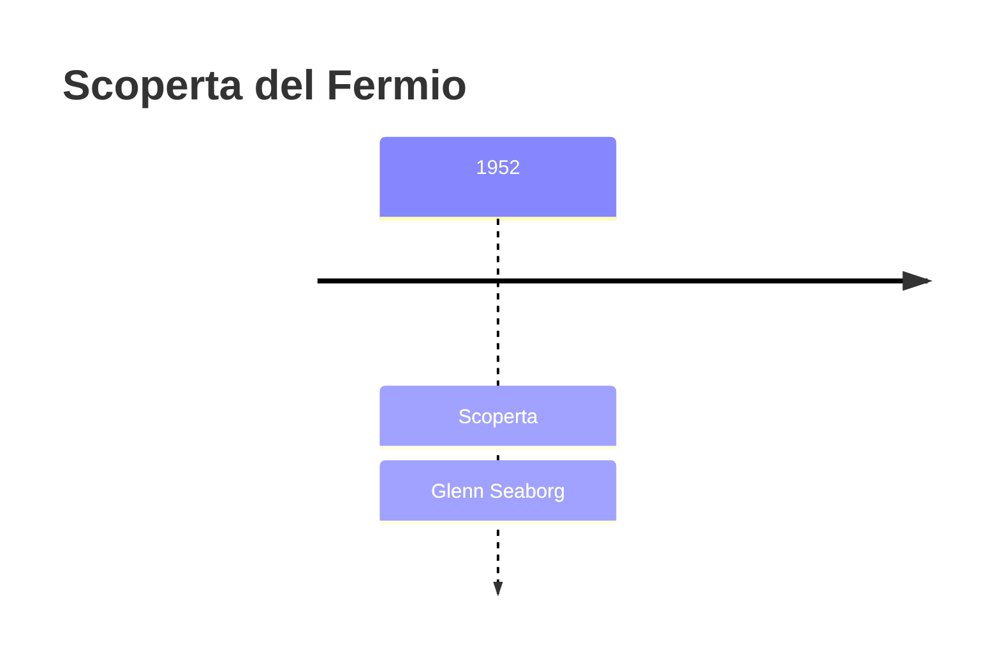
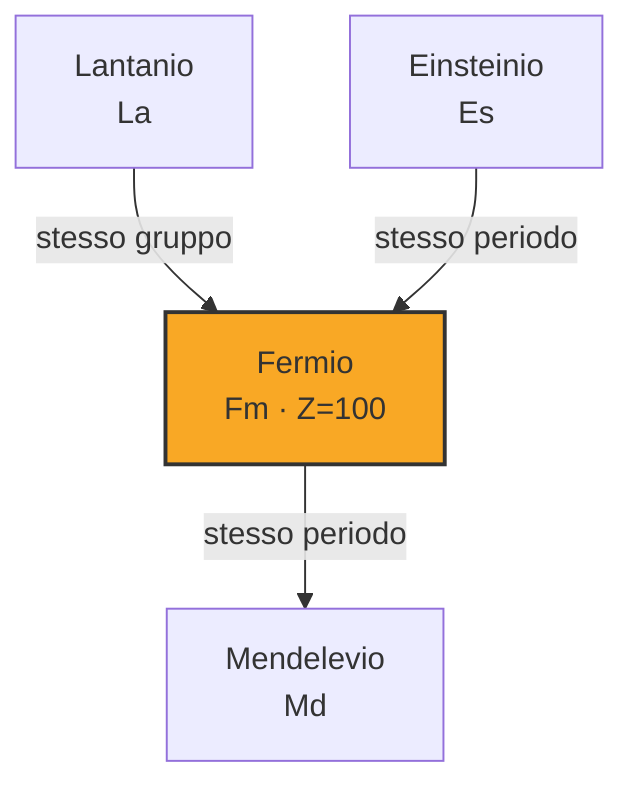

# Fermio (Fm)

> [!abstract] 100° elemento scoperto — 1952
> 

## Cronologia della scoperta

## Storia della scoperta

## Posizione nella tavola periodica

## Caratteristiche

### Dati fisico-chimici

| Proprietà | Valore |
|---|---|
| Numero atomico | 100 |
| Massa atomica | 257,0 u |
| Categoria | Attinide |
| Gruppo | 3 |
| Periodo | 7 |
| Blocco | f |
| Configurazione elettronica | [Rn] 5f¹² 7s² |
| Punto di fusione | 1526,9 °C |
| Punto di ebollizione | dato non disponibile |
| Densità | dato non disponibile |
| Stati di ossidazione | — |

## Struttura atomica

![[atomo-Fermio.svg]]

## Usi e presenza in natura

## Nella cronologia

← Precedente: [[Einsteinio]] (1952)
→ Successivo: [[Mendelevio]] (1955)

Epoca: [[Era nucleare]] · Scopritore: [[Glenn Seaborg]]

## Fonti

