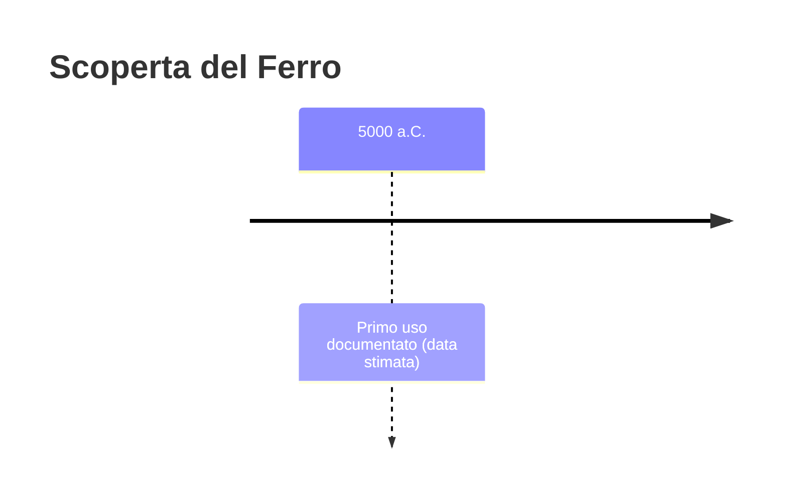
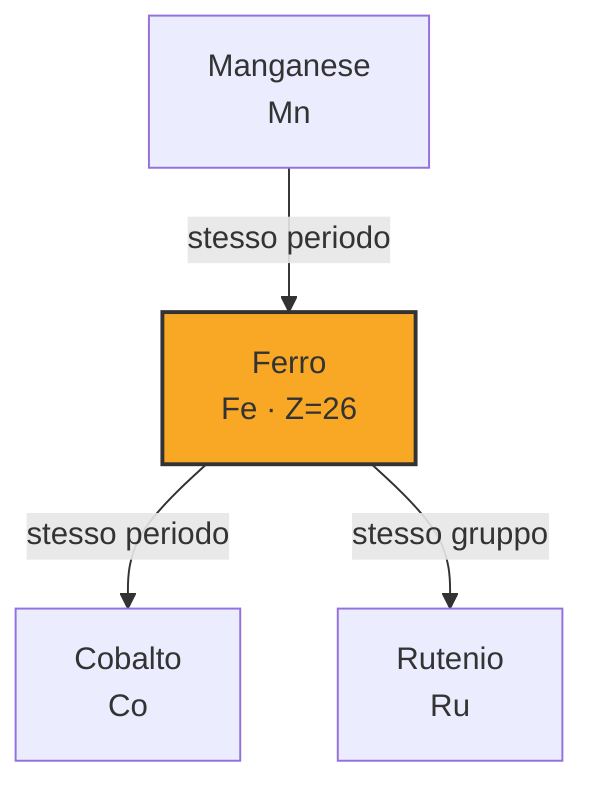
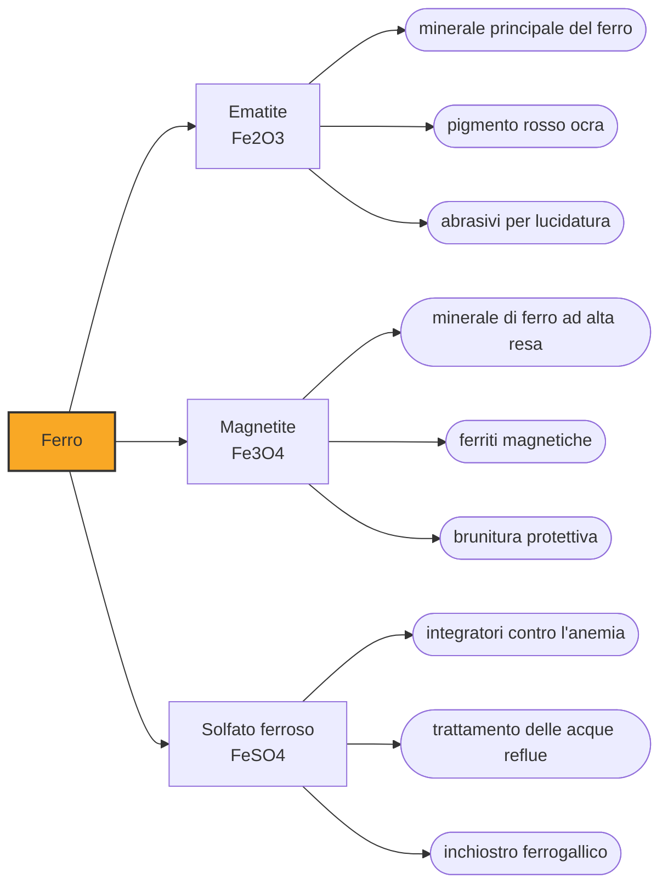

# Ferro (Fe)

> [!abstract] 5° elemento scoperto — 5000 a.C.
> Il primo ferro lavorato dall'uomo non veniva dalla Terra: cadeva dal cielo. Per quattromila anni il ferro è stato un metallo raro e prezioso, prima che qualcuno imparasse a strapparlo alla roccia.

Il ferro è l'elemento più abbondante della Terra per massa e forma gran parte del nucleo del pianeta, eppure è arrivato tardi. La ragione è tecnica: il ferro non si trova quasi mai allo stato metallico in superficie, e per estrarlo dal minerale serve un calore che l'umanità ha impiegato millenni a saper produrre.

## Cronologia della scoperta

## Storia della scoperta

Il ferro che si lavora prima della siderurgia viene dalle meteoriti. Circa una meteorite su venti è ricca di leghe ferro-nichel già metalliche, e queste masse cadute dal cielo si possono martellare a freddo senza fondere nulla, esattamente come si faceva con il rame nativo. È a questo ferro che si riferisce la data convenzionale usata qui: un metallo raccolto, non prodotto.

I reperti sono espliciti su quanto quel metallo valesse. Le nove perline di ferro dalle tombe di Gerzeh, nell'Egitto settentrionale, datate intorno al 3200 a.C., sono state ottenute martellando frammenti meteoritici in lamine sottili e arrotolandole in tubi; le analisi al microscopio elettronico vi hanno riconosciuto la struttura tipica di una meteorite e circa il trenta per cento di nichel. Erano infilate in una collana insieme a lapislazzuli, oro e corniola: il ferro stava, allora, fra le pietre preziose.

Il caso più celebre è il pugnale trovato nel sarcofago di Tutankhamon, del XIV secolo a.C. La sua lama non è mai arrugginita in tremila anni e la sua composizione, misurata con la fluorescenza a raggi X, mostra circa l'undici per cento di nichel e mezzo punto di cobalto: proporzioni che sulla Terra non esistono e che indicano senza ambiguità un'origine meteoritica. In una tomba piena d'oro, l'oggetto tecnicamente più raro era di ferro.

Il salto alla siderurgia vera non è, come si dice spesso, una questione di riuscire a fondere il ferro: nei forni antichi il ferro non fondeva affatto. Il bassofuoco lavora fra i 1100 e i 1300 gradi, ben sotto il punto di fusione del metallo, e il minerale viene ridotto allo stato solido dal monossido di carbonio che sprigiona il carbone di legna. La difficoltà sta lì: ottenere e mantenere un'atmosfera povera di ossigeno per ore, e poi lavorare a caldo la massa spugnosa che si raccoglie sul fondo, martellandola a lungo per spremerne fuori le scorie. La padronanza del processo matura nel II millennio a.C. in Eurasia, e intorno al 1200 a.C. gli utensili di ferro cominciano a soppiantare quelli di bronzo.

Ciò che cambia con la siderurgia non è la qualità del metallo, che all'inizio è anzi peggiore del buon bronzo, ma la sua disponibilità. Il bronzo dipendeva dallo stagno, raro e da importare da lontanissimo; i minerali di ferro invece si trovano quasi ovunque. Il ferro è il primo metallo che smette di essere un lusso: arma chiunque, ara qualunque campo, e ridisegna gli equilibri di potere di conseguenza.

> [!warning] Questione aperta
> La data convenzionale del V millennio a.C. si riferisce al ferro meteoritico, non a quello estratto dai minerali, e la distinzione non è un dettaglio ma il cuore della vicenda. Il ferro meteoritico è già metallico quando lo si raccoglie e si lavora a freddo con le stesse tecniche del rame nativo; i reperti sicuri più antichi e ben analizzati sono le perline di Gerzeh, in Egitto, del 3200 a.C. circa, riconosciute come meteoritiche per la struttura di Widmanstätten e per il tenore di nichel intorno al trenta per cento. La siderurgia vera è un'altra cosa e arriva molto dopo: matura nel II millennio a.C. e diventa dominante intorno al 1200 a.C. Vale la pena precisare che non consiste nel fondere il ferro, cosa che i forni antichi non facevano: il bassofuoco lavora fra i 1100 e i 1300 gradi e riduce il minerale allo stato solido, lasciando una massa spugnosa da depurare a martellate. Presentare il ferro come noto dal V millennio senza precisare quale ferro anticiperebbe la metallurgia di quasi quattromila anni.

## Posizione nella tavola periodica

## Caratteristiche

Il ferro non ha una sola struttura cristallina: la cambia al variare della temperatura, passando fra forme diverse chiamate alfa, gamma e delta. Sembra un dettaglio da manuale, ed è invece il fondamento di tutta la metallurgia dell'acciaio, perché ciascuna forma scioglie il carbonio in misura diversa. Temprare una lama, cioè raffreddarla di colpo, significa congelare una di queste strutture prima che abbia il tempo di trasformarsi.

Il ferro è il ferromagnete per eccellenza, e alla sua capacità di magnetizzarsi si deve la parola stessa. La proprietà però ha un limite netto: sopra i 770 gradi, la cosiddetta temperatura di Curie, il ferro perde il ferromagnetismo e diventa semplicemente paramagnetico. Da questo comportamento discendono i motori elettrici, i trasformatori e per decenni la registrazione magnetica dei dati.

Il difetto del ferro è che ossida male. La ruggine, ossido idrato di ferro, occupa più volume del metallo da cui nasce, quindi si sfoglia e si stacca invece di formare una pellicola protettiva: sotto lo strato caduto c'è metallo fresco pronto a corrodersi a sua volta. È il motivo per cui il ferro va verniciato, zincato o legato al cromo per farne acciaio inossidabile. La sua chimica conosce parecchi stati di ossidazione, ma in pratica quasi tutto quello che si incontra è ferro +2 o +3.

### Dati fisico-chimici

| Proprietà | Valore |
|---|---|
| Numero atomico | 26 |
| Massa atomica | 55,8452 u |
| Categoria | Metallo di transizione |
| Gruppo | 8 |
| Periodo | 4 |
| Blocco | d |
| Configurazione elettronica | [Ar] 3d⁶ 4s² |
| Punto di fusione | 1537,9 °C |
| Punto di ebollizione | 2860,9 °C |
| Densità | 7,874 g/cm³ |
| Stati di ossidazione | -2, -1, +1, +2, +3, +4, +5, +6 |

## Struttura atomica

![[atomo-Ferro.svg]]

## Usi e presenza in natura

Oggi il ferro è il metallo più prodotto al mondo con un margine enorme, e quasi tutto finisce in acciaio, cioè ferro con una piccola percentuale di carbonio più eventuali altri elementi in lega. Travi, rotaie, lamiere per automobili, armature del cemento, tubazioni, utensili: l'infrastruttura fisica del mondo contemporaneo è, in massa, essenzialmente acciaio.

Aggiungendo altri elementi si ottengono acciai con proprietà su misura: il cromo e il nichel danno l'inossidabile per posate e industria alimentare, il manganese la resistenza all'urto per macchine movimento terra, il silicio i lamierini a bassa perdita per i trasformatori. La ghisa, più ricca di carbonio e quindi fragile ma facile da colare, resta insostituibile per basamenti di macchine e ceppi freno.

## Curiosità

Un corpo umano adulto contiene circa quattro grammi di ferro, per la maggior parte dentro l'emoglobina, la proteina che trasporta l'ossigeno nel sangue. È un atomo di ferro a legare l'ossigeno nei polmoni e a rilasciarlo nei tessuti, ed è la sua presenza a rendere rosso il sangue. Lo stesso elemento che regge i grattacieli tiene in vita chi ci abita.

Che il primo ferro venisse dal cielo è rimasto scritto nelle lingue. Dalla XIX dinastia in Egitto compare per il ferro l'espressione biA n pt, che vale letteralmente «ferro del cielo», e i segni proposti per la parola sumerica corrispondente contengono anch'essi il segno del cielo. Sono parole coniate da chi vedeva cadere il metallo e non aveva altro modo di procurarselo, e sopravvivono nei testi molto dopo che i forni avevano reso la questione irrilevante.

## Nella cronologia

← Precedente: [[Piombo]] (7000 a.C.)
→ Successivo: [[Argento]] (5000 a.C.)

Epoca: [[Antichità]]

## Fonti

- [Iron](https://en.wikipedia.org/wiki/Iron) — consultata il 07/09/2026
- [Analysis of a prehistoric Egyptian iron bead (Meteoritics & Planetary Science, 2013)](https://onlinelibrary.wiley.com/doi/10.1111/maps.12120) — consultata il 07/09/2026
- [Iron dagger of Tutankhamun](https://en.wikipedia.org/wiki/Iron_dagger_of_Tutankhamun) — consultata il 07/09/2026
- [Did Hieroglyphic Texts Reveal That Ancient Egyptians Knew Meteorites Came From the Sky?](https://www.smithsonianmag.com/science-nature/do-hieroglyphic-texts-reveal-that-ancient-egyptians-knew-meteorites-came-from-the-sky-180983039/) — consultata il 07/09/2026
- [Smelting Conditions and Smelting Products: Experimental Insights into the Development of Iron Bloomery Furnaces (EXARC Journal)](https://exarc.net/issue-2020-2/ea/development-bloomery-furnaces) — consultata il 07/09/2026
