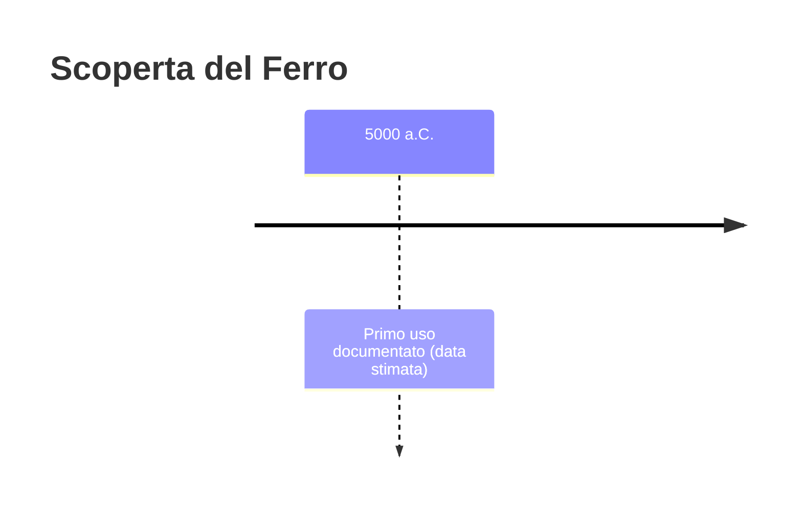
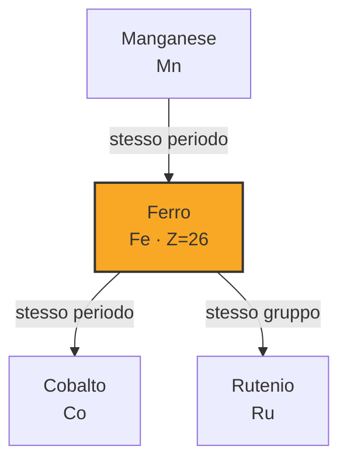

# Ferro (Fe)

> [!abstract] 5° elemento scoperto — 5000 a.C.
> 

## Cronologia della scoperta

## Storia della scoperta

## Posizione nella tavola periodica

## Caratteristiche

### Dati fisico-chimici

| Proprietà | Valore |
|---|---|
| Numero atomico | 26 |
| Massa atomica | 55,8452 u |
| Categoria | Metallo di transizione |
| Gruppo | 8 |
| Periodo | 4 |
| Blocco | d |
| Configurazione elettronica | [Ar] 3d⁶ 4s² |
| Punto di fusione | 1537,9 °C |
| Punto di ebollizione | 2860,9 °C |
| Densità | 7,874 g/cm³ |
| Stati di ossidazione | — |

## Struttura atomica

![[atomo-Ferro.svg]]

## Usi e presenza in natura

## Nella cronologia

← Precedente: [[Piombo]] (7000 a.C.)
→ Successivo: [[Argento]] (5000 a.C.)

Epoca: [[Antichità]]

## Fonti

