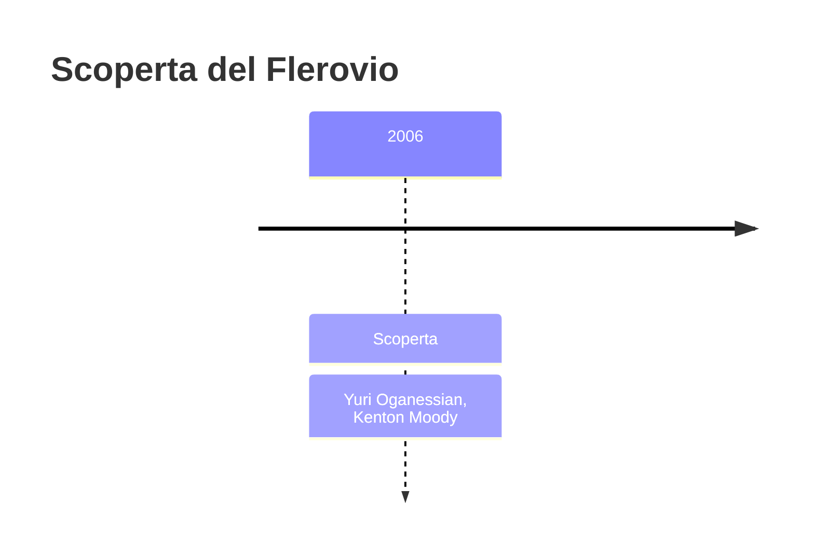
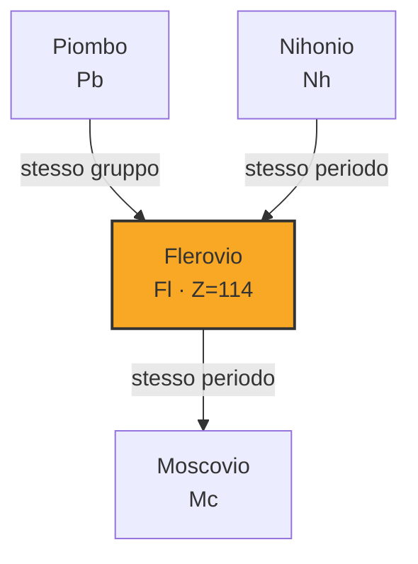
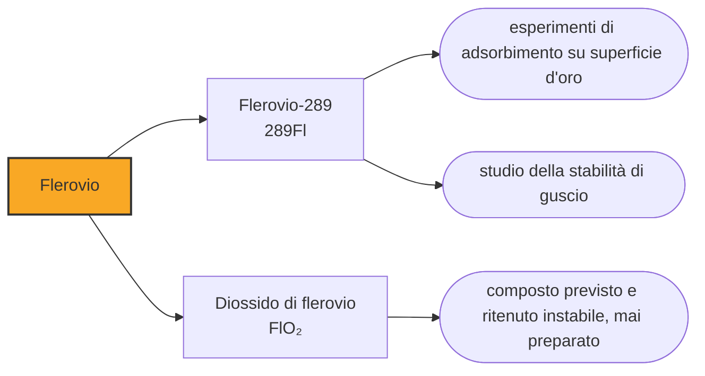

# Flerovio (Fl)

> [!abstract] 116° elemento scoperto — 2006
> Per trent'anni la casella 114 è stata il centro previsto dell'isola di stabilità, la regione in cui i nuclei superpesanti avrebbero dovuto durare anni invece di secondi. Il flerovio è arrivato, e l'isola non era lì.

Il flerovio è l'elemento su cui la fisica nucleare aveva scommesso più di ogni altro. Doveva essere la porta di una regione di nuclei insolitamente longevi, e in parte lo è: i suoi isotopi resistono alla fissione più dei vicini. Ma il centro dell'isola che si cercava non è la sua casella, e capire perché ha richiesto di fabbricarlo.

## Cronologia della scoperta

> [!info] Nota sulla cronologia
> Il primo atomo è del dicembre 1998, ma la cronologia di riferimento data l'elemento al 2006, anno degli esperimenti che hanno reso conclusiva la rivendicazione; la IUPAC lo ha riconosciuto nel 2011. È la ragione per cui in questo racconto il flerovio compare dopo il livermorio e il moscovio, che sono stati prodotti dopo di lui.

## Storia della scoperta

Il primo atomo comparve a Dubna nel dicembre del 1998, in una collaborazione fra l'istituto russo e il laboratorio di Livermore guidata da Jurij Oganesjan. Il bersaglio era plutonio-244, il proiettile calcio-48, e l'unico nucleo prodotto sopravvisse trenta secondi prima di emettere una particella alfa: un tempo enorme per quella regione della tavola, ed è la ragione per cui il risultato fece impressione. Quell'attività non è però mai più stata osservata in alcun esperimento successivo, e a quale isotopo appartenesse resta incerto. La conferma dell'elemento richiese anni di lavoro ulteriore, e la IUPAC lo riconobbe nel 2011.

La differenza rispetto agli elementi tedeschi sta nel proiettile. Il calcio-48 ha venti protoni e ventotto neutroni, due numeri che corrispondono a gusci nucleari completi, ed è quindi un nucleo compatto e insolitamente ricco di neutroni: sparato contro un bersaglio di attinide, produce nuclei che portano con sé quei neutroni in eccesso e resistono meglio alla fissione. È l'ingrediente che ha permesso di arrivare fino alla fine della riga.

L'espressione «doppiamente magico» merita una spiegazione, perché è la chiave di tutta la vicenda. I protoni e i neutroni si dispongono nel nucleo per gusci, come gli elettroni attorno a esso, e un guscio completo rende il nucleo più compatto e più difficile da rompere. I numeri che completano un guscio si chiamano magici; un nucleo che li ha completi per entrambe le specie è doppiamente magico, ed è il caso del piombo-208, che non a caso è il bersaglio preferito di tutta questa parte della tavola.

Il nome, ufficializzato nel 2012, viene dal laboratorio di Dubna dedicato alle reazioni nucleari, che a sua volta porta il nome di Georgij Flërov. Flërov aveva scoperto con Konstantin Petržak la fissione spontanea, e nell'aprile del 1942 aveva scritto a Stalin per segnalare una cosa che nessuno aveva notato: sulle riviste americane, britanniche e tedesche non si pubblicava più nulla sulla fissione nucleare. Il silenzio, sostenne, significava che il tema era diventato segreto militare.

Aveva ragione, e da quella lettera nacque il programma atomico sovietico. È un episodio raro di deduzione corretta ricavata dall'assenza di dati anziché dalla loro presenza, e collega la casella 114 alla stessa vicenda che aveva prodotto le caselle da 93 a 98 dall'altra parte del mondo.

## Posizione nella tavola periodica

## Caratteristiche

Nel 1966 nuovi calcoli avevano spostato il guscio protonico completo dal numero 126, che ci si aspettava, al numero 114, e da allora il flerovio con centottantaquattro neutroni è stato considerato il nucleo doppiamente magico al centro dell'isola di stabilità. I dati raccolti dopo la sintesi non lo confermano: il flerovio non si comporta come un guscio sferico chiuso, e le previsioni attuali spostano il centro dell'isola più avanti, verso caselle che nessuno ha ancora raggiunto.

L'attesa non è però andata delusa del tutto. Gli isotopi del flerovio resistono alla fissione spontanea molto più di quanto la sola carica nucleare farebbe prevedere, e questa maggiore tenuta si estende ai vicini: è un effetto di guscio reale, solo non centrato dove lo si era collocato. La differenza fra l'isola prevista e quella trovata è di poche caselle e di parecchi ordini di grandezza in durata.

Anche la chimica ha riservato una sorpresa. Il flerovio sta nel gruppo 14, sotto il piombo, e ci si aspettava un metallo pesante e poco volatile; gli esperimenti di adsorbimento condotti fra il 2007 e il 2014 lo hanno invece trovato molto più volatile del previsto, con un comportamento vicino a quello del copernicio e una reattività verso l'oro sorprendentemente debole. Alcuni calcoli recenti gli danno un punto di fusione sotto lo zero.

Nessuno stato di ossidazione del flerovio è mai stato osservato, e i valori di questa nota sono calcoli: si prevede che il +2 sia nettamente favorito, come nel piombo, e che il +4 sia molto instabile. La ragione è ancora relativistica: due dei quattro elettroni esterni sono trattenuti così saldamente da non partecipare quasi mai al legame.

Si conoscono sei isotopi del flerovio. Il più longevo fra quelli confermati è il flerovio-289, che dura circa due secondi; di un flerovio-290, non confermato, si stima una ventina di secondi. Sono i tempi che hanno reso possibili gli esperimenti di chimica, e ogni neutrone in più li allunga.

### Dati fisico-chimici

| Proprietà | Valore |
|---|---|
| Numero atomico | 114 |
| Massa atomica | 289,0 u |
| Categoria | Metallo post-transizione |
| Gruppo | 14 |
| Periodo | 7 |
| Blocco | p |
| Configurazione elettronica | [Rn] 5f¹⁴ 6d¹⁰ 7s² 7p² |
| Punto di fusione | 66,9 °C |
| Punto di ebollizione | 146,9 °C |
| Densità | 14,0 g/cm³ |
| Stati di ossidazione | +2, +4 |

## Struttura atomica

![[atomo-Flerovio.svg]]

## Usi e presenza in natura

Il flerovio non ha usi e non ne avrà: non esiste in natura e se ne producono singoli atomi. La sua utilità è tutta nella verifica dei modelli nucleari, ed è una verifica che è servita soprattutto a correggerli.

Sapere che l'isola di stabilità non è dove si pensava vale quanto trovarla. I modelli che collocavano il guscio chiuso al 114 sono gli stessi che si usano per prevedere se esistano elementi oltre il 118 e quanto possano durare: correggerli sposta il bersaglio degli esperimenti futuri, e decide dove valga la pena spendere mesi di fascio e milligrammi di calcio-48.

## Curiosità

Nel dicembre del 1997 Glenn Seaborg disse che uno dei suoi sogni più antichi era vedere uno di quegli elementi magici. Quando la sintesi del flerovio fu pubblicata, nel 1999, Albert Ghiorso andò a dirglielo al capezzale: gli parve, raccontò poi, di vedergli illuminarsi lo sguardo, ma il giorno dopo Seaborg non se ne ricordava. Morì il 25 febbraio di quell'anno.

Con il flerovio il laboratorio di Dubna ha messo nella tavola periodica il nome della propria città e quello del proprio fondatore, a nove caselle di distanza: il dubnio nel 1997 come compenso di una disputa perduta, il flerovio nel 2012 come riconoscimento di una serie di scoperte vinte. In mezzo c'è tutto il cambiamento di metodo che ha reso possibile la seconda cosa.

## Nella cronologia

← Precedente: [[Nihonio]] (2004)
→ Successivo: [[Oganesson]] (2006)

Epoca: [[Era nucleare]] · Scopritori: [[Yuri Oganessian]], [[Kenton Moody]]

## Fonti

- [Flerovium](https://en.wikipedia.org/wiki/Flerovium) — consultata il 10/09/2026
- [Flerovium — Royal Society of Chemistry](https://periodic-table.rsc.org/element/114/flerovium) — consultata il 10/09/2026
- [Island of stability](https://en.wikipedia.org/wiki/Island_of_stability) — consultata il 10/09/2026

---

> [!warning] Avvertenza
> Questo progetto è stato realizzato con l'assistenza di sistemi di
> intelligenza artificiale. I contenuti sono verificati sulle fonti citate,
> ma **possono contenere errori e imprecisioni**: prima di riutilizzarli,
> controlla la fonte.
