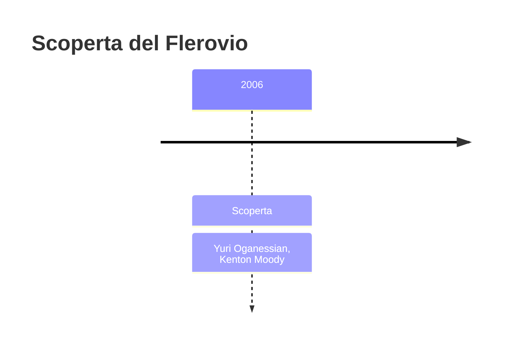
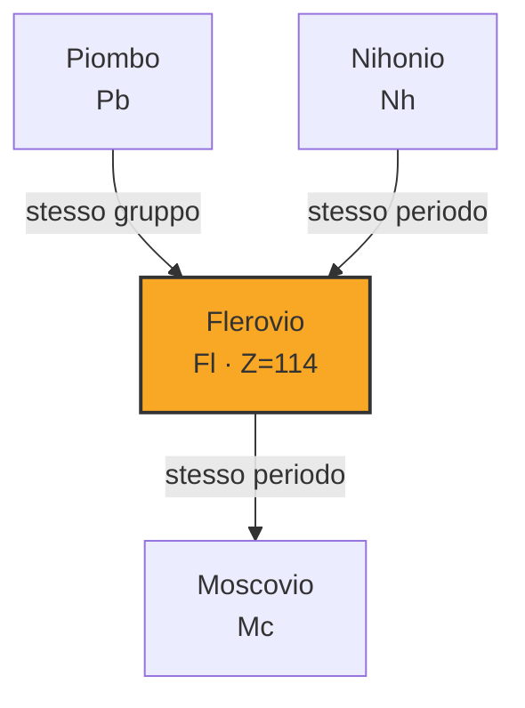

# Flerovio (Fl)

> [!abstract] 116° elemento scoperto — 2006
> 

## Cronologia della scoperta

## Storia della scoperta

## Posizione nella tavola periodica

## Caratteristiche

### Dati fisico-chimici

| Proprietà | Valore |
|---|---|
| Numero atomico | 114 |
| Massa atomica | 289,0 u |
| Categoria | Metallo post-transizione |
| Gruppo | 14 |
| Periodo | 7 |
| Blocco | p |
| Configurazione elettronica | [Rn] 5f¹⁴ 6d¹⁰ 7s² 7p² |
| Punto di fusione | 66,9 °C |
| Punto di ebollizione | 146,9 °C |
| Densità | 14,0 g/cm³ |
| Stati di ossidazione | — |

## Struttura atomica

![[atomo-Flerovio.svg]]

## Usi e presenza in natura

## Nella cronologia

← Precedente: [[Nihonio]] (2004)
→ Successivo: [[Oganesson]] (2006)

Epoca: [[Era nucleare]] · Scopritori: [[Yuri Oganessian]], [[Kenton Moody]]

## Fonti

