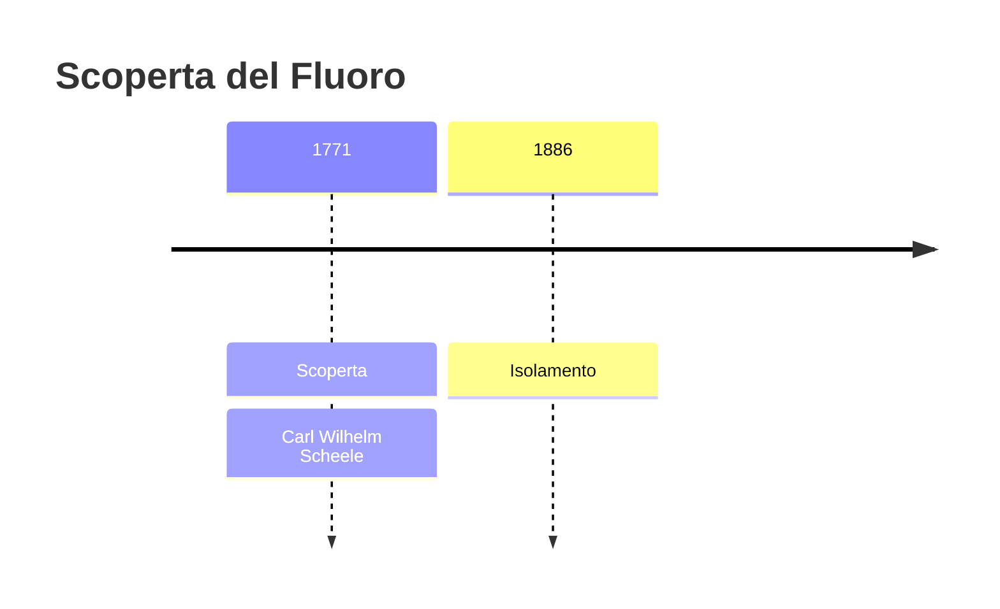
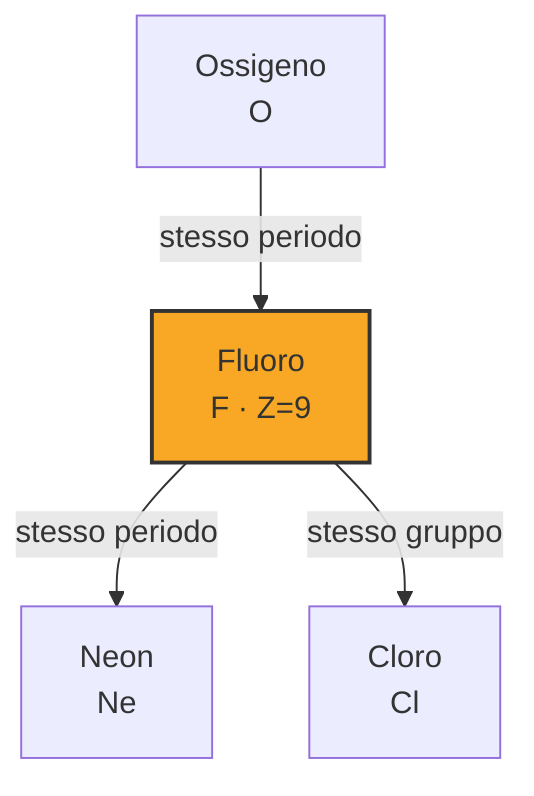
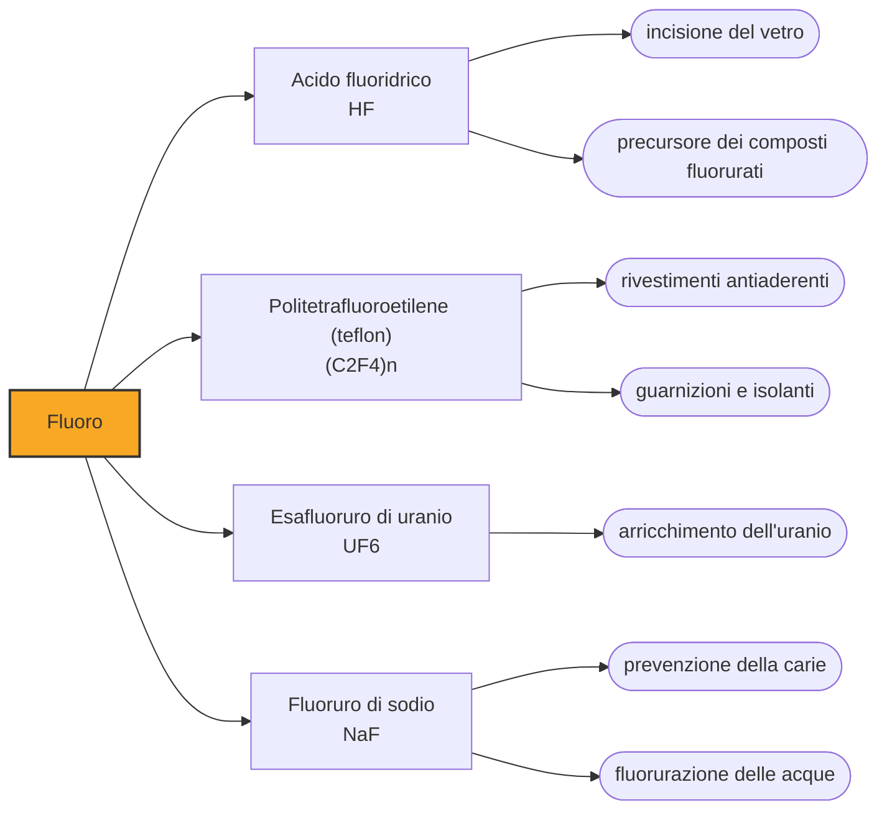

# Fluoro (F)

> [!abstract] 25° elemento scoperto — 1771
> Fra il momento in cui si capì che esisteva e quello in cui qualcuno riuscì a vederlo passarono centoquindici anni. Nel frattempo lasciò dietro di sé una fila di chimici avvelenati.

Il fluoro è l'elemento più elettronegativo della tavola periodica: strappa elettroni a chiunque e non li cede a nessuno. Da questo primato discende tutto il resto, la sua aggressività verso quasi ogni altra sostanza, la stabilità quasi indistruttibile dei composti che forma e il secolo abbondante che ci è voluto per isolarlo. È l'unico elemento che, nei suoi composti, si presenta sempre e soltanto in un unico stato di ossidazione, meno uno.

## Cronologia della scoperta

> [!info] Nota sulla cronologia
> Scheele nel 1771 prepara e studia l'acido fluoridrico dalla fluorite, riconoscendo che contiene qualcosa di nuovo. La cronologia adotta il 1810, l'anno in cui Ampère formula l'ipotesi dell'elemento: l'elemento libero è ottenuto solo il 26 giugno 1886 da Henri Moissan, settantasei anni dopo.

## Storia della scoperta

Il minerale è noto da secoli e il suo nome dice a che serviva. Nel 1529 Georgius Agricola descrive la fluorite come additivo che abbassa il punto di fusione dei metalli nella fusione dei minerali, e la chiama così dal latino fluere, scorrere: era un fondente, una sostanza che rendeva la carica più fluida nel forno. I minatori tedeschi la conoscevano bene, ne ammiravano i cristalli cubici colorati, e non avevano ragione di sospettare che vi fosse dentro qualcosa di irriducibile.

Nel 1771 Carl Wilhelm Scheele scalda la fluorite con acido solforico in una storta di vetro e ottiene un vapore acido che fa una cosa notevole: corrode il vetro stesso del recipiente, incidendolo. È l'acido fluoridrico. Scheele ne descrive le proprietà e capisce che quell'acido contiene un componente che non corrisponde a nulla di noto, ma il componente in questione non si lascia separare da niente. È la scoperta di un elemento per interposta persona: se ne vede l'ombra, non il corpo.

La situazione è tanto chiara nella teoria quanto impraticabile nei fatti. Nel 1810 il fisico André-Marie Ampère avanza l'ipotesi che l'acido fluoridrico sia un composto di idrogeno e di un elemento ignoto, analogo al cloro; due anni dopo, in una lettera a Humphry Davy del 26 agosto 1812, propone di chiamarlo fluorine. Davy accoglie il nome e prova a isolare la sostanza, senza riuscirci. Per i settantaquattro anni successivi il fluoro esiste come voce nelle tabelle degli elementi, con un nome, un posto e nessun campione: un elemento dedotto e mai visto.

Il problema è che per liberare il fluoro bisogna manipolare l'acido fluoridrico, che attacca il vetro, la pelle e le ossa, e che una volta liberato il fluoro reagisce con l'apparato che dovrebbe contenerlo. I chimici che ne pagarono il prezzo nell'Ottocento furono chiamati martiri del fluoro, e l'espressione non è retorica: il belga Paulin Louyet e il francese Jérôme Nicklès morirono nel tentativo, e gli irlandesi Thomas e George Knox riportarono gravi avvelenamenti da acido fluoridrico, tanto che uno dei due restò invalido per tre anni. Altri se la cavarono con danni minori: a Humphry Davy l'acido danneggiò gli occhi.

La soluzione arriva il 26 giugno 1886 e consiste nel togliere al fluoro ogni cosa da aggredire. Henri Moissan elettrolizza una soluzione di fluoruro acido di potassio in acido fluoridrico liquido, dentro un apparato costruito interamente in platino con elettrodi di platino e iridio, e raffredda il tutto a meno cinquanta gradi per rallentare la corrosione. All'anodo si raccoglie un gas giallo pallido che incendia il silicio all'istante. È il metodo che l'industria usa ancora oggi.

Moissan ricevette per questo il premio Nobel per la chimica del 1906 e morì improvvisamente a Parigi nel febbraio 1907, poche settimane dopo il ritorno da Stoccolma. Si legge spesso che sia stato l'ultimo martire del fluoro, ucciso dal suo stesso elemento; la causa registrata fu però un'appendicite acuta, e il contributo delle esposizioni al fluoro e al monossido di carbonio resta un'ipotesi mai dimostrata. La coincidenza è impressionante, il nesso non è provato.

## Posizione nella tavola periodica

## Caratteristiche

Il fluoro ha sette elettroni nel guscio esterno e un nucleo piccolo che li tiene stretti: gli manca un solo elettrone per completarsi e lo pretende da chiunque. Reagisce con tutti gli altri elementi tranne i gas nobili più leggeri, brucia l'acqua liberando ossigeno, incendia spontaneamente il vetro di quarzo, l'amianto e molti metalli. Non esiste in natura allo stato libero per la ragione più semplice: non farebbe in tempo a restarci.

Il rovescio di tanta violenza è una calma assoluta. Il legame carbonio-fluoro è fra i più forti della chimica organica, e una volta formato non lo scioglie quasi nulla: né il calore, né gli acidi, né i batteri. È per questo che le molecole perfluorurate resistono a tutto, e per la stessa ragione si accumulano nell'ambiente e negli organismi, dove nessun enzima sa demolirle. Le si chiama sostanze chimiche eterne proprio in virtù di questa stabilità.

L'acido fluoridrico merita un paragrafo per conto suo, perché è pericoloso in un modo che inganna. In acqua è un acido debole, meno corrosivo del cloridrico al tatto immediato, ma lo ione fluoruro attraversa la pelle senza dare dolore, raggiunge il sangue e sequestra il calcio dei tessuti e delle ossa: un'ustione estesa può uccidere per arresto cardiaco ore dopo il contatto, e chi la subisce può accorgersene troppo tardi.

### Dati fisico-chimici

| Proprietà | Valore |
|---|---|
| Numero atomico | 9 |
| Massa atomica | 18,9984031636 u |
| Categoria | Alogeno |
| Gruppo | 17 |
| Periodo | 2 |
| Blocco | p |
| Configurazione elettronica | [He] 2s² 2p⁵ |
| Punto di fusione | -219,7 °C |
| Punto di ebollizione | -188,1 °C |
| Densità | 1,696 g/cm³ |
| Stati di ossidazione | -1 |

## Struttura atomica

![[atomo-Fluoro.svg]]

## Usi e presenza in natura

La quota maggiore di fluorite estratta finisce in acido fluoridrico, che è il punto di partenza di quasi tutto il resto: refrigeranti, propellenti, polimeri fluorurati come il politetrafluoroetilene, e i fluoruri usati nella raffinazione dell'alluminio. Una parte va invece direttamente all'industria dell'acciaio come fondente, l'uso che i minerari conoscevano cinque secoli fa e che non è mai passato di moda.

C'è poi un impiego che dipende da un dettaglio nucleare: il fluoro ha un solo isotopo stabile. Questo fa dell'esafluoruro di uranio l'unico composto gassoso di uranio in cui la differenza di massa fra le molecole dipende soltanto dall'isotopo di uranio, e quindi il veicolo dell'arricchimento, per centrifugazione o per diffusione. Il progetto Manhattan ne produsse quantità enormi, e ogni programma nucleare civile o militare passa ancora di lì.

## Curiosità

Il polimero più famoso del fluoro nacque per sbaglio. Nel 1938 Roy Plunkett, che alla DuPont cercava un nuovo refrigerante, trovò una bombola di tetrafluoroetilene apparentemente vuota ma ancora pesante: il gas era polimerizzato spontaneamente sulle pareti in una cera bianca scivolosissima e inattaccabile da tutto. Era il politetrafluoroetilene, il teflon, che servì prima a guarnire le valvole degli impianti di arricchimento dell'uranio e solo dopo a rivestire le padelle.

La presenza del fluoro nei dentifrici si deve a un'osservazione epidemiologica: nelle zone dove l'acqua ne conteneva naturalmente di più la carie era molto meno diffusa, anche se un eccesso macchiava lo smalto. Lo ione fluoruro sostituisce parte degli ossidrili nel minerale del dente formando fluorapatite, più resistente all'attacco degli acidi. È l'elemento che nell'Ottocento uccideva i chimici e che oggi sta in ogni bagno, dosato in parti per milione.

## Nella cronologia

← Precedente: [[Ossigeno]] (1771)
→ Successivo: [[Azoto]] (1772)

Epoca: [[Chimica pneumatica]] · Scopritore: [[Carl Wilhelm Scheele]]

## Fonti

- [Fluorine](https://en.wikipedia.org/wiki/Fluorine) — consultata il 07/09/2026
- [History of fluorine](https://en.wikipedia.org/wiki/History_of_fluorine) — consultata il 07/09/2026
- [Henri Moissan](https://en.wikipedia.org/wiki/Henri_Moissan) — consultata il 07/09/2026
- [Not-So-Great Moments in Chemical Safety (Science History Institute)](https://www.sciencehistory.org/stories/magazine/not-so-great-moments-in-chemical-safety/) — consultata il 07/09/2026
- [The Nobel Prize in Chemistry 1906 — Henri Moissan](https://www.nobelprize.org/prizes/chemistry/1906/moissan/facts/) — consultata il 07/09/2026

---

> [!warning] Avvertenza
> Questo progetto è stato realizzato con l'assistenza di sistemi di
> intelligenza artificiale. I contenuti sono verificati sulle fonti citate,
> ma **possono contenere errori e imprecisioni**: prima di riutilizzarli,
> controlla la fonte.
