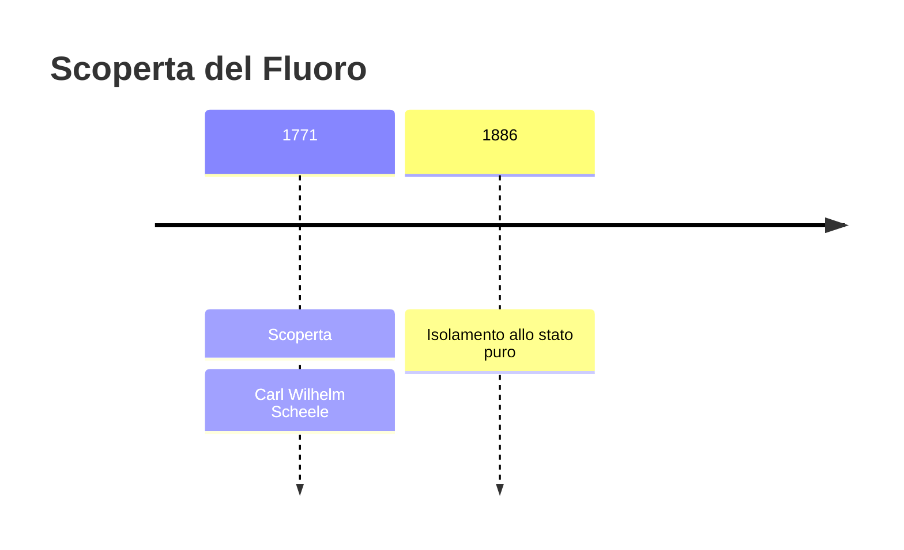
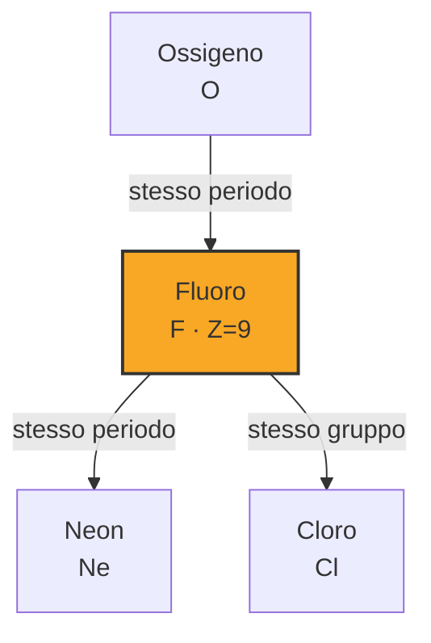

# Fluoro (F)

> [!abstract] 25° elemento scoperto — 1771
> 

## Cronologia della scoperta

## Storia della scoperta

## Posizione nella tavola periodica

## Caratteristiche

### Dati fisico-chimici

| Proprietà | Valore |
|---|---|
| Numero atomico | 9 |
| Massa atomica | 18,9984031636 u |
| Categoria | Alogeno |
| Gruppo | 17 |
| Periodo | 2 |
| Blocco | p |
| Configurazione elettronica | [He] 2s² 2p⁵ |
| Punto di fusione | -219,7 °C |
| Punto di ebollizione | -188,1 °C |
| Densità | 1,696 g/cm³ |
| Stati di ossidazione | — |

## Struttura atomica

![[atomo-Fluoro.svg]]

## Usi e presenza in natura

## Nella cronologia

← Precedente: [[Ossigeno]] (1771)
→ Successivo: [[Azoto]] (1772)

Epoca: [[Chimica pneumatica]] · Scopritore: [[Carl Wilhelm Scheele]]

## Fonti

