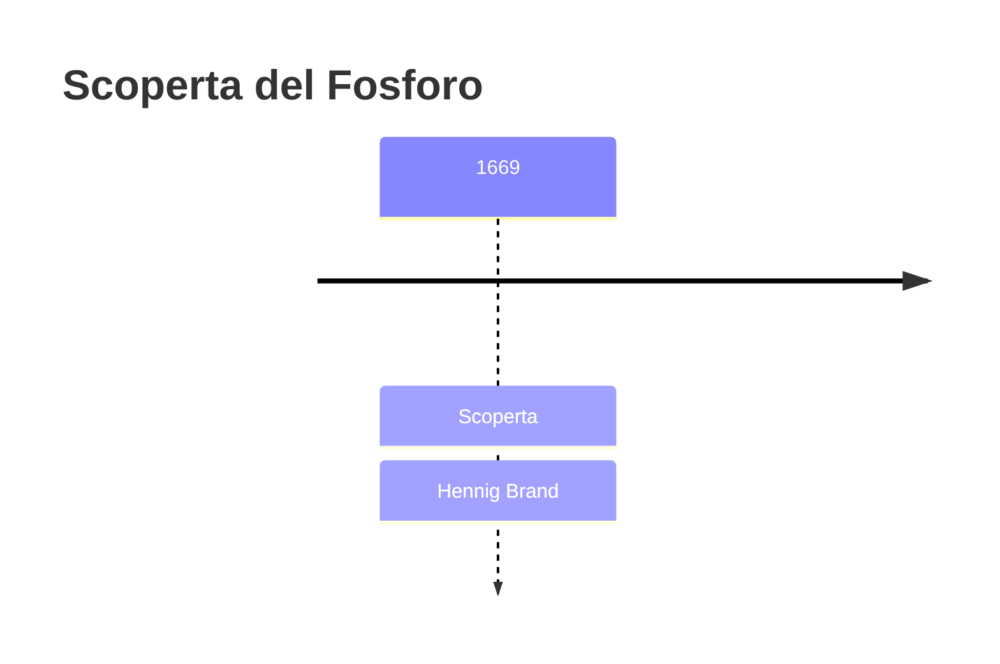
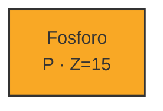
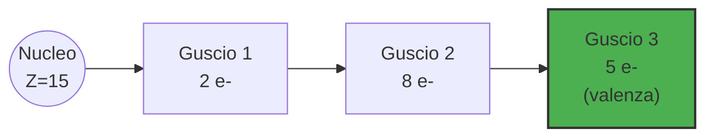
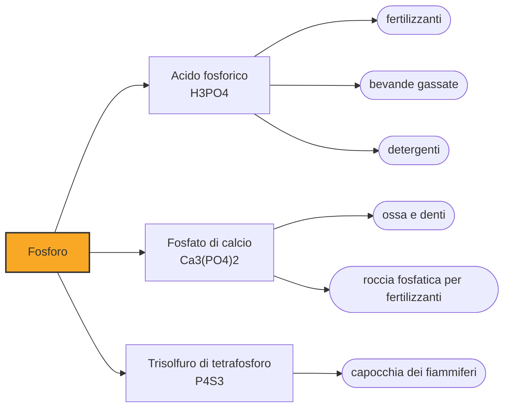

# Fosforo (P)

> [!abstract] 2° elemento scoperto — 1669
> Un alchimista bollì cinquemila litri di urina cercando l'oro, e trovò una luce che non si spegneva.

Il fosforo è l'elemento che brilla senza bruciare: il primo mai scoperto con una data, un luogo e un nome d'autore certi, in un'epoca in cui gli altri elementi erano ancora materiali senza teoria.

## Cronologia della scoperta

## Storia della scoperta

Hennig Brand è un mercante di vetro caduto in disgrazia, ad Amburgo, che nella seconda metà del Seicento decide di reinventarsi alchimista. Come tanti nel suo secolo insegue la pietra filosofale, la sostanza leggendaria capace di trasformare i metalli comuni in oro. Non ha formazione scientifica, ma ha un'idea che ai chimici di professione non era venuta: se il corpo umano produce sostanze dal colore dell'oro, forse l'oro si nasconde proprio lì.

Brand si procura quantità enormi di urina umana, raccolta da soldati e conoscenti, e la lascia fermentare per giorni prima di farla bollire in grandi caldaie fino a ridurla a una pasta densa e scura. Le stime più citate parlano di circa cinquemila litri di liquido di partenza per ogni ciclo di distillazione: un'operazione lunga, puzzolente e costosa, condotta senza alcuna garanzia di successo.

Nel 1669 Brand scalda il residuo nero fino all'incandescenza e nel collo della storta vede condensare vapori bianchi che, raffreddandosi, lasciano una sostanza cerosa. Al buio, quella sostanza emette una luce verde pallida e continua, senza fiamma né calore percepibile. Non ha trovato l'oro: ha trovato qualcosa che nessuno aveva mai visto prima, un materiale che sembra portare la luce dentro di sé.

Brand chiama la sostanza "phosphorus mirabilis", dal greco antico che significa "portatore di luce": lo stesso nome con cui i greci indicavano Venere quando compare all'alba. È il primo elemento della storia a ricevere un nome scelto apposta per descrivere una sua proprietà osservata, invece di ereditarlo da un minerale o da un dio.

Come molti alchimisti del suo tempo, Brand tiene il procedimento segreto per anni, sperando di venderlo o di usarlo per attirare un mecenate. Il segreto dura poco: nel giro di qualche anno il chimico tedesco Johann Kunckel e il chimico e fisico inglese Robert Boyle indipendentemente riescono a riprodurre la preparazione, e la notizia della sostanza luminosa si diffonde nelle corti e nelle accademie scientifiche d'Europa.

## Posizione nella tavola periodica

## Caratteristiche

Il fosforo appena preparato da Brand, quello che oggi si chiama fosforo bianco, è un solido ceroso e traslucido che si scioglie a poco più di quarantaquattro gradi e prende fuoco da solo a contatto con l'aria a temperature di poco superiori. Per questo va conservato sott'acqua: esposto all'atmosfera si accende spontaneamente, un comportamento che nel Seicento appariva a metà tra il prodigio e il pericolo.

Con il tempo si scoprì che il fosforo esiste in forme diverse, dette allotropi, con proprietà quasi opposte. Il fosforo rosso, ottenuto scaldando quello bianco al riparo dall'aria, è stabile, non tossico e non si accende spontaneamente: è quello usato oggi nei fiammiferi. Il fosforo nero, la forma più stabile in assoluto, ha una struttura a strati che ricorda la grafite e conduce persino l'elettricità.

Nella tavola periodica il fosforo occupa il gruppo dell'azoto, di cui condivide alcuni comportamenti chimici pur essendo molto più reattivo. Non si trova mai libero in natura: si lega quasi sempre all'ossigeno formando fosfati, i sali dell'acido fosforico, che sono la forma in cui questo elemento circola nelle rocce, nel suolo e negli organismi viventi.

La particolare instabilità del fosforo bianco dipende dalla sua struttura molecolare: è composto da unità tetraedriche di quattro atomi, P4, tenute insieme da legami tesi e facilmente rompibili, che reagiscono con l'ossigeno dell'aria liberando energia sotto forma di luce e calore. È questo stesso meccanismo, ossidazione lenta a bassa temperatura, a produrre il bagliore verde osservato per la prima volta da Brand, un fenomeno oggi chiamato chemiluminescenza.

### Dati fisico-chimici

| Proprietà | Valore |
|---|---|
| Numero atomico | 15 |
| Massa atomica | 30,974 u |
| Categoria | Non metallo |
| Gruppo | 15 |
| Periodo | 3 |
| Blocco | p |
| Configurazione elettronica | [Ne] 3s² 3p³ |
| Punto di fusione | 44,2 °C |
| Punto di ebollizione | 280,6 °C |
| Densità | 1,823 g/cm³ |
| Stati di ossidazione | -3, -2, -1, +1, +3, +4, +5 |

## Struttura atomica

## Usi e presenza in natura

Il fosforo è indispensabile alla vita: entra nella struttura del DNA e dell'RNA, nelle membrane cellulari e nell'ATP, la molecola che le cellule usano per immagazzinare e trasportare energia. Senza fosforo nella dieta, animali e piante non potrebbero sostenere il metabolismo che le tiene in vita.

L'uso industriale più massiccio del fosforo riguarda l'agricoltura: la roccia fosfatica estratta dalle miniere viene trasformata in acido fosforico e quindi in fertilizzanti, che restituiscono ai campi il fosforo asportato dai raccolti. Senza questo apporto costante, i terreni intensamente coltivati si impoverirebbero nel giro di poche stagioni.

Il fosforo rosso accende la testa dei fiammiferi di sicurezza, mentre i suoi composti compaiono in detersivi, bevande gassate come acidificante e persino nei fuochi d'artificio, dove alcuni composti fosforati contribuiscono agli effetti di scia luminosa.

Il fosforo elementare per uso industriale si ottiene oggi non più dall'urina ma dalla roccia fosfatica, scaldata in forni elettrici insieme a sabbia silicea e coke fino a liberare vapori di fosforo che vengono poi condensati sott'acqua: lo stesso principio di conservazione che già gli alchimisti del Seicento avevano intuito empiricamente.

## Curiosità

*Per tradizione:* Per un certo periodo il prezzo dell'urina salì alle stelle nelle città tedesche, perché altri sperimentatori, saputo del segreto di Brand, cercarono di procurarsene quantità industriali per riprodurre l'esperimento senza conoscerne esattamente il procedimento.

*Per tradizione:* Brand finì per vendere la sua formula, ormai non più tanto segreta, al chimico tedesco Daniel Kraft, che la portò in tournée per le corti europee mostrando il fosforo luminoso come un fenomeno da meraviglia, prima ancora che ne fosse compresa la natura chimica.

## Nella cronologia

← Precedente: [[Rame]] (9000 a.C.)
→ Successivo: [[Sodio]] (1807)

Epoca: [[Alchimia e primo moderno]] · Scopritore: [[Hennig Brand]]

## Fonti

- [Hennig Brand](https://en.wikipedia.org/wiki/Hennig_Brand) — consultata il 05/09/2026
- [Phosphorus](https://en.wikipedia.org/wiki/Phosphorus) — consultata il 05/09/2026
- [Lo strano modo di scoprire il fosforo](https://scuole.federchimica.it/elementi/lo-strano-modo-di-scoprire-il-fosforo) — consultata il 05/09/2026
