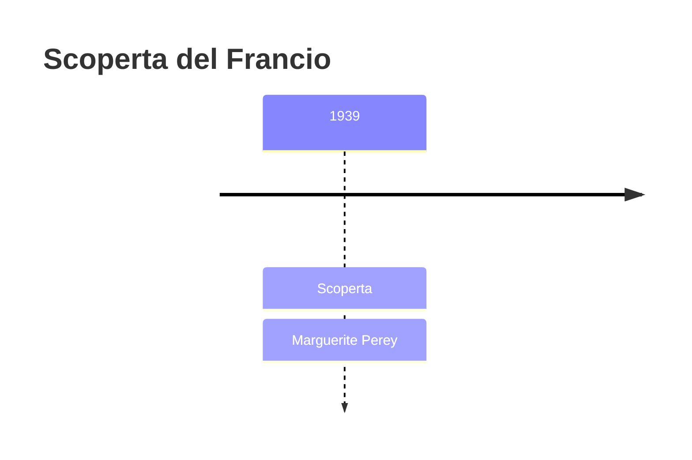
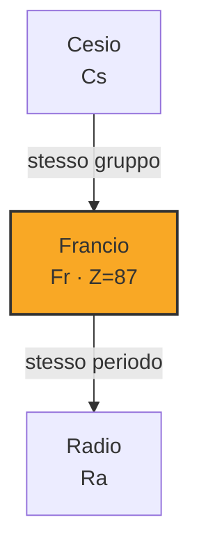

# Francio (Fr)

> [!abstract] 90° elemento scoperto — 1939
> 

## Cronologia della scoperta

## Storia della scoperta

## Posizione nella tavola periodica

## Caratteristiche

### Dati fisico-chimici

| Proprietà | Valore |
|---|---|
| Numero atomico | 87 |
| Massa atomica | 223,0 u |
| Categoria | Metallo alcalino |
| Gruppo | 1 |
| Periodo | 7 |
| Blocco | s |
| Configurazione elettronica | [Rn] 7s¹ |
| Punto di fusione | 26,9 °C |
| Punto di ebollizione | 676,9 °C |
| Densità | 1,87 g/cm³ |
| Stati di ossidazione | — |

## Struttura atomica

![[atomo-Francio.svg]]

## Usi e presenza in natura

## Nella cronologia

← Precedente: [[Tecnezio]] (1937)
→ Successivo: [[Astato]] (1940)

Epoca: [[Spettroscopia e radioattività]] · Scopritore: [[Marguerite Perey]]

## Fonti

