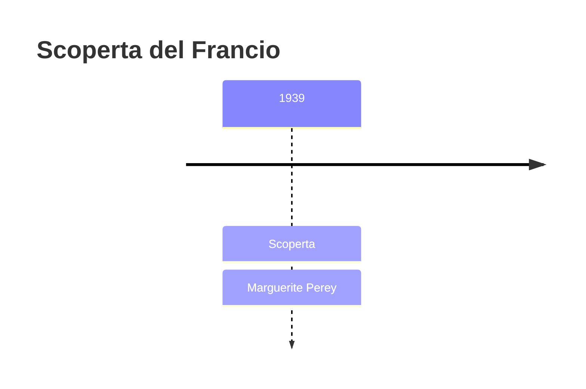
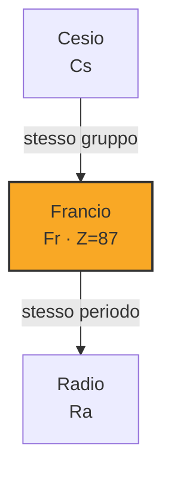
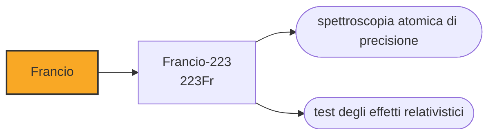

# Francio (Fr)

> [!abstract] 90° elemento scoperto — 1939
> In tutta la crosta terrestre, in ogni istante, ne esistono si e no una trentina di grammi. Nessuno ne ha mai visto un pezzo, e nessuno lo vedrà: si vaporizzerebbe per il proprio calore prima di essere guardato.

Il francio è l'ultimo elemento a essere stato trovato in natura invece che fabbricato, ed è anche il più raro: la sua vita media si misura in minuti, e ciò che ne esiste sulla Terra è solo quello che si sta formando in questo momento dal decadimento dell'attinio. È un elemento che esiste sempre e non dura mai.

## Cronologia della scoperta

> [!info] Nota sulla cronologia
> La data segue l'individuazione fatta da Marguerite Perey il 7 gennaio 1939. Le rivendicazioni precedenti sulla casella 87 — russium, alkalinium, virginium, moldavium — non sono mai state confermate e nelle tavole non compaiono.

## Storia della scoperta

Alla fine degli anni Trenta la casella 87, sotto il cesio, era una delle ultime rimaste vuote fra gli elementi naturali. Era stata rivendicata più volte, con nomi come russium, alkalinium, virginium e moldavium, e ogni volta la rivendicazione era caduta: l'elemento c'era davvero, ma nessuno aveva guardato dove bisognava.

A trovarlo fu Marguerite Perey, all'Istituto del radio di Parigi, il 7 gennaio 1939. Stava purificando un campione di attinio-227 per studiarne il decadimento, e si accorse che una parte dell'attività non tornava: c'era una radiazione beta che non apparteneva né all'attinio né a nessuno dei suoi figli conosciuti, e che compariva subito dopo la purificazione, cioè da qualcosa che si stava formando lì per lì. Era un ramo minore della catena di decadimento, imboccato da poco più dell'uno per cento degli atomi di attinio, e portava all'elemento 87.

Perey era entrata all'Istituto a diciannove anni come tecnica di laboratorio, assunta da Marie Curie, e aveva imparato la radiochimica lavorandoci dentro. La scoperta del francio la portò molto lontano: divenne professoressa a Strasburgo e nel 1962 fu la prima donna eletta all'Académie des sciences, che dal 1666 non ne aveva mai accolta una.

Propose di chiamarlo catium, per il fatto che il suo ione è probabilmente il più elettropositivo che esista, ma il nome suonava male in inglese e fu abbandonato. Scelse allora francium, dalla Francia: l'ultimo elemento naturale della tavola periodica porta il nome di un paese, come il germanio, il polonio, il gallio e l'europio.

Con il francio finisce la caccia agli elementi naturali, cominciata tre secoli prima con il fosforo. Da quel momento in poi ogni nuovo elemento verrà fabbricato: prima in ciclotrone, poi in reattore, poi in acceleratori sempre più grandi, fino agli elementi che esistono per millesimi di secondo e si contano un atomo alla volta.

## Posizione nella tavola periodica

## Caratteristiche

L'isotopo più stabile, il francio-223, ha un'emivita di ventidue minuti: dopo un'ora ne resta un ottavo, dopo un giorno praticamente nulla. Si forma come ramo minoritario del decadimento dell'attinio-227, e a sua volta decade in radio e astato. È il secondo elemento più raro della crosta terrestre, dopo l'astato.

Non ne è mai stata vista una quantità macroscopica, e non per mancanza di tentativi: l'energia liberata dal decadimento di un campione visibile lo scalderebbe tanto da vaporizzarlo all'istante. Tutto ciò che si sa delle sue proprietà viene da misure su pochi atomi alla volta, tenuti sospesi in trappole magneto-ottiche, o da calcoli teorici.

In teoria il francio dovrebbe essere l'elemento più elettropositivo di tutti, cioè quello che cede l'elettrone esterno con la massima facilità, essendo l'ultimo della colonna degli alcalini. Gli effetti relativistici, che negli atomi pesanti trattengono gli elettroni più vicini al nucleo, complicano però il quadro, e le misure indicano che il cesio potrebbe restare al primo posto.

Le stime dicono che in ogni istante l'intera crosta terrestre contenga una trentina di grammi di francio: tutto quello che si forma dal decadimento dell'attinio, in equilibrio con tutto quello che nel frattempo decade. Non è una quantità che si possa raccogliere, perché è dispersa in ogni giacimento di uranio del pianeta, qualche atomo alla volta.

### Dati fisico-chimici

| Proprietà | Valore |
|---|---|
| Numero atomico | 87 |
| Massa atomica | 223,0 u |
| Categoria | Metallo alcalino |
| Gruppo | 1 |
| Periodo | 7 |
| Blocco | s |
| Configurazione elettronica | [Rn] 7s¹ |
| Punto di fusione | 26,9 °C |
| Punto di ebollizione | 676,9 °C |
| Densità | 1,87 g/cm³ |
| Stati di ossidazione | +1 |

## Struttura atomica

![[atomo-Francio.svg]]

## Usi e presenza in natura

Non ha usi commerciali e non ne avrà: nessuna applicazione può reggersi su un materiale che dopo mezz'ora non c'è più. Serve però alla fisica fondamentale. La sua struttura atomica è semplicissima — un solo elettrone esterno, come per tutti gli alcalini — ma il nucleo è pesantissimo, e questa combinazione amplifica effetti che negli atomi leggeri sono invisibili: la violazione della parità dovuta all'interazione debole, per esempio, si misura nel francio molto meglio che altrove.

Il francio che si studia non si estrae: si fabbrica, bombardando bersagli d'oro con fasci di ossigeno negli acceleratori, e si cattura al volo in trappole ottiche prima che decada. Gli esperimenti si progettano attorno al fatto che il campione dura minuti, e ogni misura va fatta mentre il materiale sta già scomparendo.

## Curiosità

Marguerite Perey lavorò per decenni con materiali radioattivi e morì nel 1975 di un tumore che quasi certamente ne era la conseguenza, come Marie Curie che l'aveva assunta e come diverse altre persone di quel laboratorio. Aveva dedicato gli ultimi anni proprio allo studio degli effetti biologici delle radiazioni.

Prima del francio, la casella 87 aveva ospitato annunci chiamati russium, alkalinium, virginium e moldavium, ciascuno rivendicato da un laboratorio diverso. È il segno di quanto fosse difficile, prima delle tecniche radiochimiche, distinguere una scoperta vera da un artefatto di misura: la tavola periodica ha avuto molti più elementi annunciati che elementi.

## Nella cronologia

← Precedente: [[Tecnezio]] (1937)
→ Successivo: [[Astato]] (1940)

Epoca: [[Spettroscopia e radioattività]] · Scopritore: [[Marguerite Perey]]

## Fonti

- [Francium](https://en.wikipedia.org/wiki/Francium) — consultata il 09/09/2026
- [Francium — Royal Society of Chemistry](https://periodic-table.rsc.org/element/87/francium) — consultata il 09/09/2026
- [Marguerite Perey](https://en.wikipedia.org/wiki/Marguerite_Perey) — consultata il 09/09/2026
