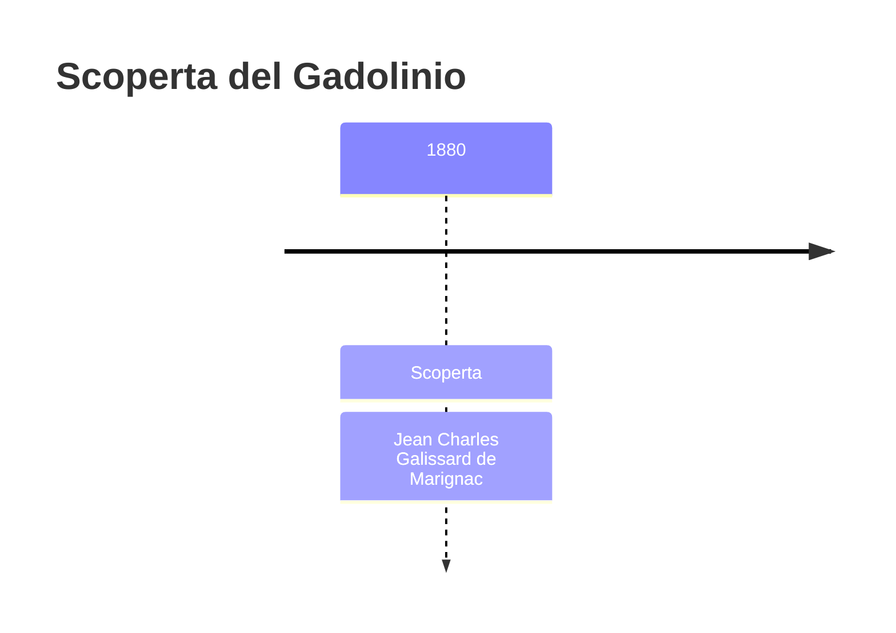
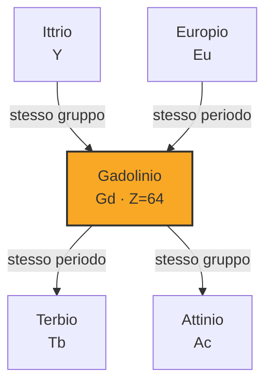

# Gadolinio (Gd)

> [!abstract] 72° elemento scoperto — 1880
> 

## Cronologia della scoperta

## Storia della scoperta

## Posizione nella tavola periodica

## Caratteristiche

### Dati fisico-chimici

| Proprietà | Valore |
|---|---|
| Numero atomico | 64 |
| Massa atomica | 157,253 u |
| Categoria | Lantanide |
| Gruppo | 3 |
| Periodo | 6 |
| Blocco | f |
| Configurazione elettronica | [Xe] 4f⁷ 5d¹ 6s² |
| Punto di fusione | 1311,9 °C |
| Punto di ebollizione | 2999,9 °C |
| Densità | 7,9 g/cm³ |
| Stati di ossidazione | — |

## Struttura atomica

![[atomo-Gadolinio.svg]]

## Usi e presenza in natura

## Nella cronologia

← Precedente: [[Tulio]] (1879)
→ Successivo: [[Praseodimio]] (1885)

Epoca: [[Spettroscopia e radioattività]] · Scopritore: [[Jean Charles Galissard de Marignac]]

## Fonti

