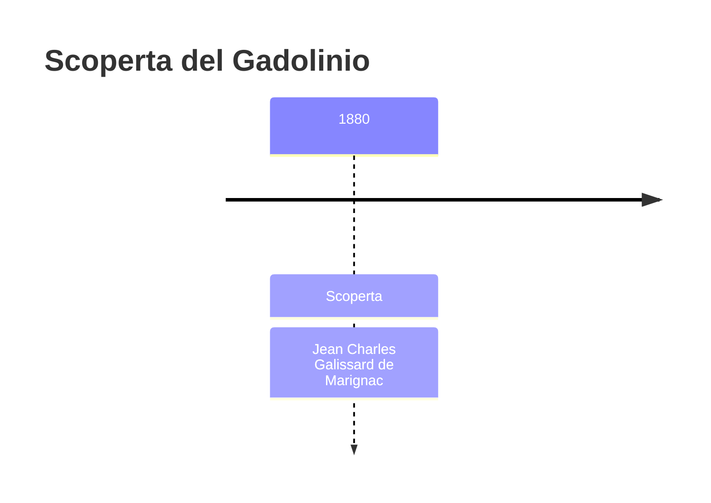
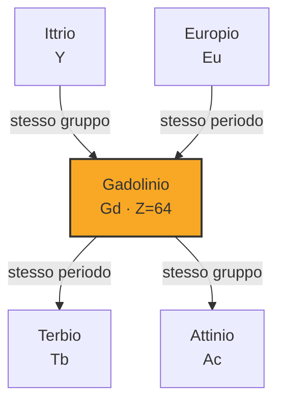
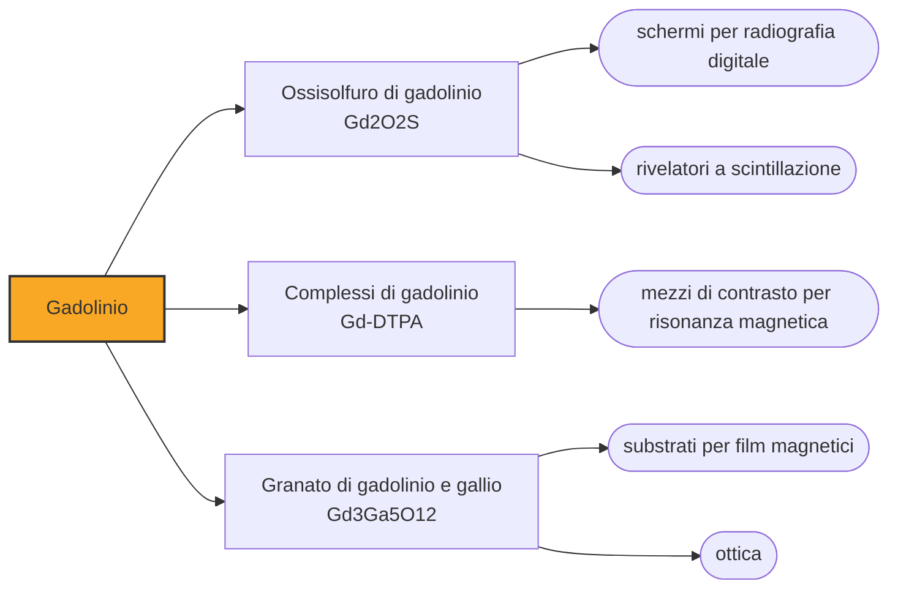

# Gadolinio (Gd)

> [!abstract] 72° elemento scoperto — 1880
> È l'unico elemento che diventa magnetico quando fa freddo in una stanza: sotto i venti gradi si comporta come il ferro, sopra smette. E per questo raffredda, riscalda e illumina le risonanze magnetiche.

Il gadolinio è il quarto elemento ferromagnetico a temperatura ordinaria, dopo ferro, cobalto e nichel, ma con una differenza: la sua temperatura di Curie è a 20,1 gradi, cioè dentro l'intervallo delle temperature di una giornata. Sopra quel valore il magnetismo sparisce, sotto torna, e su questa soglia si costruiscono macchine che raffreddano senza compressori.

## Cronologia della scoperta

> [!info] Nota sulla cronologia
> Marignac ne osservò le righe nel 1880 senza riuscire a isolarlo; fu Lecoq de Boisbaudran a separarlo nel 1886 e a dargli il nome, dal minerale gadolinite. Il metallo puro è del 1935, ottenuto da Félix Trombe.

## Storia della scoperta

Nel 1880, a Ginevra, Jean Charles Galissard de Marignac osservò allo spettroscopio righe che non appartenevano a nessun elemento noto in campioni ricavati dalla gadolinite e dal didimio. Non riuscì a isolare la sostanza, ma l'osservazione era netta abbastanza da valere un annuncio: era il secondo elemento che trovava in due anni, dopo l'itterbio.

A separare la nuova terra e a darle un nome fu Paul-Émile Lecoq de Boisbaudran, che nel 1886 la isolò e la chiamò gadolinio dal minerale gadolinite, il quale a sua volta portava il nome del chimico finlandese Johan Gadolin, che nel 1794 aveva aperto tutta la vicenda delle terre rare analizzando la pietra nera di Ytterby.

Il gadolinio è così uno dei pochi elementi che portano, per interposta persona, il nome di uno scienziato: non gli fu intitolato direttamente, ma attraverso il minerale che qualcun altro aveva già dedicato a Gadolin. È una catena di rinvii che dice quanto quella pietra svedese fosse diventata un luogo della memoria chimica.

Il metallo puro arrivò nel 1935, per mano del francese Félix Trombe, cinquantacinque anni dopo l'osservazione di Marignac. Come per tutti i lantanidi, il ritardo non era di comprensione ma di tecnica: separare elementi che si comportano quasi allo stesso modo ha richiesto metodi che sono maturati solo nel Novecento.

## Posizione nella tavola periodica

## Caratteristiche

Gli elementi ferromagnetici a temperatura ambiente sono quattro: ferro, con temperatura di Curie a 770 gradi, cobalto a 1130, nichel a 354 e gadolinio a 20,1. Il gadolinio è il caso limite, quello in cui la soglia cade dove cade la temperatura di una stanza: un pezzo di gadolinio tenuto in mano smette di essere attratto da un magnete, e raffreddato torna a esserlo.

Vicino alla temperatura di Curie il gadolinio mostra un effetto magnetocalorico marcato: entrando in un campo magnetico si scalda, uscendone si raffredda. Ripetendo il ciclo e portando via il calore al momento giusto si ottiene una pompa di calore senza gas e senza compressore, ed è il principio della refrigerazione magnetica, di cui il gadolinio resta il materiale di riferimento.

Il gadolinio-157 ha la sezione d'urto per la cattura dei neutroni termici più alta di qualunque nuclide stabile: circa 259.000 barn, decine di migliaia di volte quella degli assorbitori ordinari. Un velo di gadolinio ferma un flusso di neutroni che attraverserebbe spessori di piombo senza accorgersene, e questa proprietà lo mette insieme nelle barre di controllo dei reattori e negli schermi della radiografia neutronica.

Nella crosta terrestre è a circa sei parti per milione, fra i lantanidi più comuni, e si ricava da monazite e bastnäsite come tutta la famiglia. Nei composti sta nello stato +3, e i suoi ioni sono incolori: il guscio f semipieno, con sette elettroni spaiati, è ciò che gli dà insieme il magnetismo e la trasparenza ottica.

### Dati fisico-chimici

| Proprietà | Valore |
|---|---|
| Numero atomico | 64 |
| Massa atomica | 157,253 u |
| Categoria | Lantanide |
| Gruppo | 3 |
| Periodo | 6 |
| Blocco | f |
| Configurazione elettronica | [Xe] 4f⁷ 5d¹ 6s² |
| Punto di fusione | 1311,9 °C |
| Punto di ebollizione | 2999,9 °C |
| Densità | 7,9 g/cm³ |
| Stati di ossidazione | +3 |

## Struttura atomica

![[atomo-Gadolinio.svg]]

## Usi e presenza in natura

L'impiego che ne consuma di più in medicina sono i mezzi di contrasto per la risonanza magnetica: complessi organici di gadolinio, iniettati in vena, accorciano i tempi di rilassamento dei protoni dell'acqua nei tessuti in cui si accumulano, e li fanno risaltare nell'immagine. Il gadolinio libero sarebbe tossico, e la molecola che lo racchiude serve proprio a portarlo dentro e a riportarlo fuori intatto.

Nei reattori nucleari il gadolinio fa da veleno neutronico nelle barre di controllo e nei combustibili, dove regola la reattività consumandosi con l'invecchiamento della carica; nella radiografia digitale gli schermi di ossisolfuro di gadolinio drogato al terbio convertono i raggi X in luce visibile, riducendo la dose necessaria a ottenere un'immagine.

In metallurgia bastano frazioni di punto percentuale di gadolinio per migliorare la lavorabilità del ferro e del cromo e la resistenza alle alte temperature; il granato di gadolinio e gallio è invece il substrato su cui si facevano crescere le memorie a bolle magnetiche, una tecnologia degli anni Settanta oggi superata ma che ha lasciato in eredità metodi di crescita dei cristalli ancora in uso.

## Curiosità

La temperatura di Curie del gadolinio è così vicina a quella ambiente che se ne fa una dimostrazione da tavolo: si appende un pezzo di gadolinio a un magnete, lo si scalda con un fon e quello cade da solo; lo si raffredda e risale. È l'unico elemento con cui si può mostrare la transizione ferromagnetica in un'aula, senza fornaci né azoto liquido.

Johan Gadolin, il chimico finlandese a cui l'elemento deve indirettamente il nome, non ne vide mai nemmeno un granello: morì nel 1852, ventotto anni prima dell'osservazione di Marignac. Quello che aveva fatto, nel 1794, era analizzare una pietra nera che qualcuno gli aveva mandato da una cava vicino a Stoccolma, e annunciarvi una terra nuova.

## Nella cronologia

← Precedente: [[Tulio]] (1879)
→ Successivo: [[Praseodimio]] (1885)

Epoca: [[Spettroscopia e radioattività]] · Scopritore: [[Jean Charles Galissard de Marignac]]

## Fonti

- [Gadolinium](https://en.wikipedia.org/wiki/Gadolinium) — consultata il 09/09/2026
- [Gadolinium — Royal Society of Chemistry](https://periodic-table.rsc.org/element/64/gadolinium) — consultata il 09/09/2026
- [Magnetic refrigeration](https://en.wikipedia.org/wiki/Magnetic_refrigeration) — consultata il 09/09/2026
