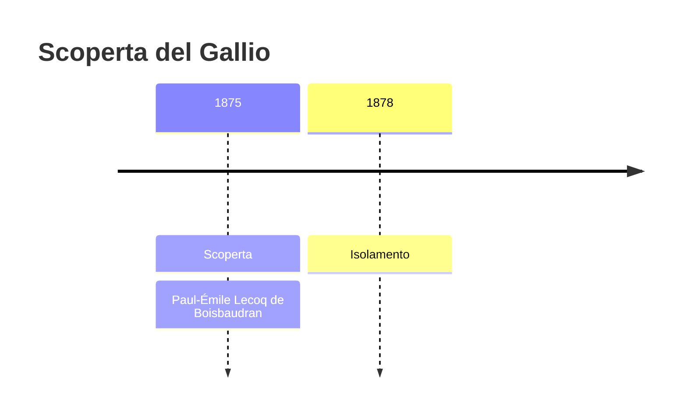
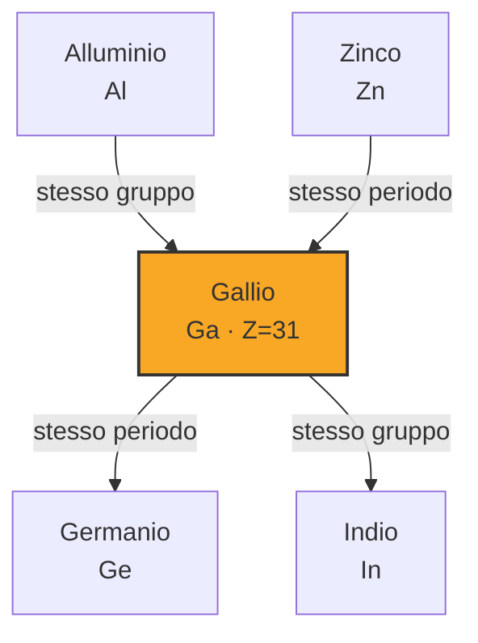

# Gallio (Ga)

> [!abstract] 66° elemento scoperto — 1875
> 

## Cronologia della scoperta

## Storia della scoperta

## Posizione nella tavola periodica

## Caratteristiche

### Dati fisico-chimici

| Proprietà | Valore |
|---|---|
| Numero atomico | 31 |
| Massa atomica | 69,7231 u |
| Categoria | Metallo post-transizione |
| Gruppo | 13 |
| Periodo | 4 |
| Blocco | p |
| Configurazione elettronica | [Ar] 3d¹⁰ 4s² 4p¹ |
| Punto di fusione | 29,8 °C |
| Punto di ebollizione | 2399,9 °C |
| Densità | 5,91 g/cm³ |
| Stati di ossidazione | — |

## Struttura atomica

![[atomo-Gallio.svg]]

## Usi e presenza in natura

## Nella cronologia

← Precedente: [[Elio]] (1868)
→ Successivo: [[Olmio]] (1878)

Epoca: [[Spettroscopia e radioattività]] · Scopritore: [[Paul-Émile Lecoq de Boisbaudran]]

## Fonti

