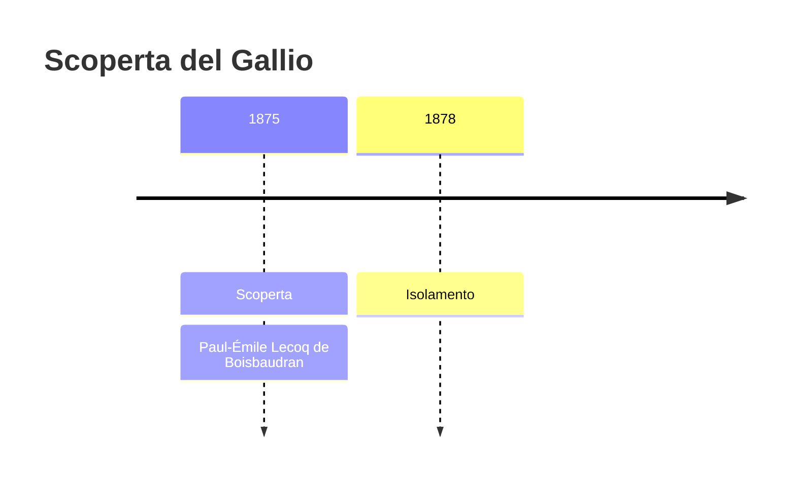
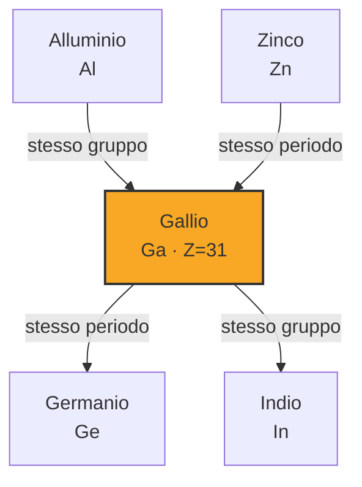
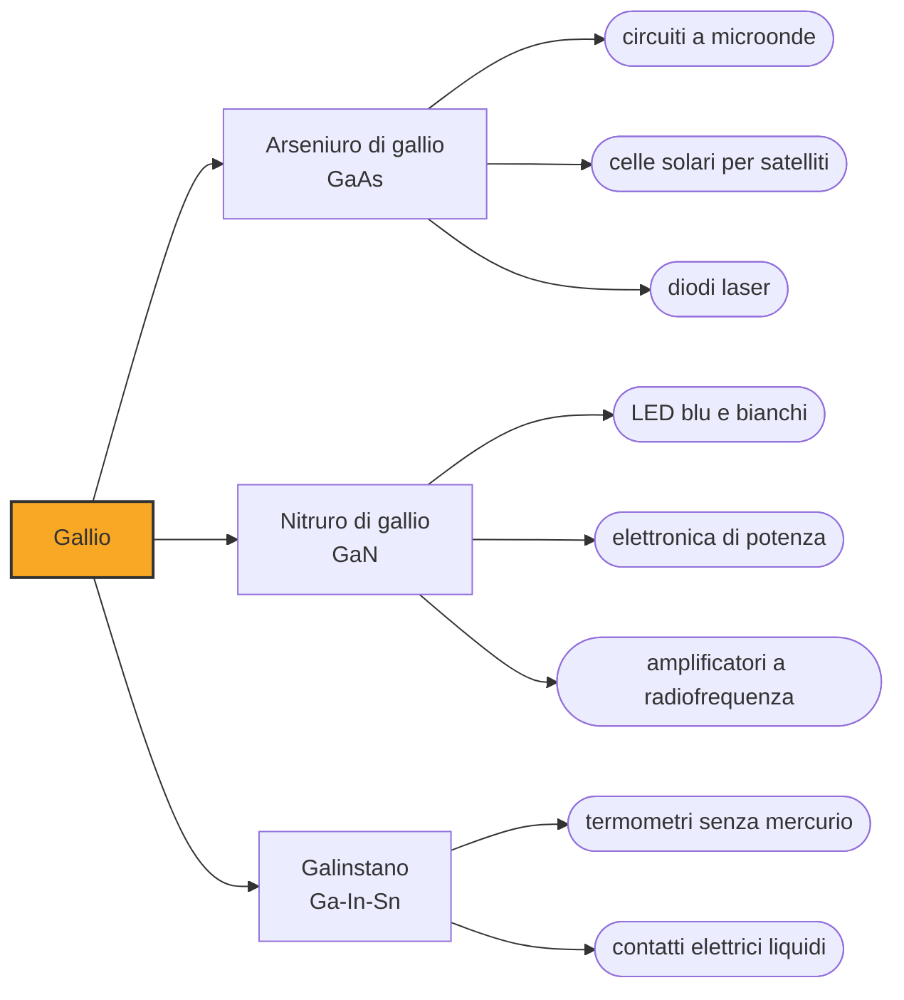

# Gallio (Ga)

> [!abstract] 66° elemento scoperto — 1875
> Mendeleev aveva lasciato una casella vuota sotto l'alluminio e ne aveva descritto l'occupante prima che esistesse. Quando qualcuno lo trovò, gli scrisse per dirgli che aveva misurato male la densità.

Il gallio è un metallo argenteo che fonde a 29,8 gradi: un pezzo tenuto nel palmo della mano diventa liquido in pochi minuti. Da liquido bagna il vetro e la pelle, e solidificando si espande invece di contrarsi, come fa l'acqua. Non se ne vedono oggetti perché non serve a fare oggetti: serve a fare semiconduttori.

## Cronologia della scoperta

## Storia della scoperta

Nel 1869 Dmitrij Mendeleev aveva ordinato gli elementi per peso atomico e si era trovato con dei buchi. Invece di ignorarli, li usò: se la tavola era una legge di natura, quei buchi erano elementi non ancora trovati, e le proprietà dei vicini dicevano quali dovessero essere. Nel 1871 descrisse l'occupante della casella sotto l'alluminio, lo chiamò eka-alluminio e ne indicò peso atomico, densità, punto di fusione basso e il modo in cui lo si sarebbe trovato.

Nel 1875 Paul-Émile Lecoq de Boisbaudran esaminava allo spettroscopio un campione di sfalerite dei Pirenei, un minerale di zinco, e vi trovò due righe viola che non appartenevano a nulla di conosciuto. Ne isolò il metallo per elettrolisi in poche settimane, e lo chiamò gallio.

Poco dopo l'annuncio, Lecoq de Boisbaudran ricevette una lettera da Pietroburgo: Mendeleev gli faceva notare che il nuovo elemento era il suo eka-alluminio e che la densità misurata, 4,7 grammi per centimetro cubo, doveva essere sbagliata, perché la teoria ne prevedeva quasi sei. Il francese rifece la misura su un campione più puro e trovò 5,9. La tavola periodica aveva corretto un dato sperimentale.

Sul nome si discusse. Gallia è il nome latino della Francia, ma gallus in latino significa gallo, e il cognome dello scopritore, Lecoq, in francese vuol dire esattamente la stessa cosa: molti lessero il battesimo come una firma nascosta. Lecoq de Boisbaudran smentì per iscritto nel 1877, dichiarando di aver pensato soltanto alla Francia.

L'effetto della vicenda fu enorme e riguardava la tavola più che l'elemento. Fino ad allora la periodicità era uno schema utile; una previsione verificata nei dettagli, e capace perfino di smentire una misura, la trasformò in una legge su cui si poteva contare. Nei dieci anni successivi la stessa cosa sarebbe accaduta altre due volte, con lo scandio e con il germanio.

## Posizione nella tavola periodica

## Caratteristiche

Il punto di fusione a 29,8 gradi e il punto di ebollizione a oltre 2200 fanno del gallio il metallo con l'intervallo di stato liquido più ampio che si conosca: resta liquido per più di duemila gradi. È la ragione per cui riempie i termometri ad alta temperatura, dove il mercurio bollirebbe.

Solidificando aumenta di volume di circa il tre per cento, e questo lo rende capace di rompere i contenitori in cui lo si congela; da liquido bagna la maggior parte delle superfici, vetro compreso, il che lo rende scomodo da maneggiare quanto è comodo da fondere. In lega con indio e stagno forma il galinstano, liquido già a meno diciannove gradi, che ha sostituito il mercurio nei termometri clinici.

Il gallio liquido penetra nei bordi dei grani cristallini dell'alluminio e ne distrugge la coesione: una goccia su una lattina la rende fragile come carta nel giro di ore. Per questa ragione è vietato a bordo degli aerei in quantità significative, e nei laboratori si tiene lontano dalle strutture leggere.

### Dati fisico-chimici

| Proprietà | Valore |
|---|---|
| Numero atomico | 31 |
| Massa atomica | 69,7231 u |
| Categoria | Metallo post-transizione |
| Gruppo | 13 |
| Periodo | 4 |
| Blocco | p |
| Configurazione elettronica | [Ar] 3d¹⁰ 4s² 4p¹ |
| Punto di fusione | 29,8 °C |
| Punto di ebollizione | 2399,9 °C |
| Densità | 5,91 g/cm³ |
| Stati di ossidazione | +3 |

## Struttura atomica

![[atomo-Gallio.svg]]

## Usi e presenza in natura

Quasi tutto il gallio prodotto finisce in composti semiconduttori. L'arseniuro di gallio è il materiale dei circuiti a microonde e dei componenti veloci, e delle celle solari ad alta efficienza per i satelliti; il nitruro di gallio è quello dei LED blu e violetti e dei diodi laser, e negli ultimi anni è diventato il materiale dell'elettronica di potenza, che regge tensioni e frequenze dove il silicio non arriva.

Il LED bianco delle lampade di casa è, sotto il rivestimento giallo, un LED blu al nitruro di indio e gallio: il fosforo che lo copre converte parte di quel blu in giallo, e la somma dà il bianco. La stessa famiglia di materiali fa i laser dei lettori Blu-ray e i LED delle insegne.

Il gallio non ha minerali propri e si ricava come sottoprodotto: soprattutto dalla bauxite lavorata per l'alluminio, in misura minore dai residui dello zinco. La produzione è concentrata in pochi paesi — nel 2023 la Cina ne forniva circa l'ottanta per cento — e questo lo ha reso una delle materie prime che compaiono negli elenchi dei materiali critici.

## Curiosità

*Per tradizione:* Il gallio è protagonista di uno scherzo classico da laboratorio: un cucchiaino fuso e colato in uno stampo sembra un normale cucchiaino di metallo, finché non lo si immerge nel tè caldo, dove scompare in pochi secondi lasciando una pozza argentea sul fondo della tazza.

Per trent'anni il gallio è servito a osservare il Sole in un modo che nessun telescopio permette: gli esperimenti sui neutrini solari usavano decine di tonnellate di cloruro di gallio in caverne sotterranee, perché un neutrino che colpisce un nucleo di gallio-71 lo trasforma in germanio-71, e contando quegli atomi si contano i neutrini arrivati dal nucleo del Sole.

## Nella cronologia

← Precedente: [[Elio]] (1868)
→ Successivo: [[Olmio]] (1878)

Epoca: [[Spettroscopia e radioattività]] · Scopritore: [[Paul-Émile Lecoq de Boisbaudran]]

## Fonti

- [Gallium](https://en.wikipedia.org/wiki/Gallium) — consultata il 09/09/2026
- [Gallium — Royal Society of Chemistry](https://periodic-table.rsc.org/element/31/gallium) — consultata il 09/09/2026
- [Mendeleev's predicted elements](https://en.wikipedia.org/wiki/Mendeleev%27s_predicted_elements) — consultata il 09/09/2026
