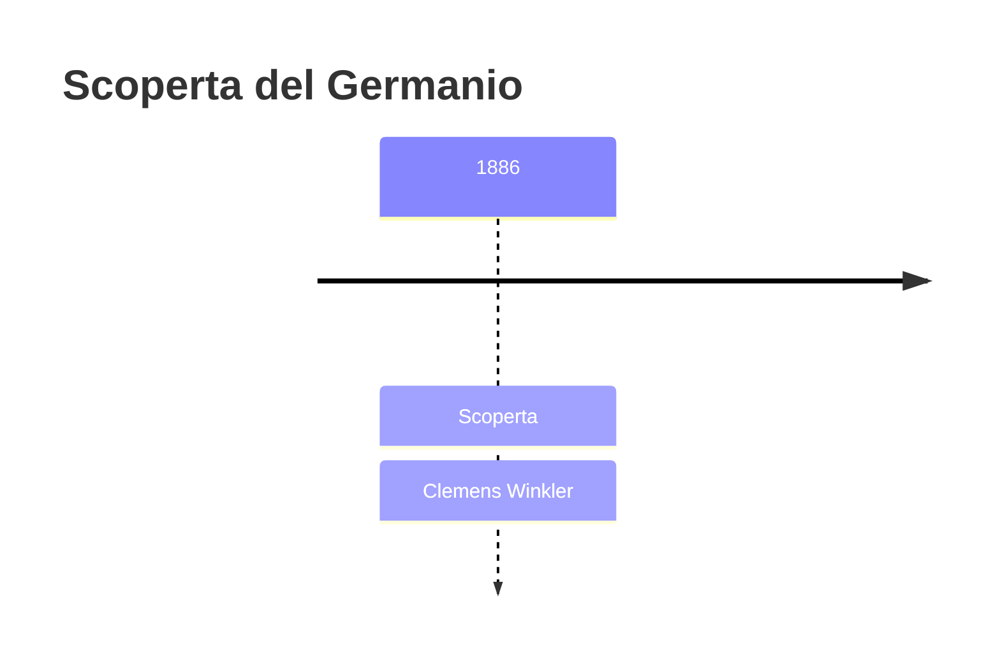
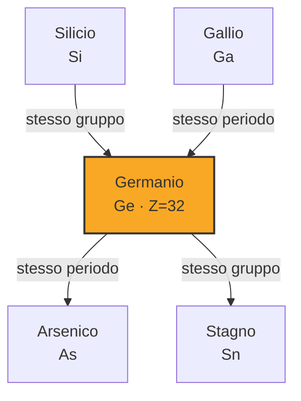
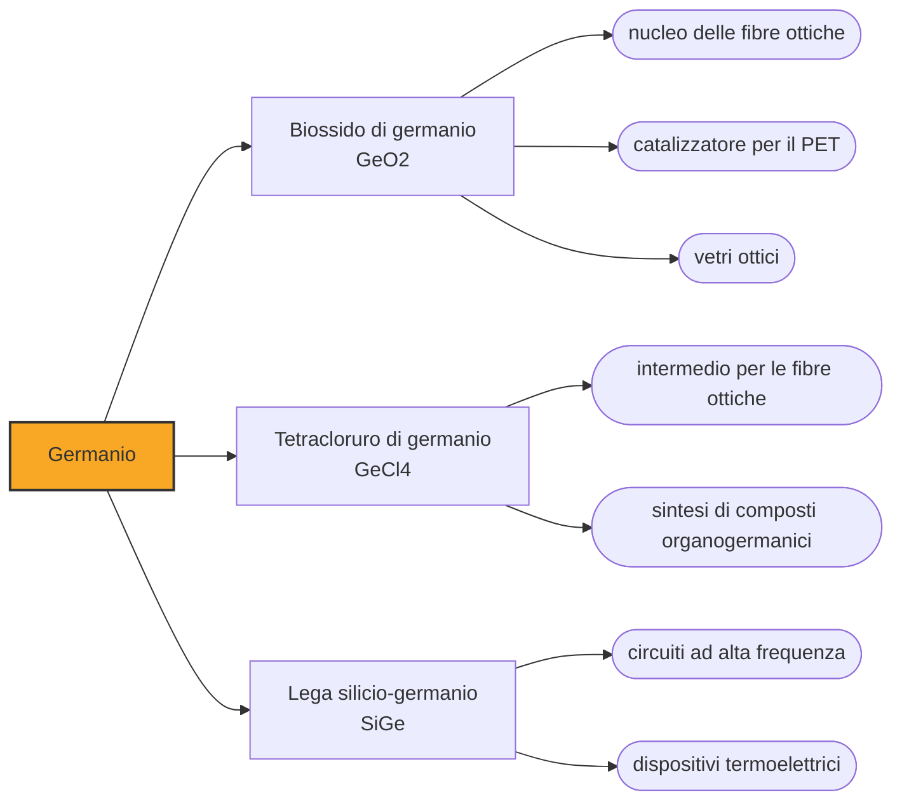

# Germanio (Ge)

> [!abstract] 74° elemento scoperto — 1886
> Winkler cercava di far tornare i conti di un minerale d'argento: pesava tutto e gli mancava il sette per cento. Quel buco nella bilancia era un elemento che Mendeleev aveva descritto quindici anni prima.

Il germanio è un semimetallo grigio e fragile che ha fatto da culla a tutta l'elettronica a stato solido: i primi transistor erano di germanio, e solo dopo il silicio lo ha sostituito quasi ovunque. Oggi lavora dove il silicio non arriva, cioè nell'infrarosso e nelle fibre ottiche.

## Cronologia della scoperta

## Storia della scoperta

Nel 1869 Mendeleev aveva previsto un elemento nella casella vuota sotto il silicio, l'eka-silicio, indicandone la massa atomica intorno a 70, la densità, il colore grigio e perfino il comportamento del suo ossido e del suo cloruro. Era la terza delle sue previsioni verificabili, e la più dettagliata.

Nel 1885 in una miniera presso Freiberg, in Sassonia, si trovò un minerale d'argento nuovo, che fu chiamato argirodite. Clemens Winkler ne fece l'analisi completa e si trovò davanti a un problema: sommando argento, zolfo e le altre componenti identificate arrivava solo al novantatré per cento del peso. Mancava un sette per cento che non riusciva ad attribuire a nulla di conosciuto.

Inseguire quel residuo gli prese mesi. Alla fine ne isolò l'elemento e ne misurò le proprietà, e all'inizio credette che si trattasse dell'eka-antimonio, un'altra delle caselle vuote; solo poco dopo si convinse che era invece l'eka-silicio, esattamente com'era stato descritto quindici anni prima da un chimico che quel minerale non lo aveva mai visto.

Winkler avrebbe voluto chiamarlo neptunium, dal pianeta la cui esistenza era stata anch'essa prevista prima dell'osservazione, ma quel nome era già stato usato per una rivendicazione precedente e rimasto in circolazione. Scelse allora germanium, dal nome latino della propria patria, sulla scia del gallio che aveva preso il nome dalla Francia.

Il confronto fra le proprietà previste e quelle misurate è rimasto il pezzo forte di ogni manuale di chimica: massa atomica prevista 72, trovata 72,6; densità prevista 5,5, trovata 5,47; il cloruro previsto liquido e bollente sotto i cento gradi, trovato liquido e bollente a ottantasei. Dopo il germanio nessuno discusse più la tavola periodica.

## Posizione nella tavola periodica

## Caratteristiche

Il germanio ha la stessa struttura cristallina del diamante e del silicio e ne condivide il comportamento: non è né un metallo né un isolante, e la sua conducibilità si comanda drogandolo con quantità minime di altri elementi. È questa proprietà, incomprensibile fino agli anni Trenta del Novecento, ad averlo portato al centro della tecnologia del dopoguerra.

È opaco alla luce visibile ma trasparente all'infrarosso, e il suo ossido ha un indice di rifrazione alto con una dispersione bassa. Sono le due proprietà su cui si reggono i suoi usi ottici: da una parte le lenti delle termocamere, che devono lasciar passare il calore e non la luce, dall'altra il nucleo delle fibre ottiche, dove serve un vetro che rifranga un po' più del mantello che lo circonda.

Come l'acqua, il silicio e il gallio, il germanio si espande solidificando: il solido è meno denso del liquido. È una stranezza che condivide con pochi altri materiali e che dipende dalla struttura aperta del reticolo, dove ogni atomo ha solo quattro vicini invece dei dodici di un metallo ordinario.

### Dati fisico-chimici

| Proprietà | Valore |
|---|---|
| Numero atomico | 32 |
| Massa atomica | 72,6308 u |
| Categoria | Semimetallo |
| Gruppo | 14 |
| Periodo | 4 |
| Blocco | p |
| Configurazione elettronica | [Ar] 3d¹⁰ 4s² 4p² |
| Punto di fusione | 938,3 °C |
| Punto di ebollizione | 2832,9 °C |
| Densità | 5,323 g/cm³ |
| Stati di ossidazione | -4, +2, +4 |

## Struttura atomica

![[atomo-Germanio.svg]]

## Usi e presenza in natura

Il transistor del 1947, ai Bell Labs, era un contatto puntiforme su un cristallo di germanio, e per un quarto di secolo il germanio è stato il materiale dell'elettronica a stato solido: radioline, calcolatori, i primi computer commerciali. Il silicio lo ha poi sostituito quasi ovunque perché regge temperature più alte e ha correnti di dispersione molto più basse, ma per farlo ha richiesto un grado di purezza che negli anni Cinquanta nessuno sapeva raggiungere. Il germanio ha tenuto il campo finché la metallurgia del silicio non è maturata, e in quel frattempo ha insegnato agli ingegneri come si progetta un circuito a semiconduttori.

Oggi il grosso del germanio va nelle fibre ottiche, dove il biossido drogato nel nucleo di vetro ne alza l'indice di rifrazione quel tanto che basta a intrappolare la luce, e nelle ottiche a infrarossi: le lenti delle termocamere, dei sistemi di visione notturna e dei sensori termici industriali sono quasi tutte di germanio.

Il resto si divide fra il ruolo di catalizzatore nella produzione del PET, la plastica delle bottiglie, e le celle solari multigiunzione per i satelliti, dove il germanio fa da substrato e da giunzione inferiore. La produzione mondiale si misura in poche centinaia di tonnellate l'anno e viene quasi tutta come sottoprodotto dello zinco e delle ceneri di carbone.

## Curiosità

I rivelatori di raggi gamma più precisi che esistano sono cristalli singoli di germanio ultrapuro, raffreddati con azoto liquido: distinguono energie che gli altri rivelatori confondono, e sono lo strumento con cui si identificano gli isotopi in un campione sconosciuto, dai reperti archeologici ai controlli sulle contaminazioni radioattive.

Il nome neptunium che Winkler scartò non andò perduto: fu usato nel 1940 per l'elemento 93, il primo dei transuranici, che sta nella tavola periodica subito dopo l'uranio come Nettuno sta nel sistema solare subito dopo Urano. La logica del battesimo è la stessa che aveva in mente Winkler, con cinquant'anni di ritardo.

## Nella cronologia

← Precedente: [[Praseodimio]] (1885)
→ Successivo: [[Disprosio]] (1886)

Epoca: [[Spettroscopia e radioattività]] · Scopritore: [[Clemens Winkler]]

## Fonti

- [Germanium](https://en.wikipedia.org/wiki/Germanium) — consultata il 09/09/2026
- [Germanium — Royal Society of Chemistry](https://periodic-table.rsc.org/element/32/germanium) — consultata il 09/09/2026
- [Mendeleev's predicted elements](https://en.wikipedia.org/wiki/Mendeleev%27s_predicted_elements) — consultata il 09/09/2026
