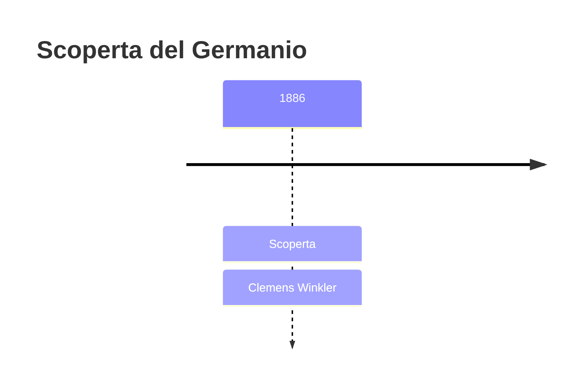
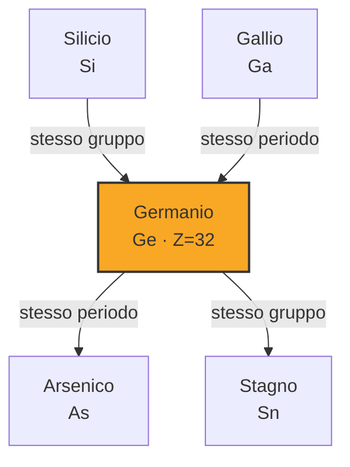

# Germanio (Ge)

> [!abstract] 74° elemento scoperto — 1886
> 

## Cronologia della scoperta

## Storia della scoperta

## Posizione nella tavola periodica

## Caratteristiche

### Dati fisico-chimici

| Proprietà | Valore |
|---|---|
| Numero atomico | 32 |
| Massa atomica | 72,6308 u |
| Categoria | Semimetallo |
| Gruppo | 14 |
| Periodo | 4 |
| Blocco | p |
| Configurazione elettronica | [Ar] 3d¹⁰ 4s² 4p² |
| Punto di fusione | 938,3 °C |
| Punto di ebollizione | 2832,9 °C |
| Densità | 5,323 g/cm³ |
| Stati di ossidazione | — |

## Struttura atomica

![[atomo-Germanio.svg]]

## Usi e presenza in natura

## Nella cronologia

← Precedente: [[Praseodimio]] (1885)
→ Successivo: [[Disprosio]] (1886)

Epoca: [[Spettroscopia e radioattività]] · Scopritore: [[Clemens Winkler]]

## Fonti

