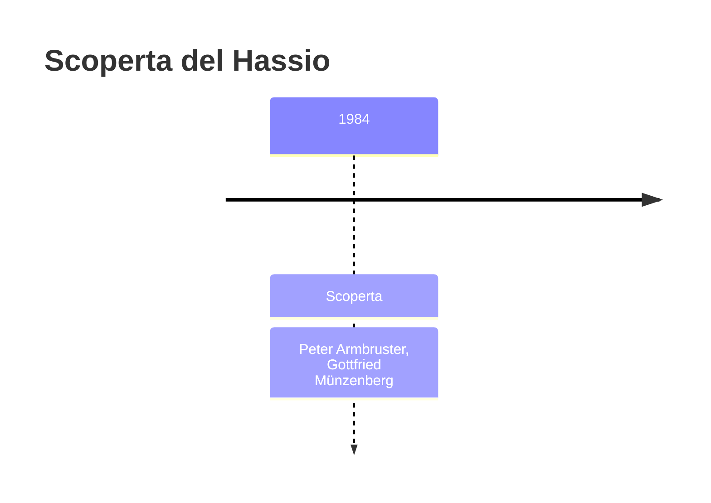
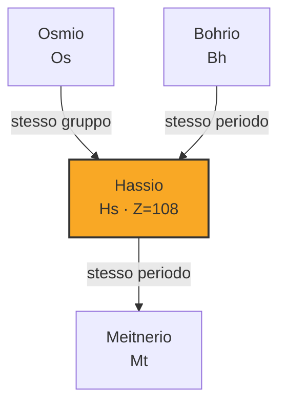

# Hassio (Hs)

> [!abstract] 109° elemento scoperto — 1984
> 

## Cronologia della scoperta

## Storia della scoperta

## Posizione nella tavola periodica

## Caratteristiche

### Dati fisico-chimici

| Proprietà | Valore |
|---|---|
| Numero atomico | 108 |
| Massa atomica | 269,0 u |
| Categoria | Metallo di transizione |
| Gruppo | 8 |
| Periodo | 7 |
| Blocco | d |
| Configurazione elettronica | [Rn] 5f¹⁴ 6d⁶ 7s² |
| Punto di fusione | -147,2 °C |
| Punto di ebollizione | dato non disponibile |
| Densità | 40,7 g/cm³ |
| Stati di ossidazione | — |

## Struttura atomica

![[atomo-Hassio.svg]]

## Usi e presenza in natura

## Nella cronologia

← Precedente: [[Meitnerio]] (1982)
→ Successivo: [[Darmstadtio]] (1994)

Epoca: [[Era nucleare]] · Scopritori: [[Peter Armbruster]], [[Gottfried Münzenberg]]

## Fonti

