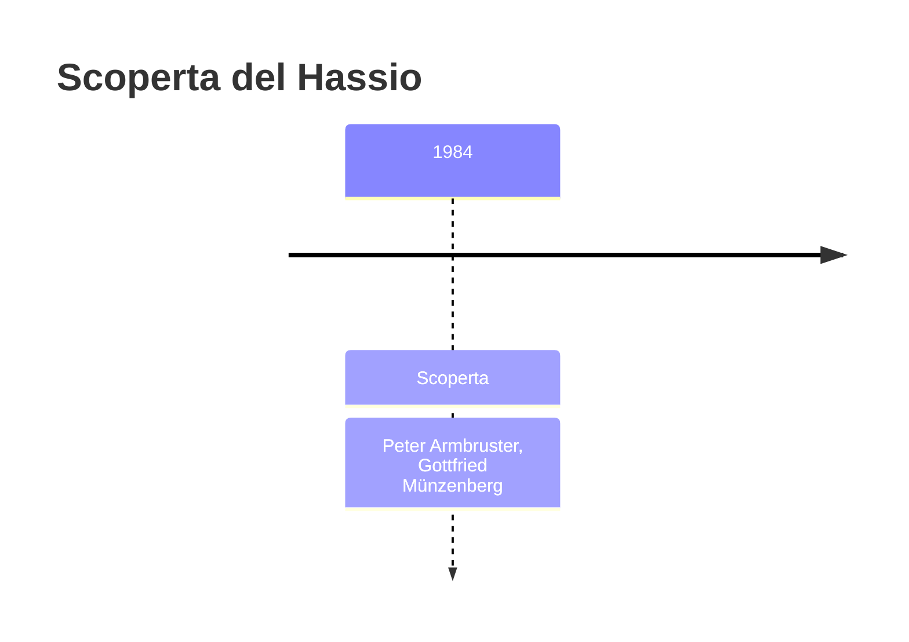
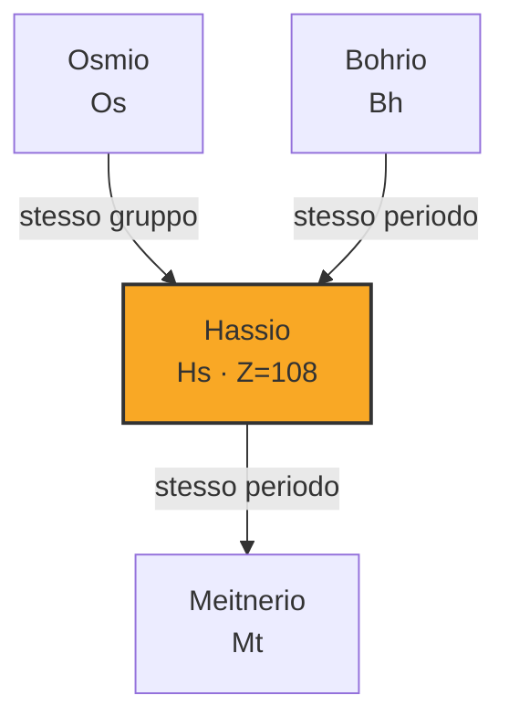
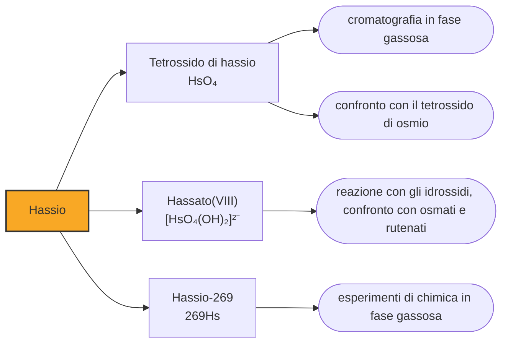

# Hassio (Hs)

> [!abstract] 109° elemento scoperto — 1984
> Nel 1963 un geologo sovietico dichiarò di aver trovato l'elemento 108 in un minerale, perché quel minerale bollito nell'acido nitrico dava un ossido volatile come l'osmio. La scoperta era falsa. Il ragionamento era giusto.

Dell'hassio si conosce la chimica per esperimento e non per calcolo, il che in questa parte della tavola periodica è tutt'altro che scontato: se ne conosce un composto vero, si sa quanto è volatile e a quale temperatura si deposita, e lo si è potuto confrontare con l'elemento che gli sta sopra nella stessa colonna. È anche l'elemento i cui nuclei durano molto più a lungo di quanto la sola carica elettrica lascerebbe prevedere, e le due cose sono collegate.

## Cronologia della scoperta

> [!info] Nota sulla cronologia
> La cronologia adotta il 1984 e attribuisce la scoperta al GSI: Dubna aveva rivendicato l'elemento nello stesso anno, ma la commissione congiunta ha giudicato conclusivo il solo rapporto tedesco. La proposta IUPAC del 1994 avrebbe assegnato a questa casella il nome hahnium; hassium è definitivo dal 1997. La rivendicazione di un elemento 108 naturale, il «sergenio» del 1963, non è mai stata accettata.

## Storia della scoperta

Il gruppo di Darmstadt arrivò alla casella 108 nel 1984, bombardando piombo-208 con ioni di ferro-58 e ottenendo tre atomi di hassio-265; due anni dopo ne produsse uno di hassio-264. A Dubna il gruppo di Oganesjan aveva registrato una ventina di eventi di fissione spontanea che attribuiva allo stesso elemento, ma senza la stessa possibilità di risalire al numero atomico. La commissione internazionale giudicò il rapporto tedesco conclusivo di per sé.

Il GSI propose hassium, dal latino Hassia, cioè l'Assia, il Land tedesco in cui sta Darmstadt. La proposta IUPAC del 1994 avrebbe voluto chiamare questa casella hahnium, spostandoci il nome che Berkeley aveva scelto per la 105; il laboratorio tedesco protestò, e la sistemazione del 1997 restituì all'elemento il nome della regione in cui era stato fatto.

Vent'anni prima, però, qualcuno aveva già annunciato l'elemento 108, e non in un acceleratore. Nel 1963 il geologo sovietico Viktor Čerdyncev sostenne di averlo trovato nella molibdenite, in un isotopo con un'emivita di quattrocento o cinquecento milioni di anni, e propose di chiamarlo sergenium, dal nome della via della seta, con il simbolo Sg. La sua ragione era chimica: quei minerali, bolliti nell'acido nitrico, davano ossidi volatili come fa l'osmio, e sotto l'osmio nella tavola c'è la casella 108.

La rivendicazione fu demolita da altri fisici sovietici, e non sul terreno della chimica ma su quello dei numeri: l'energia dei decadimenti alfa dichiarati era molti ordini di grandezza inferiore a quella attesa, e l'emivita annunciata incompatibile con quell'energia. Del sergenio non è rimasto nulla, salvo il simbolo Sg, che trent'anni dopo è andato al seaborgio.

## Posizione nella tavola periodica

## Caratteristiche

L'esperimento che ha dato all'hassio una chimica è del 2001. Sette atomi, prodotti bombardando curio-248 con magnesio-26, furono rallentati e fatti reagire con una miscela di elio e ossigeno: ne uscì il tetrossido di hassio, HsO₄, esattamente come l'osmio dà il tetrossido di osmio. Nella stessa colonna vennero fatti scorrere isotopi radioattivi di osmio come termine di paragone, così che le due sostanze si potessero confrontare nelle stesse condizioni.

Il tetrossido di hassio si depositò a una temperatura più alta di quello di osmio, cioè risultò meno volatile, che è ciò che ci si aspetta scendendo lungo il gruppo 8. L'energia con cui la molecola aderisce al quarzo fu misurata in circa quarantacinque kilojoule per mole, in accordo con il calcolo. Nel 2008 un esperimento successivo ha mostrato che quel tetrossido reagisce con gli idrossidi formando un hassato, come fanno i tetrossidi di rutenio e osmio.

La volatilità di questi tetrossidi ha una ragione geometrica: la molecola è un tetraedro regolare con l'atomo metallico al centro e quattro ossigeni ai vertici, quindi perfettamente simmetrica e priva di polarità. Molecole così si attraggono poco fra loro ed evaporano facilmente. È la stessa proprietà che rende il tetrossido di osmio un reattivo pericoloso da maneggiare, ed è ciò che ha permesso di fare chimica su sette atomi trasportandoli in un flusso di gas.

L'altra particolarità dell'hassio riguarda il nucleo. I nuclei di questa regione non sono sferici ma allungati, e per nuclei deformati i calcoli indicano numeri magici diversi da quelli noti: centosessantadue neutroni e centotto protoni. L'hassio ha esattamente centotto protoni, e i suoi isotopi attorno ai centosessantadue neutroni resistono alla fissione spontanea molto più dei vicini. È un'isola di stabilità, più modesta di quella sferica che si cerca più avanti, ma reale e già raggiunta.

Gli isotopi noti dell'hassio sono una dozzina e nessuno arriva al minuto: l'hassio-271 tocca i tre quarti di minuto, l'hassio-269 una decina di secondi. Sono tempi lunghissimi per la casella 108, e sono proprio quelli che hanno reso possibile l'esperimento del 2001: con emivite dell'ordine del millisecondo, come quelle degli isotopi leggeri, non ci sarebbe stato modo di portare l'atomo dalla camera di reazione alla colonna.

### Dati fisico-chimici

| Proprietà | Valore |
|---|---|
| Numero atomico | 108 |
| Massa atomica | 269,0 u |
| Categoria | Metallo di transizione |
| Gruppo | 8 |
| Periodo | 7 |
| Blocco | d |
| Configurazione elettronica | [Rn] 5f¹⁴ 6d⁶ 7s² |
| Punto di fusione | -147,2 °C |
| Punto di ebollizione | dato non disponibile |
| Densità | 40,7 g/cm³ |
| Stati di ossidazione | +8 |

## Struttura atomica

![[atomo-Hassio.svg]]

## Usi e presenza in natura

L'hassio non ha usi: se ne producono singoli atomi, e la quantità totale mai esistita sulla Terra si conta nell'ordine delle centinaia di atomi. In natura non c'è, e le ricerche di un hassio primordiale condotte in laboratori sotterranei non hanno trovato nulla.

Serve però a due cose insieme. La prima è verificare che il gruppo 8 resti una famiglia coerente fin quaggiù, e la risposta è sì, con gli scarti giusti nella direzione giusta. La seconda è mappare l'isola di stabilità deformata attorno ai centosessantadue neutroni, che è la sola parte di quella regione già raggiungibile con gli acceleratori di oggi e il trampolino verso l'isola sferica prevista più avanti.

## Curiosità

Nel 1931, quando i transuranici non esistevano nemmeno come ipotesi seria, il fisico tedesco Richard Swinne propose che esistessero «regioni» di elementi transuranici a vita lunga, e ne collocò una attorno al numero atomico 108. Non aveva modo di dimostrarlo e non rivendicò alcuna scoperta, ma la posizione che indicò è esattamente quella dell'isola di stabilità deformata che i calcoli moderni assegnano all'hassio.

L'Assia non è l'unico luogo tedesco a comparire nella tavola periodica: due caselle più in là c'è il darmstadtio, intitolato alla città che dell'Assia fa parte. Lo stesso laboratorio ha dunque messo nella tavola la propria regione e il proprio comune, e fra i due ha collocato il meitnerio: tre caselle di fila che raccontano dove e da chi sono state riempite.

## Nella cronologia

← Precedente: [[Meitnerio]] (1982)
→ Successivo: [[Darmstadtio]] (1994)

Epoca: [[Era nucleare]] · Scopritori: [[Peter Armbruster]], [[Gottfried Münzenberg]]

## Fonti

- [Hassium](https://en.wikipedia.org/wiki/Hassium) — consultata il 10/09/2026
- [Hassium — Royal Society of Chemistry](https://periodic-table.rsc.org/element/108/hassium) — consultata il 10/09/2026
- [Island of stability](https://en.wikipedia.org/wiki/Island_of_stability) — consultata il 10/09/2026
