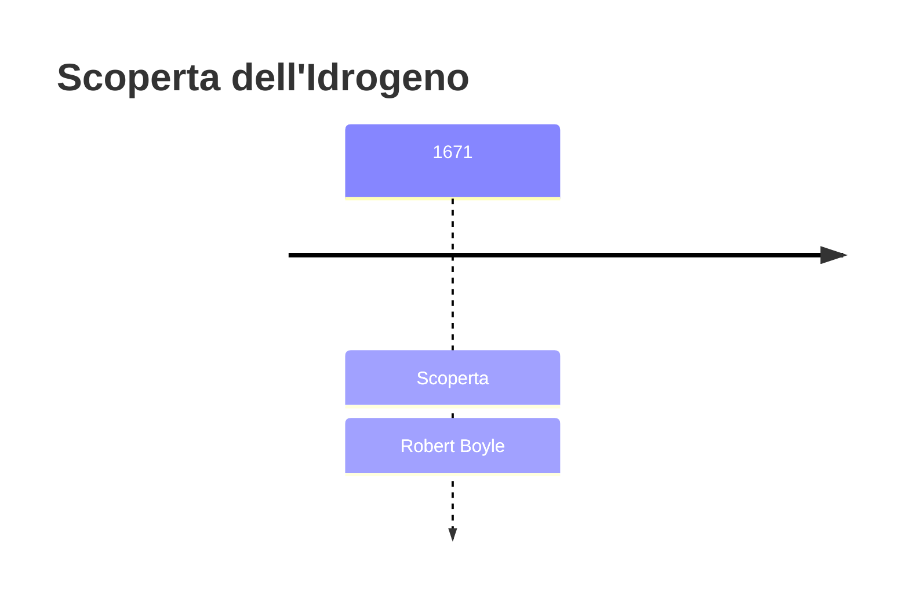
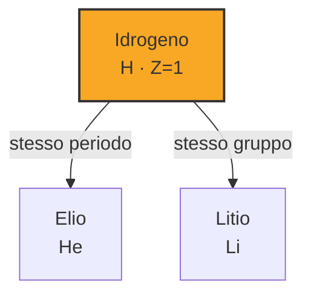
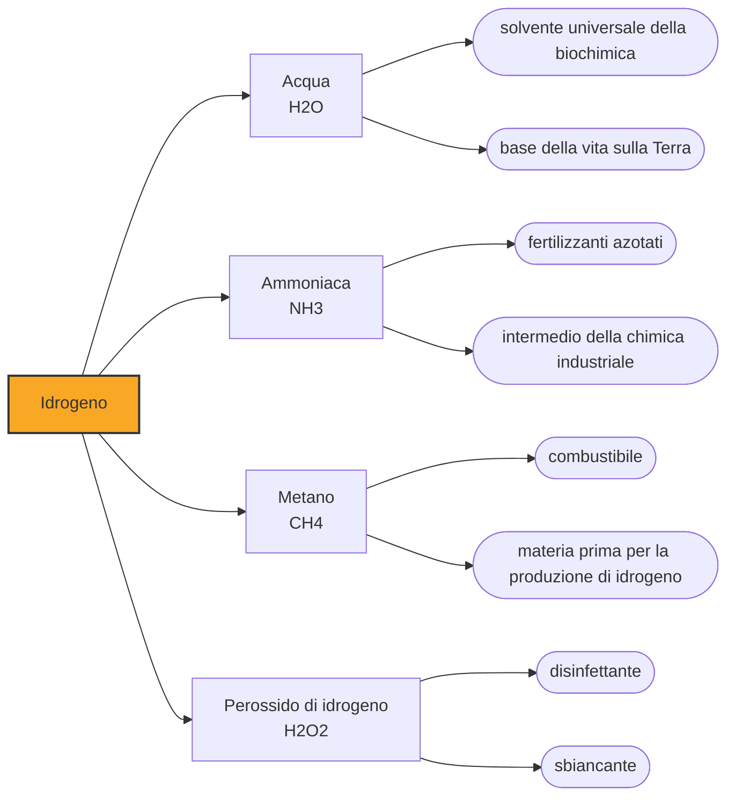

# Idrogeno (H)

> [!abstract] 16° elemento scoperto — 1671
> È il primo elemento della tavola, il più abbondante dell'universo e il più semplice che esista. Ci sono voluti due secoli e mezzo perché qualcuno capisse che cos'era.

L'idrogeno è un atomo ridotto all'essenziale: un protone e un elettrone, niente altro. Da questa semplicità estrema discendono tutti i suoi primati — è il numero uno della tavola periodica, costituisce circa tre quarti della materia ordinaria dell'universo ed è il combustibile delle stelle. Sulla Terra, però, non se ne trova quasi traccia allo stato libero, ed è per questo che è stato riconosciuto tardi.

## Cronologia della scoperta

## Storia della scoperta

Nel Seicento i gas sono il punto cieco della chimica. Si vedono, si sentono, a volte esplodono, ma non si sanno raccogliere né pesare, e la dottrina corrente li considera tutti varianti di un'unica aria, resa più o meno impura da ciò che vi si mescola. Un chimico che liberasse un gas nuovo non aveva nessuna categoria mentale in cui metterlo: quello che usciva dalla storta era aria, e basta.

Robert Boyle è l'uomo che più di ogni altro spinge la chimica fuori dall'alchimia. Nel Chimico scettico, del 1661, demolisce la teoria dei quattro elementi e dei tre principi degli alchimisti e propone una definizione di elemento sorprendentemente moderna: un corpo che non si può scomporre in altri più semplici. È anche, allo stesso tempo, un uomo del suo secolo, convinto della trasmutazione dei metalli e impegnato per anni a cercarla in laboratorio.

Intorno al 1671 Boyle versa olio di vitriolo, cioè acido solforico, su limatura di ferro e descrive con precisione l'aria che ne sgorga. La ricetta è esatta: è ancora oggi il modo da manuale di produrre idrogeno in laboratorio. Quello che manca è l'interpretazione. Boyle registra il fenomeno e prosegue, senza sospettare di aver messo le mani sulla sostanza più diffusa dell'universo.

Il passo decisivo è di Henry Cavendish, quasi un secolo dopo. Nel 1766 presenta alla Royal Society una memoria sulle arie fittizie in cui tratta quell'aria infiammabile come una sostanza a sé, la produce da metalli e acidi diversi ottenendo sempre lo stesso prodotto, e soprattutto la pesa: risulta molte volte più leggera dell'aria comune. Nel 1781 mostra che bruciandola si forma acqua, il che demolisce l'idea dell'acqua come elemento.

Il nome arriva nel 1783 da Antoine Lavoisier, che ripete l'esperimento di Cavendish insieme a Laplace e conia idrogeno dal greco: generatore d'acqua. Con quel nome la sostanza entra ufficialmente nella nuova chimica degli elementi, e la vecchia aria unica dei filosofi si sgretola definitivamente in un insieme di gas distinti e pesabili.

> [!warning] Questione aperta
> L'idrogeno è un elemento senza uno scopritore che regga davvero. La data qui adottata, il 1671, è quella in cui Robert Boyle descrive l'aria che si sviluppa facendo agire l'olio di vitriolo sulla limatura di ferro: una descrizione accurata di come produrre idrogeno, ma non di che cosa fosse. Boyle non ne annota nemmeno l'infiammabilità, e nel suo quadro concettuale quella era aria comune modificata, non una sostanza nuova. Non era neppure il primo: Paracelso aveva osservato lo stesso fenomeno intorno al 1520 sciogliendo metalli nell'acido, e Théodore Turquet de Mayerne lo ripete nel 1650. Il riconoscimento vero arriva un secolo dopo Boyle, nel 1766, quando Henry Cavendish presenta alla Royal Society quell'"aria infiammabile" come una sostanza a sé, ne misura la densità, molte volte inferiore a quella dell'aria, e nel 1781 dimostra che bruciando produce acqua. È a Cavendish che la storiografia corrente attribuisce la scoperta, e il nome arriva solo nel 1783 da Lavoisier. Fra il primo a produrlo e il primo a capirlo corrono due secoli e mezzo. Anche l'anno di isolamento che compare qui accanto al 1671 va letto in questa luce: registra la convenzione della fonte cronologica adottata dal progetto, per cui produrre il gas e isolarlo coincidono, non un isolamento consapevole che nel Seicento non ci fu.

## Posizione nella tavola periodica

## Caratteristiche

L'idrogeno è l'unico atomo per cui le equazioni della meccanica quantistica si risolvono esattamente, senza approssimazioni: un protone e un elettrone soli sono un problema a due corpi, e da lì escono i livelli energetici e le righe spettrali con una precisione perfetta. Tutta la chimica teorica degli altri elementi si costruisce per analogia a partire da questo unico caso risolto.

Nella tavola periodica l'idrogeno sta in cima al primo gruppo, sopra i metalli alcalini, ma è una collocazione di comodo che nessuno considera del tutto soddisfacente. Ha un elettrone solo come il sodio, e in questo gli somiglia; ma gli manca un elettrone per completare il guscio come al fluoro, e in questo somiglia agli alogeni. Nei composti comuni si comporta da più uno, cedendo il suo elettrone, mentre negli idruri dei metalli lo acquista e vale meno uno.

Allo stato libero l'idrogeno non esiste come atomo singolo ma come molecola biatomica, H2, ed è il gas più leggero che si conosca: quattordici volte meno denso dell'aria. Liquefa solo a venti gradi sopra lo zero assoluto, il che ne rende costosissimo lo stoccaggio in forma liquida. Brucia con una fiamma quasi invisibile, producendo soltanto acqua, e la sua combustione libera per unità di massa più energia di qualsiasi altro combustibile chimico.

### Dati fisico-chimici

| Proprietà | Valore |
|---|---|
| Numero atomico | 1 |
| Massa atomica | 1,008 u |
| Categoria | Non metallo |
| Gruppo | 1 |
| Periodo | 1 |
| Blocco | s |
| Configurazione elettronica | 1s¹ |
| Punto di fusione | -259,2 °C |
| Punto di ebollizione | -252,9 °C |
| Densità | 0,08988 g/cm³ |
| Stati di ossidazione | -1, +1 |

## Struttura atomica

![[atomo-Idrogeno.svg]]

## Usi e presenza in natura

La quota maggiore dell'idrogeno prodotto nel mondo non finisce nei motori ma nei reattori chimici. Serve soprattutto alla sintesi dell'ammoniaca con il processo Haber-Bosch, da cui derivano i fertilizzanti azotati che sostengono buona parte dell'alimentazione mondiale, e alla raffinazione del petrolio, dove viene usato per togliere lo zolfo dai carburanti.

Come vettore energetico l'idrogeno ha un pregio evidente e un difetto altrettanto evidente: bruciandolo o facendolo reagire in una cella a combustibile si ottiene energia e vapore acqueo, senza anidride carbonica, ma sulla Terra non esistono giacimenti da cui prelevarlo, e va prodotto spendendo energia. Se quell'energia venga da combustibili fossili o da fonti rinnovabili decide se l'idrogeno sia una soluzione o soltanto uno spostamento del problema.

## Curiosità

Per trent'anni l'idrogeno ha sollevato i dirigibili, finché nel 1937 l'incendio dello Hindenburg a Lakehurst non chiuse l'epoca in mezzo minuto di riprese cinematografiche. La sostituzione con l'elio, più pesante ma inerte, era già tecnicamente possibile: a mancare all'industria tedesca era l'accesso all'elio, di cui gli Stati Uniti detenevano di fatto il monopolio e limitavano l'esportazione.

Sotto pressioni di milioni di atmosfere si prevede che l'idrogeno diventi un metallo, conduttore di elettricità come il rame. Nessuno è ancora riuscito a dimostrarlo in laboratorio in modo che la comunità accetti senza riserve, ma la questione non è accademica: se la previsione è giusta, buona parte dell'interno di Giove è fatta di idrogeno metallico liquido, ed è quella la sorgente del suo campo magnetico gigantesco.

## Nella cronologia

← Precedente: [[Fosforo]] (1669)
→ Successivo: [[Cobalto]] (1735)

Epoca: [[Alchimia e primo moderno]] · Scopritore: [[Robert Boyle]]

## Fonti

- [Hydrogen](https://en.wikipedia.org/wiki/Hydrogen) — consultata il 07/09/2026
- [Timeline of hydrogen technologies](https://en.wikipedia.org/wiki/Timeline_of_hydrogen_technologies) — consultata il 07/09/2026
- [Robert Boyle](https://en.wikipedia.org/wiki/Robert_Boyle) — consultata il 07/09/2026
- [Henry Cavendish](https://en.wikipedia.org/wiki/Henry_Cavendish) — consultata il 07/09/2026
