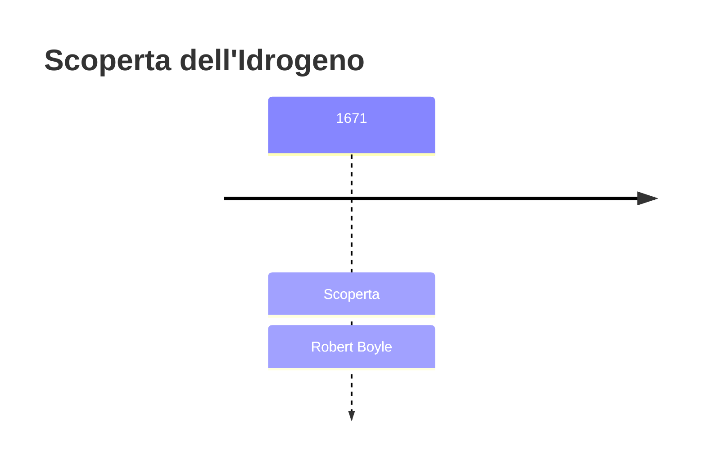
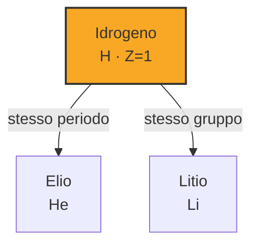

# Idrogeno (H)

> [!abstract] 16° elemento scoperto — 1671
> 

## Cronologia della scoperta

## Storia della scoperta

## Posizione nella tavola periodica

## Caratteristiche

### Dati fisico-chimici

| Proprietà | Valore |
|---|---|
| Numero atomico | 1 |
| Massa atomica | 1,008 u |
| Categoria | Non metallo |
| Gruppo | 1 |
| Periodo | 1 |
| Blocco | s |
| Configurazione elettronica | 1s¹ |
| Punto di fusione | -259,2 °C |
| Punto di ebollizione | -252,9 °C |
| Densità | 0,08988 g/cm³ |
| Stati di ossidazione | — |

## Struttura atomica

![[atomo-Idrogeno.svg]]

## Usi e presenza in natura

## Nella cronologia

← Precedente: [[Fosforo]] (1669)
→ Successivo: [[Cobalto]] (1735)

Epoca: [[Alchimia e primo moderno]] · Scopritore: [[Robert Boyle]]

## Fonti

