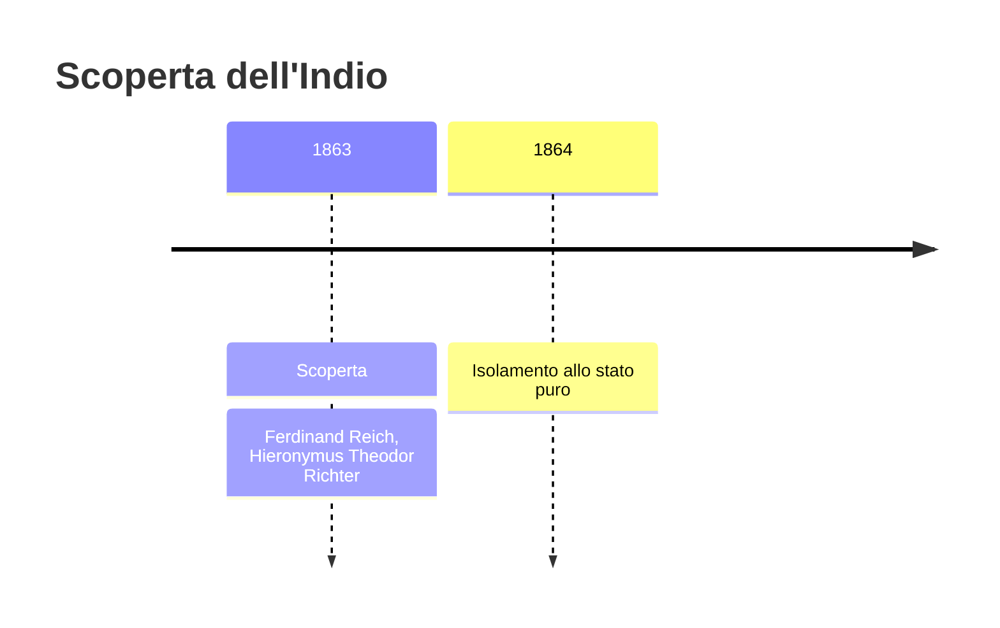
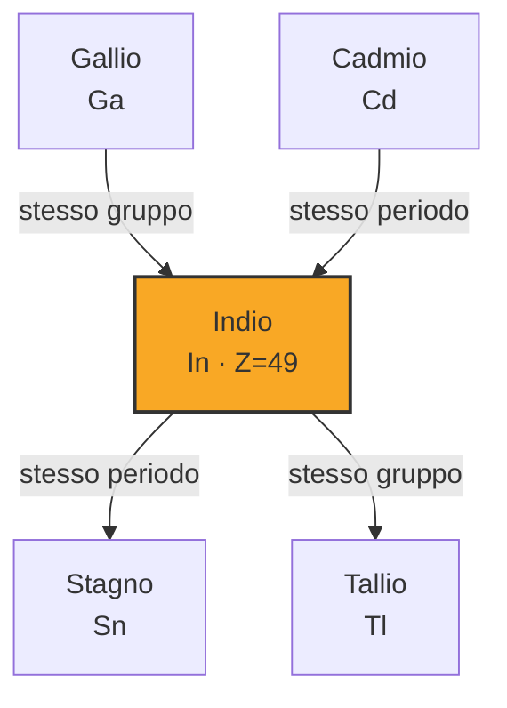

# Indio (In)

> [!abstract] 64° elemento scoperto — 1863
> 

## Cronologia della scoperta

## Storia della scoperta

## Posizione nella tavola periodica

## Caratteristiche

### Dati fisico-chimici

| Proprietà | Valore |
|---|---|
| Numero atomico | 49 |
| Massa atomica | 114,8181 u |
| Categoria | Metallo post-transizione |
| Gruppo | 13 |
| Periodo | 5 |
| Blocco | p |
| Configurazione elettronica | [Kr] 4d¹⁰ 5s² 5p¹ |
| Punto di fusione | 156,6 °C |
| Punto di ebollizione | 2071,9 °C |
| Densità | 7,31 g/cm³ |
| Stati di ossidazione | — |

## Struttura atomica

![[atomo-Indio.svg]]

## Usi e presenza in natura

## Nella cronologia

← Precedente: [[Tallio]] (1861)
→ Successivo: [[Elio]] (1868)

Epoca: [[Spettroscopia e radioattività]] · Scopritore: [[Ferdinand Reich]], [[Hieronymus Theodor Richter]]

## Fonti

