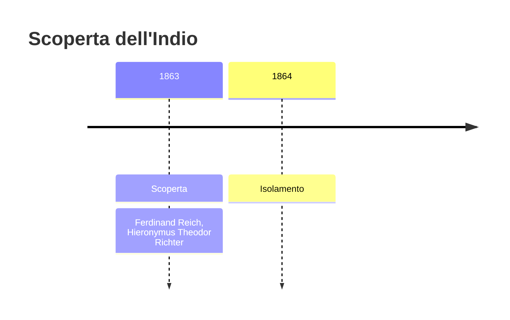
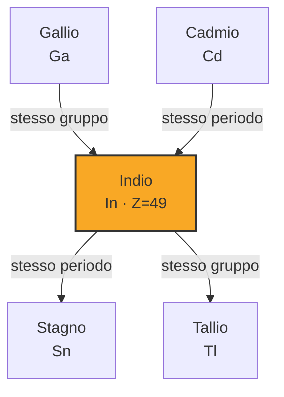
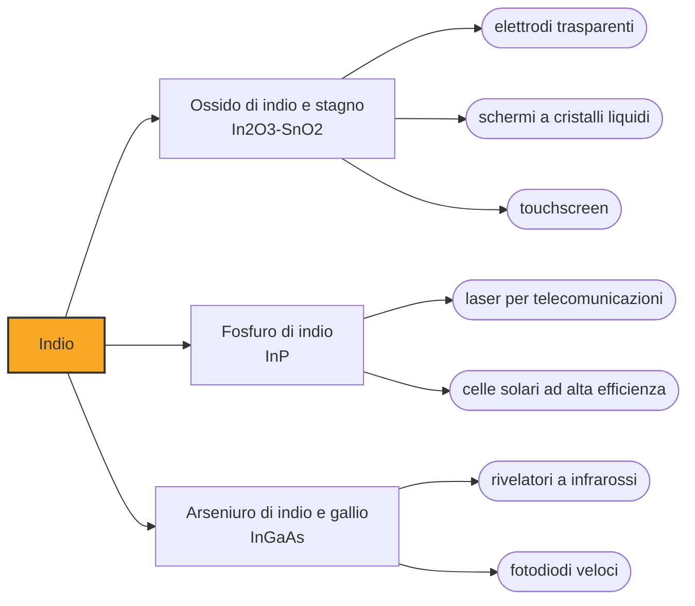

# Indio (In)

> [!abstract] 64° elemento scoperto — 1863
> Cercavano il tallio in un minerale sassone e trovarono una riga indaco che non c'entrava nulla. Chi la vide non era chi la stava cercando: il capo del laboratorio era daltonico.

L'indio è un metallo bianco-argenteo così tenero da lasciare un segno sulla carta come una matita, e così duttile da restare lavorabile alle temperature dell'azoto liquido, dove quasi tutti gli altri metalli diventano fragili. Oggi sta in ogni schermo piatto del mondo, sotto forma di un rivestimento trasparente che conduce elettricità.

## Cronologia della scoperta

## Storia della scoperta

Nel 1863, alla scuola mineraria di Freiberg in Sassonia, Ferdinand Reich stava esaminando minerali di zinco della zona convinto di potervi trovare il tallio, scoperto due anni prima e diventato subito la preda più ambita dei chimici con lo spettroscopio. Bruciando i campioni si aspettava la riga verde del tallio.

Reich era daltonico, e non poteva fidarsi dei propri occhi per giudicare il colore delle righe: si fece assistere dal suo collaboratore Hieronymus Theodor Richter, che guardò nello spettroscopio e non vide il verde atteso, ma una riga blu-indaco intensa che nessuno aveva mai descritto. È una delle poche scoperte in cui la divisione del lavoro fra chi conduce l'esperimento e chi lo osserva è una necessità fisiologica.

Il nome venne da quel colore: indio, dall'indaco, il pigmento che l'Europa importava dall'India e che dava il nome alla tinta blu-violetta. Come per il cesio, il rubidio e il tallio, il battesimo dell'elemento è il colore della sua luce, e in quattro anni la spettroscopia aveva riempito la tavola periodica di elementi che si chiamano come una sfumatura.

Richter isolò il metallo l'anno successivo, nel 1864, e nel 1867 un lingotto di mezzo chilogrammo fu esposto all'Esposizione universale di Parigi. Fra i due scopritori la collaborazione finì male: Richter rivendicò in seguito di aver fatto la scoperta da solo, e il rapporto si ruppe.

Per quasi un secolo l'indio restò una curiosità da laboratorio, prodotto in quantità che si misuravano in grammi. Trovò un primo impiego nella seconda guerra mondiale, come rivestimento dei cuscinetti dei motori aeronautici, e la sua carriera vera cominciò solo con l'elettronica: prima nei semiconduttori, poi negli schermi.

## Posizione nella tavola periodica

## Caratteristiche

È uno dei metalli più teneri che esistano, con durezza 1,2 nella scala di Mohs, e si può tagliare con un coltello o schiacciare fra le dita. Piegandolo emette un crepitio, il «grido» che si sente anche piegando lo stagno: è il rumore dei cristalli che scorrono l'uno sull'altro dentro il metallo.

Fonde a 156,6 gradi e resta duttile fino alle temperature criogeniche, dove quasi tutti i metalli si irrigidiscono e si rompono. Questa combinazione lo rende il materiale con cui si fanno le guarnizioni metalliche degli apparecchi da vuoto e le saldature che devono reggere il freddo estremo: un anello di indio schiacciato fra due flange tiene la tenuta a meno duecentosettanta gradi.

Nei composti sta quasi sempre nello stato +3, e con altri metalli forma leghe che fondono a temperature bassissime: alcune sono liquide sotto i venti gradi, e si usano dove serve un metallo che fonda prima di danneggiare ciò che gli sta attorno, dai fusibili termici ai dispositivi di sicurezza degli impianti.

### Dati fisico-chimici

| Proprietà | Valore |
|---|---|
| Numero atomico | 49 |
| Massa atomica | 114,8181 u |
| Categoria | Metallo post-transizione |
| Gruppo | 13 |
| Periodo | 5 |
| Blocco | p |
| Configurazione elettronica | [Kr] 4d¹⁰ 5s² 5p¹ |
| Punto di fusione | 156,6 °C |
| Punto di ebollizione | 2071,9 °C |
| Densità | 7,31 g/cm³ |
| Stati di ossidazione | +3 |

## Struttura atomica

![[atomo-Indio.svg]]

## Usi e presenza in natura

L'impiego che assorbe quasi tutta la produzione è l'ossido di indio e stagno, sigla ITO: un rivestimento che è insieme trasparente alla luce e conduttore di elettricità, due proprietà che di norma si escludono, perché ciò che conduce elettricità di solito assorbe anche la luce. Ogni schermo a cristalli liquidi, ogni pannello OLED e ogni touchscreen ne porta uno strato di poche decine di nanometri, perché senza di esso non ci sarebbe modo di portare corrente ai pixel senza coprirli: la sostituzione dell'ITO con materiali più comuni è uno dei problemi aperti dell'elettronica dei display.

Il resto si divide fra semiconduttori e saldature: il fosfuro e l'arseniuro di indio fanno i laser e i rivelatori a infrarosso delle telecomunicazioni ottiche, le leghe indio-stagno saldano componenti che non tollererebbero il calore di una lega ordinaria, e nei reattori nucleari l'indio entra nelle barre di controllo insieme ad argento e cadmio, perché assorbe bene i neutroni.

Non esistono miniere di indio: si ricava per intero come sottoprodotto della raffinazione dello zinco, e la produzione mondiale si misura in poche centinaia di tonnellate l'anno, concentrate in pochi paesi. Chi lo usa dipende quindi da quanto zinco il mondo decide di estrarre, non da quanto indio gli serve.

## Curiosità

Ogni lampadina a LED bianca del mondo contiene indio. Il diodo che emette il blu — quello che mancava per fare la luce bianca, e che è valso il Nobel per la fisica del 2014 — è fatto di nitruro di indio e gallio, e regolando la proporzione fra i due metalli se ne sposta il colore dal violetto al verde. Un elemento che nessuno vede è quello che decide di che colore è la luce di casa.

Siccome ogni schermo ne contiene pochi decimi di grammo ma gli schermi sono miliardi, il recupero dell'indio dall'elettronica dismessa e dagli scarti di lavorazione dei pannelli è diventato una filiera a sé: gli sfridi della deposizione dell'ITO, che sono la parte più ricca, tornano indietro prima ancora di uscire dalla fabbrica.

## Nella cronologia

← Precedente: [[Tallio]] (1861)
→ Successivo: [[Elio]] (1868)

Epoca: [[Spettroscopia e radioattività]] · Scopritori: [[Ferdinand Reich]], [[Hieronymus Theodor Richter]]

## Fonti

- [Indium](https://en.wikipedia.org/wiki/Indium) — consultata il 09/09/2026
- [Indium — Royal Society of Chemistry](https://periodic-table.rsc.org/element/49/indium) — consultata il 09/09/2026
- [Indium tin oxide](https://en.wikipedia.org/wiki/Indium_tin_oxide) — consultata il 09/09/2026
- [Indium gallium nitride](https://en.wikipedia.org/wiki/Indium_gallium_nitride) — consultata il 09/09/2026
