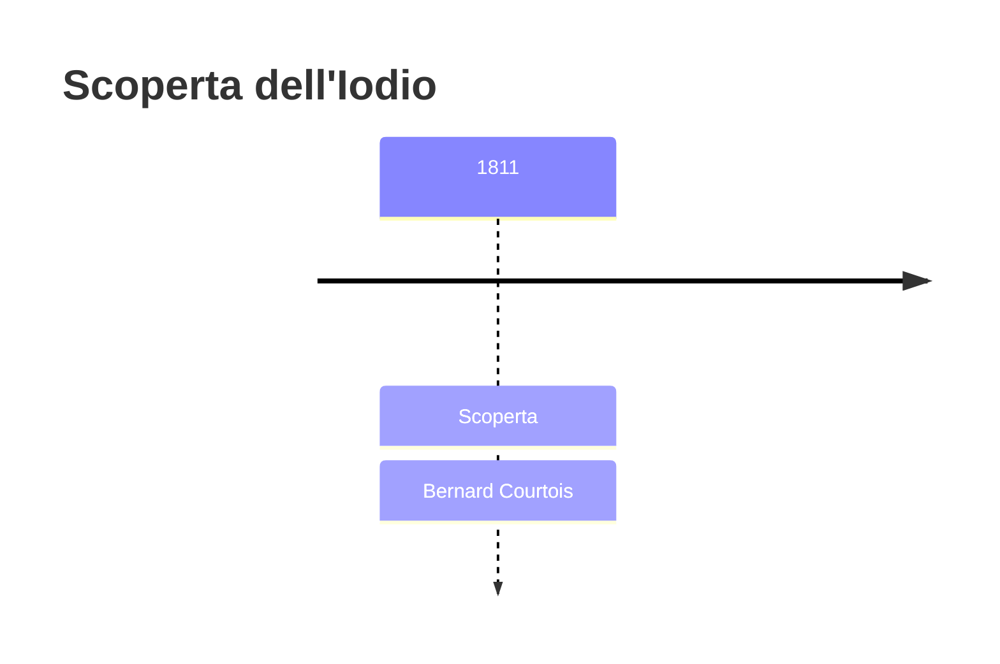
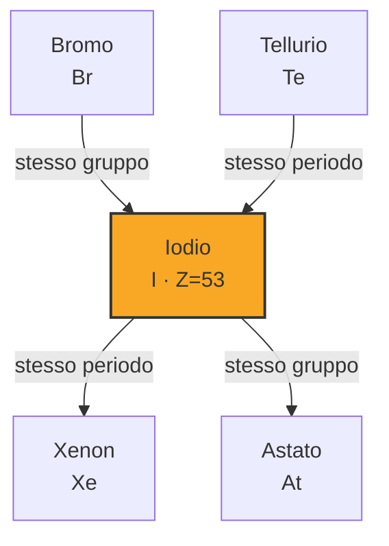
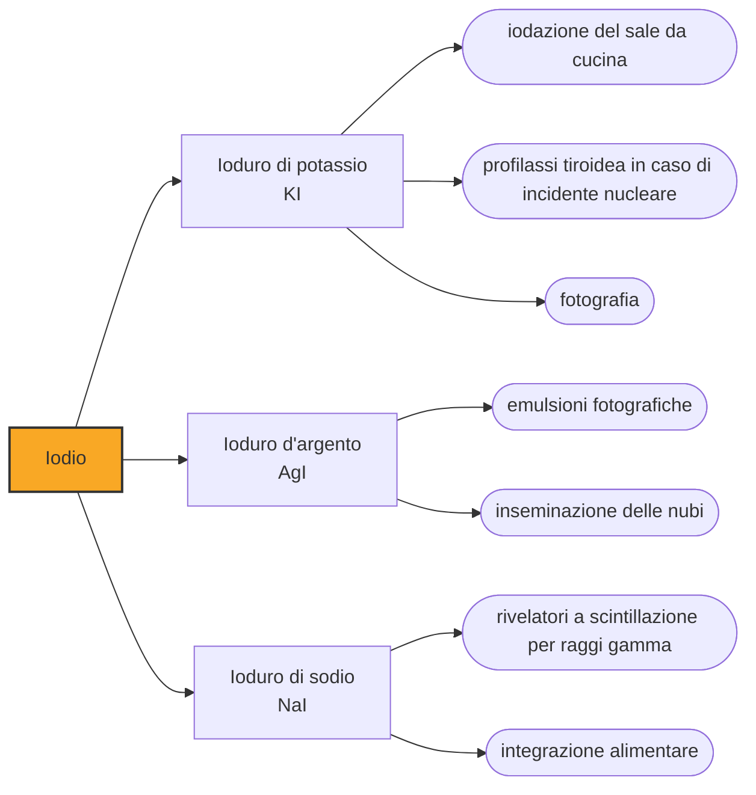

# Iodio (I)

> [!abstract] 50° elemento scoperto — 1811
> Un eccesso di acido solforico versato sui residui di cenere di alghe, in una fabbrica che riforniva di salnitro gli eserciti di Napoleone, sollevò una nuvola di vapore violetto che nessuno aveva mai visto.

Lo iodio è l'elemento che si riconosce a occhio: un solido nero-violaceo dai riflessi quasi metallici che al minimo calore si trasforma in un vapore del colore di una viola, e proprio da quel colore prende il nome. È anche il più pesante fra i nutrienti minerali indispensabili all'essere umano, che ne ha bisogno in dosi da microgrammi.

## Cronologia della scoperta

> [!info] Nota sulla cronologia
> Courtois osservò il vapore violetto nel 1811; la scoperta fu resa pubblica il 29 novembre 1813 da Desormes e Clément, e Gay-Lussac ne riconobbe la natura elementare il 6 dicembre successivo, proponendo il nome iode.

## Storia della scoperta

Il salnitro decideva quanta polvere da sparo un paese potesse fabbricare, e la Francia napoleonica ne aveva bisogno più di quanto le nitriere riuscissero a produrne. Il processo richiedeva carbonato di sodio, e per averlo i salnitrai ripiegarono sulle alghe raccolte lungo le coste di Normandia e Bretagna: bruciate in cumuli sulla spiaggia, lasciavano una cenere ricca di sali di sodio e di potassio.

Bernard Courtois, figlio di una famiglia di fabbricanti di salnitro, dirigeva uno di questi impianti. Nel 1811 stava indagando sulla corrosione che intaccava i recipienti di rame e trattò con acido solforico il residuo esausto della lisciviazione, la parte che si buttava via; ne versò più del necessario, e dal recipiente si alzò una nube violetta che si depositava sulle superfici fredde in cristalli scuri e lucenti. Courtois capì di avere fra le mani qualcosa di nuovo, ma non aveva i mezzi per studiarlo.

Consegnò dei campioni ad amici chimici, e per due anni non accadde nulla; poi tutto si decise in dodici giorni. Il 29 novembre 1813 Charles Bernard Desormes e Nicolas Clément presentarono la sostanza all'Institut de France; il 6 dicembre Joseph Louis Gay-Lussac annunciò che la sostanza era un elemento nuovo oppure un composto dell'ossigeno, e propose di chiamarla iode, dal greco iodes, «color viola»; il 10 dicembre Humphry Davy datava a Londra una lettera alla Royal Society in cui rivendicava di aver identificato lo stesso elemento nuovo.

Ne seguì una disputa di priorità fra Gay-Lussac e Davy, in un momento in cui Francia e Inghilterra erano in guerra e ogni rivendicazione scientifica pesava anche come questione nazionale. I due si contesero a lungo il merito dell'identificazione, ma su un punto non ci fu discussione: entrambi riconobbero che a vedere per primo la sostanza era stato Courtois.

L'elemento trovò presto un ruolo che nessuno dei suoi scopritori aveva previsto. Nel 1873 il medico francese Casimir Davaine descrisse l'azione antisettica dello iodio, e nel 1908 il chirurgo istriano Antonio Grossich introdusse la tintura di iodio per sterilizzare rapidamente la pelle del paziente sul campo operatorio: un gesto che in pochi anni divenne routine in ogni sala chirurgica.

## Posizione nella tavola periodica

## Caratteristiche

A temperatura ambiente lo iodio è un solido cristallino grigio-nerastro con lucentezza quasi metallica. Fonde a 113,7 °C e bolle a 184,3 °C, ma la sua tensione di vapore è tanto alta che in un contenitore aperto i cristalli passano direttamente al vapore violetto ben prima di fondere: per vederlo liquido bisogna scaldarlo in fretta o in ambiente chiuso.

È il più pesante degli alogeni stabili ed è anche il meno aggressivo del gruppo: è il più debole degli ossidanti alogeni, tanto che cede elettroni agli altri invece di strapparglieli, e per converso lo ioduro è il riducente più energico del gruppo. Questa mitezza relativa lo rende maneggiabile, ma non innocuo: i vapori irritano occhi e vie respiratorie, e i cristalli macchiano la pelle di bruno.

Nei composti copre un intervallo ampio di stati di ossidazione, dal −1 dello ioduro fino al +7 degli acidi periodici, passando per tutti i gradi intermedi: una versatilità che il fluoro, all'altro capo del gruppo, non possiede affatto, perché non esiste elemento capace di strappargli elettroni.

Con l'amido forma un complesso di un blu-nero intensissimo, visibile anche a concentrazioni molto basse: è la reazione con cui si riconosce l'amido in un alimento o in un seme, ed è l'indicatore su cui si regge un'intera famiglia di analisi quantitative, l'iodometria.

### Dati fisico-chimici

| Proprietà | Valore |
|---|---|
| Numero atomico | 53 |
| Massa atomica | 126,904473 u |
| Categoria | Alogeno |
| Gruppo | 17 |
| Periodo | 5 |
| Blocco | p |
| Configurazione elettronica | [Kr] 4d¹⁰ 5s² 5p⁵ |
| Punto di fusione | 113,7 °C |
| Punto di ebollizione | 184,3 °C |
| Densità | 4,933 g/cm³ |
| Stati di ossidazione | -1, +1, +2, +3, +4, +5, +6, +7 |

## Struttura atomica

![[atomo-Iodio.svg]]

## Usi e presenza in natura

Il ruolo biologico dello iodio è concentrato in un organo solo: la tiroide lo cattura dal sangue e lo incorpora nella tiroxina e nella triiodotironina, gli ormoni che regolano il metabolismo dell'intero organismo. Quando la dieta non ne fornisce abbastanza, la ghiandola si ingrossa nel tentativo di procurarsene di più, ed è il gozzo.

Per questo dal Novecento molti paesi aggiungono ioduro o iodato di potassio al sale da tavola. La carenza di iodio riguarda circa due miliardi di persone ed è la prima causa prevenibile di disabilità intellettiva al mondo, perché nei primi anni di vita un apporto insufficiente compromette lo sviluppo neurologico in modo irreversibile.

Il grosso dello iodio commerciale viene da tre distretti — i giacimenti di nitrati del deserto cileno, i campi di gas naturale giapponesi e i pozzi di salamoia dell'Oklahoma — per un totale intorno alle 34.000 tonnellate l'anno. Gli impieghi maggiori, in ordine di quantità, sono i mezzi di contrasto radiografici, i film polarizzatori degli schermi a cristalli liquidi e i farmaci, davanti a disinfettanti e mangimi.

## Curiosità

Si racconta spesso che la scoperta si debba a un gatto che, saltando su un tavolo, rovesciò e mescolò le bottiglie di acido e di cenere di alghe. Nessun resoconto dell'epoca menziona l'animale: la storia compare molto più tardi e ha l'aria di un abbellimento, mentre le fonti coeve descrivono un lavoro di routine su un residuo di scarto, finito in modo inatteso.

Courtois avviò nel 1822 una produzione di iodio e di suoi sali, ma non ne trasse fortuna. Nel 1831 l'Accademia delle scienze gli assegnò seimila franchi del premio Montyon per l'utilità medica della scoperta; alla morte, nel 1838, non lasciò praticamente nulla alla vedova e al figlio.

## Nella cronologia

← Precedente: [[Potassio]] (1807)
→ Successivo: [[Litio]] (1817)

Epoca: [[L'età dell'elettrolisi]] · Scopritore: [[Bernard Courtois]]

## Fonti

- [Iodine](https://en.wikipedia.org/wiki/Iodine) — consultata il 07/09/2026
- [Bernard Courtois](https://en.wikipedia.org/wiki/Bernard_Courtois) — consultata il 07/09/2026
- [Iodine — Mineral Commodity Summaries 2026, U.S. Geological Survey](https://pubs.usgs.gov/periodicals/mcs2026/mcs2026-iodine.pdf) — consultata il 07/09/2026

---

> [!warning] Avvertenza
> Questo progetto è stato realizzato con l'assistenza di sistemi di
> intelligenza artificiale. I contenuti sono verificati sulle fonti citate,
> ma **possono contenere errori e imprecisioni**: prima di riutilizzarli,
> controlla la fonte.
