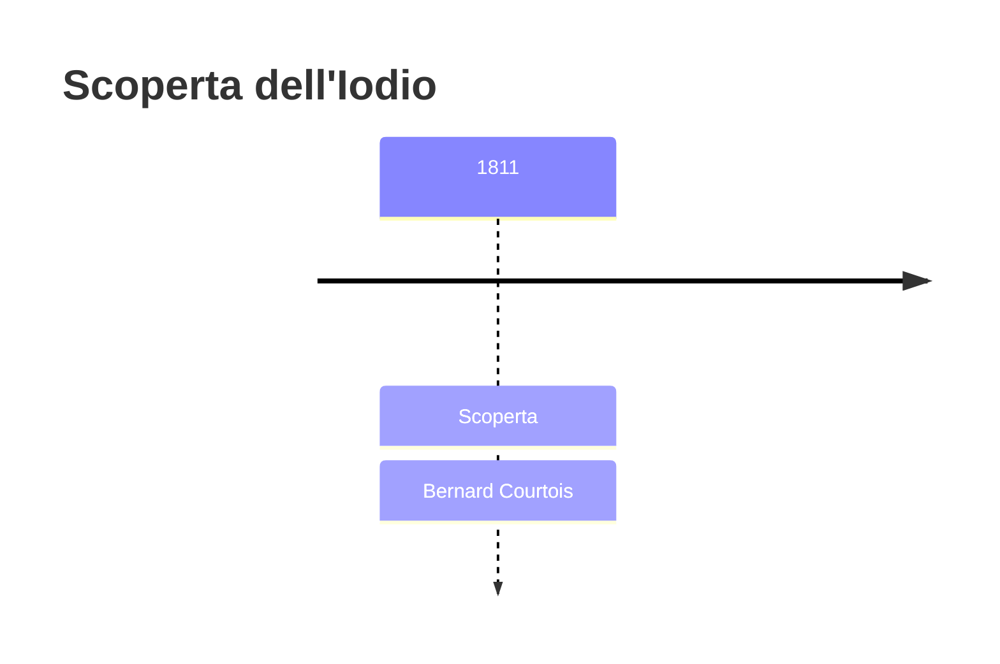
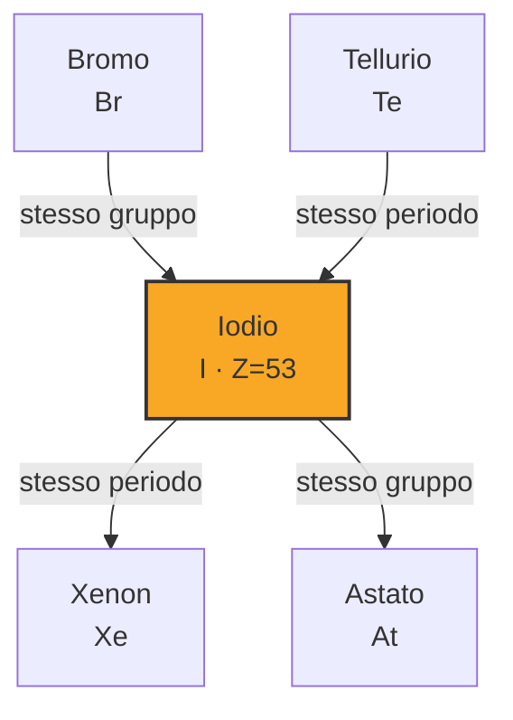

# Iodio (I)

> [!abstract] 50° elemento scoperto — 1811
> 

## Cronologia della scoperta

## Storia della scoperta

## Posizione nella tavola periodica

## Caratteristiche

### Dati fisico-chimici

| Proprietà | Valore |
|---|---|
| Numero atomico | 53 |
| Massa atomica | 126,904473 u |
| Categoria | Alogeno |
| Gruppo | 17 |
| Periodo | 5 |
| Blocco | p |
| Configurazione elettronica | [Kr] 4d¹⁰ 5s² 5p⁵ |
| Punto di fusione | 113,7 °C |
| Punto di ebollizione | 184,3 °C |
| Densità | 4,933 g/cm³ |
| Stati di ossidazione | — |

## Struttura atomica

![[atomo-Iodio.svg]]

## Usi e presenza in natura

## Nella cronologia

← Precedente: [[Potassio]] (1807)
→ Successivo: [[Litio]] (1817)

Epoca: [[L'età dell'elettrolisi]] · Scopritore: [[Bernard Courtois]]

## Fonti

