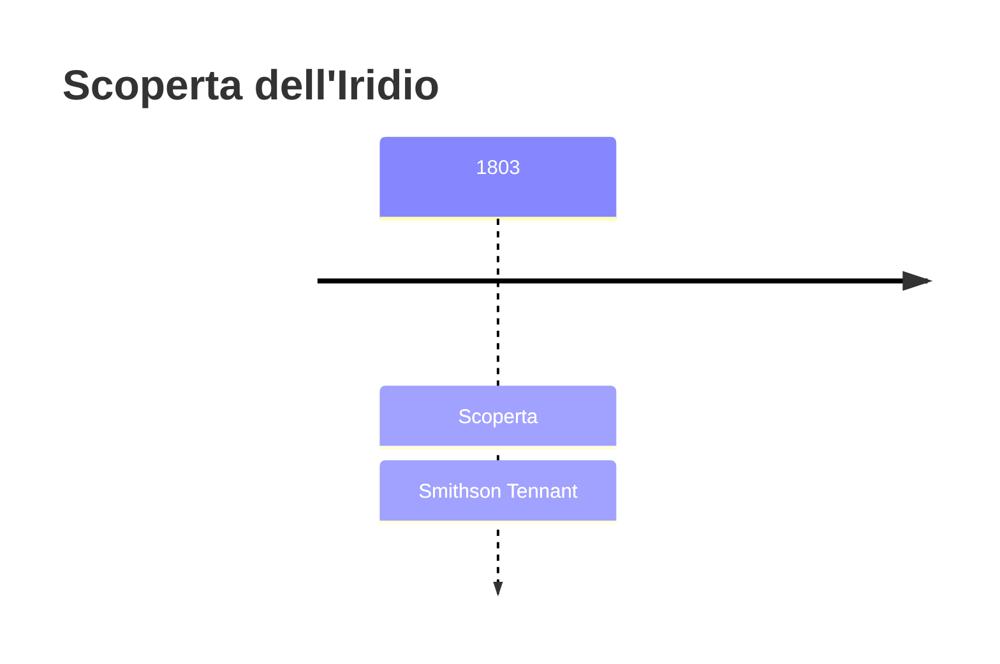
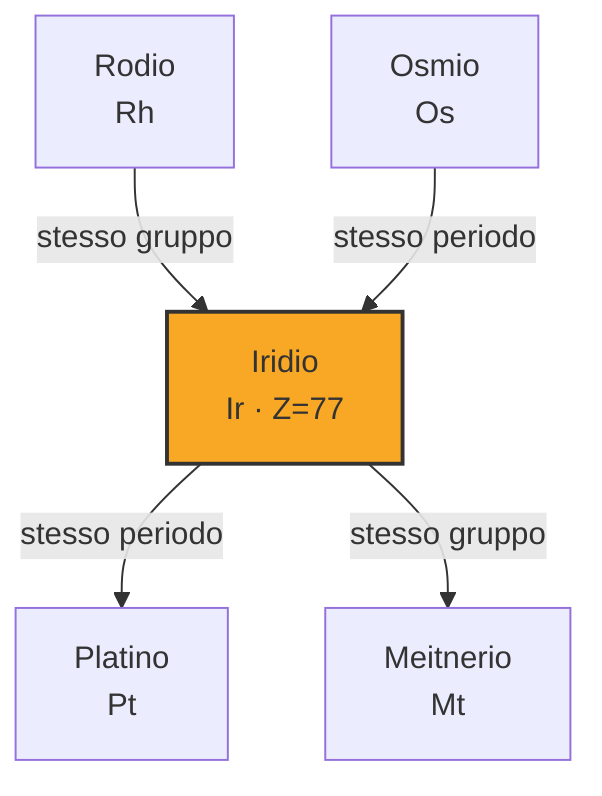

# Iridio (Ir)

> [!abstract] 46° elemento scoperto — 1803
> 

## Cronologia della scoperta

## Storia della scoperta

## Posizione nella tavola periodica

## Caratteristiche

### Dati fisico-chimici

| Proprietà | Valore |
|---|---|
| Numero atomico | 77 |
| Massa atomica | 192,2173 u |
| Categoria | Metallo di transizione |
| Gruppo | 9 |
| Periodo | 6 |
| Blocco | d |
| Configurazione elettronica | [Xe] 4f¹⁴ 5d⁷ 6s² |
| Punto di fusione | 2445,9 °C |
| Punto di ebollizione | 4129,9 °C |
| Densità | 22,56 g/cm³ |
| Stati di ossidazione | — |

## Struttura atomica

![[atomo-Iridio.svg]]

## Usi e presenza in natura

## Nella cronologia

← Precedente: [[Osmio]] (1803)
→ Successivo: [[Rodio]] (1804)

Epoca: [[L'età dell'elettrolisi]] · Scopritore: [[Smithson Tennant]]

## Fonti

