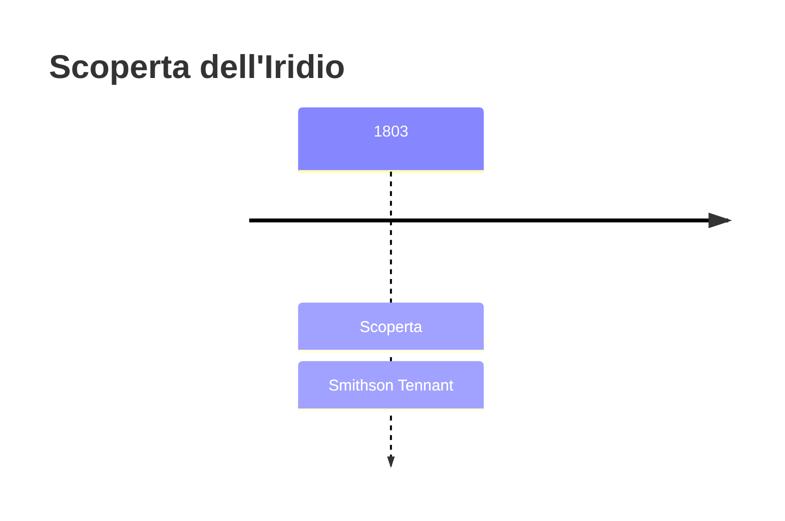
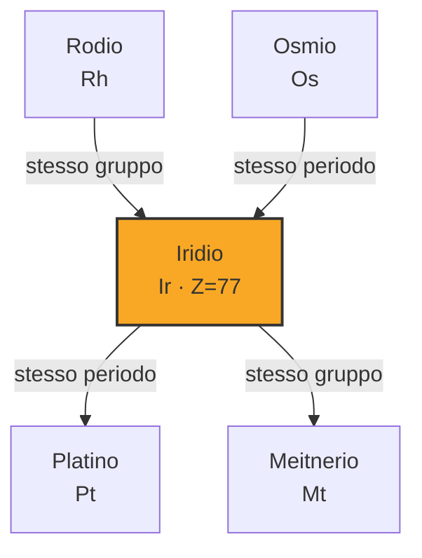
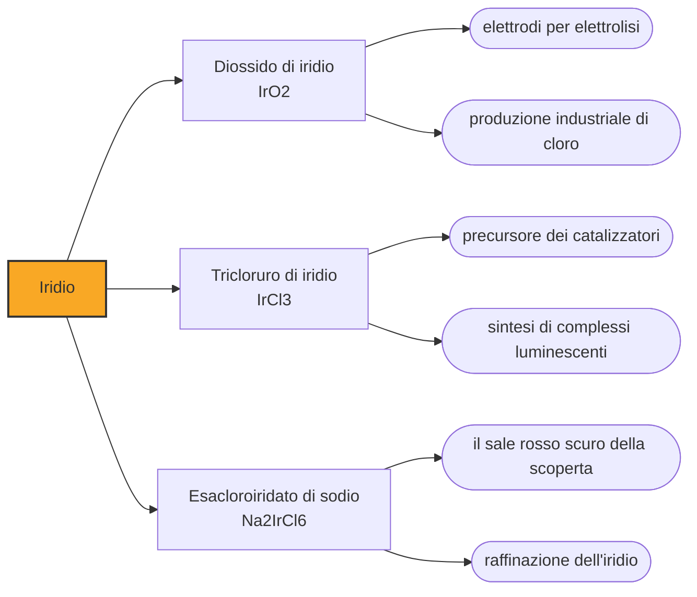

# Iridio (Ir)

> [!abstract] 46° elemento scoperto — 1803
> Ogni passaggio della separazione tirava fuori un sale di un colore diverso. Smithson Tennant chiamò il metallo che li produceva con il nome della dea greca dell'arcobaleno.

L'iridio è il secondo elemento stabile più denso, dietro all'osmio per pochi centesimi di grammo per centimetro cubo. È fra i più rari della crosta terrestre e fra i più difficili da corrodere, e nel Novecento è diventato l'indizio chimico di una catastrofe avvenuta sessantasei milioni di anni fa.

## Cronologia della scoperta

> [!info] Nota sulla cronologia
> Osservato nello stesso anno anche da Hippolyte-Victor Collet-Descotils e, a Parigi, da Fourcroy e Vauquelin, che però non ne raccolsero abbastanza per caratterizzarlo. La memoria di Tennant, che annuncia insieme iridio e osmio, fu letta alla Royal Society il 21 giugno 1804.

## Storia della scoperta

La società fra Smithson Tennant e William Hyde Wollaston, nata nel 1800 per raffinare e vendere platino, aveva diviso il minerale prima ancora di dividersi il lavoro, e a Tennant era toccato ciò che l'acqua regia si rifiutava di sciogliere. Era la parte che tutti scartavano: Joseph Louis Proust l'aveva presa per grafite, e la maggioranza dei chimici la buttava via come impurità del minerale.

Nel 1803 la stessa polvere era sotto esame anche a Parigi, dove tre chimici la riconobbero per quello che era senza poterlo dimostrare, perché non ne avevano raccolta abbastanza. Tennant, che ne aveva molto di più, lavorò per un anno intero a scioglierla e riscioglierla, alternando alcali e acidi, prima di cavarne qualcosa di netto.

Trattando il residuo alternativamente con soda e acido cloridrico, Tennant ottenne una successione di sali dai colori accesi e, alla fine, dei cristalli rosso scuro. Capì che nella polvere nera non c'era un metallo nuovo ma due, e che quei colori appartenevano al primo. Lo chiamò iridio, da Iride, la dea greca dell'arcobaleno e messaggera degli dèi dell'Olimpo, proprio per la varietà dei colori dei suoi composti.

L'annuncio dei due elementi arrivò alla Royal Society con una lettera del 21 giugno 1804. Dalla stessa partita di platina greggia Wollaston aveva già ricavato il palladio nel 1802 e il rodio l'anno seguente, presentandolo nel 1804. Un minerale che si comprava per farne altro aveva riempito quattro caselle vuote della tavola.

Averlo isolato non voleva dire poterlo usare. L'iridio fonde a 2446 °C e per quasi tutto l'Ottocento nessuno riuscì a portarlo allo stato liquido in quantità utili. Nel 1813 John George Children ne fuse un primo campione con quella che allora era la più grande batteria galvanica mai costruita; nel 1842 Robert Hare ne ottenne per primo un campione di elevata purezza, descrivendolo come quasi immalleabile e durissimo; solo nel 1860 Henri Sainte-Claire Deville e Jules Henri Debray ne fusero quantità apprezzabili, bruciando più di trecento litri di ossigeno e idrogeno puri per ogni chilogrammo di metallo.

## Posizione nella tavola periodica

## Caratteristiche

La Royal Society of Chemistry lo descrive come il materiale più resistente alla corrosione che si conosca: gli acidi non lo intaccano, nemmeno l'acqua regia. Inattaccabile però non è. Si scioglie in acido cloridrico concentrato se c'è del perclorato di sodio, reagisce con i sali di cianuro in presenza di ossigeno, e ad alta temperatura cede agli alogeni, all'ossigeno e allo zolfo.

Con 22,56 grammi per centimetro cubo è secondo solo all'osmio per densità, e la distanza fra i due sta nella terza cifra decimale. È durissimo e fragile, tanto che a freddo si lavora male, e proprio la sua rigidità lo rende adatto agli impieghi in cui la deformazione non è ammessa.

Gli stati di ossidazione noti dell'iridio vanno da -3 a +9, e il +9 è un primato: è lo stato di ossidazione più alto mai osservato in un elemento, individuato nel 2014 in uno ione gassoso di tetrossido di iridio. Nei composti stabili dominano però il +3 e il +4.

Nella crosta terrestre l'iridio è raro fino all'inverosimile, intorno a una parte per miliardo, mentre nei meteoriti è centinaia di volte più abbondante. Il motivo è antico: essendo siderofilo, quando la Terra si differenziò seguì il ferro verso il nucleo e lasciò la superficie quasi vuota.

### Dati fisico-chimici

| Proprietà | Valore |
|---|---|
| Numero atomico | 77 |
| Massa atomica | 192,2173 u |
| Categoria | Metallo di transizione |
| Gruppo | 9 |
| Periodo | 6 |
| Blocco | d |
| Configurazione elettronica | [Xe] 4f¹⁴ 5d⁷ 6s² |
| Punto di fusione | 2445,9 °C |
| Punto di ebollizione | 4129,9 °C |
| Densità | 22,56 g/cm³ |
| Stati di ossidazione | -3, -2, -1, 0, +1, +2, +3, +4, +5, +6, +7, +8, +9 |

## Struttura atomica

![[atomo-Iridio.svg]]

## Usi e presenza in natura

Gli usi dell'iridio discendono tutti dalla sua indifferenza al calore e agli acidi. Se ne fanno i crogioli in cui si fanno crescere, col metodo Czochralski, i cristalli singoli di zaffiro e di granati per i laser, a temperature che arrivano a 2100 °C; gli elettrodi per la produzione elettrolitica del cloro; le punte delle candele di accensione, in particolare quelle aeronautiche, dove il problema è l'erosione da arco elettrico; e i catalizzatori del processo Cativa, con cui si ricava acido acetico dal metanolo.

L'isotopo artificiale iridio-192 è una delle due sorgenti gamma più usate nella radiografia industriale, per controllare le saldature senza distruggerle, e in brachiterapia, per irradiare i tumori dall'interno. Il metallo riveste inoltre le pastiglie di plutonio-238 dei generatori termoelettrici che alimentano le sonde spaziali, e con il platino forma la lega novanta a dieci di cui era fatto il prototipo internazionale del metro. Sono impieghi di nicchia che si pagano cari: lo USGS colloca il prezzo medio dell'iridio nel 2024 a 4.800 dollari l'oncia troy, il più alto fra i metalli del gruppo del platino che quota.

## Curiosità

Negli anni Settanta il geologo Walter Alvarez studiava a Gubbio, in Umbria, una successione di calcari che attraversa senza interruzioni il confine fra Cretaceo e Paleogene. Fra gli strati c'era un sottile livello di argilla, e le analisi condotte da Frank Asaro e Helen Michel vi trovarono iridio in concentrazione centinaia di volte superiore al normale.

Poiché l'iridio abbonda nei meteoriti e scarseggia sulla crosta, nel 1980 quei tre insieme a Luis Alvarez, padre di Walter e premio Nobel per la fisica, proposero che l'argilla fosse la polvere ricaduta dopo l'impatto di un grande corpo extraterrestre, e che l'impatto avesse causato l'estinzione di massa di fine Cretaceo. Il cratere di Chicxulub, individuato più tardi, ha dato ragione all'ipotesi.

## Nella cronologia

← Precedente: [[Osmio]] (1803)
→ Successivo: [[Rodio]] (1804)

Epoca: [[L'età dell'elettrolisi]] · Scopritore: [[Smithson Tennant]]

## Fonti

- [Two men, two centuries, four metals](https://www.chemistryworld.com/features/two-men-two-centuries-four-metals/3004876.article) — consultata il 07/09/2026
- [Iridium](https://en.wikipedia.org/wiki/Iridium) — consultata il 07/09/2026
- [Iridium — Royal Society of Chemistry](https://periodic-table.rsc.org/element/77/iridium) — consultata il 07/09/2026
- [Alvarez hypothesis](https://en.wikipedia.org/wiki/Alvarez_hypothesis) — consultata il 07/09/2026
- [USGS Mineral Commodity Summaries 2025 — Platinum-Group Metals](https://pubs.usgs.gov/periodicals/mcs2025/mcs2025-platinum-group.pdf) — consultata il 07/09/2026
