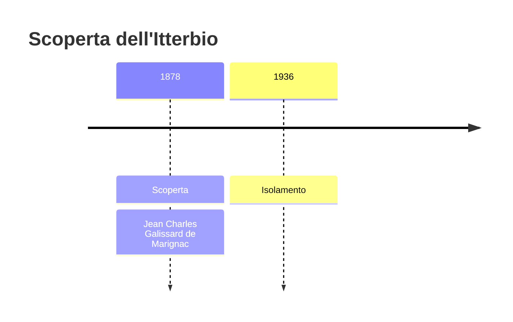
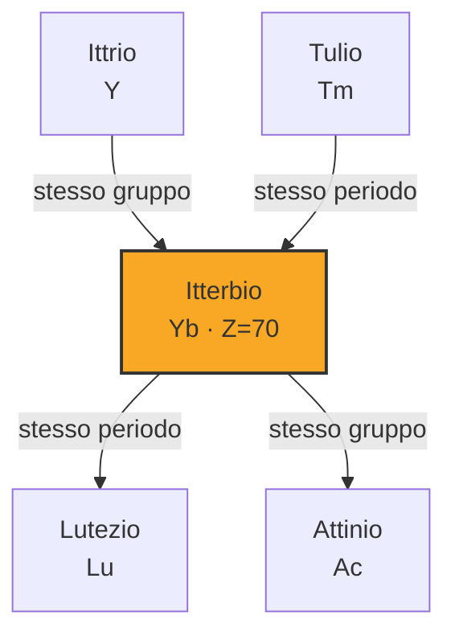
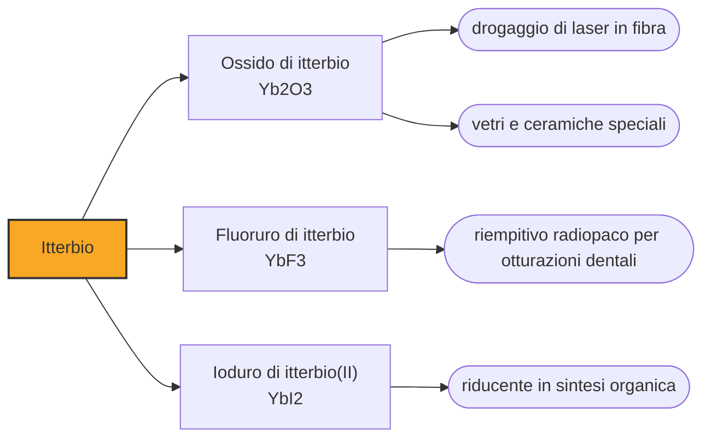

# Itterbio (Yb)

> [!abstract] 68° elemento scoperto — 1878
> Una terra chiamata erbia conteneva un elemento in più. Quando lo si tolse, ne restava un'altra terra, che a sua volta ne conteneva due. Ytterby ha dato il nome a quattro elementi, e questa è la storia del terzo.

L'itterbio è uno dei lantanidi più docili: fonde a poco più di ottocento gradi, cioè molto più in basso dei suoi vicini, ed è l'unico della serie che si comporta in due modi diversi, cedendo tre elettroni o soltanto due. Oggi il suo compito più raffinato è misurare il tempo meglio di qualunque orologio al cesio.

## Cronologia della scoperta

> [!info] Nota sulla cronologia
> Marignac separò l'itterbia dall'erbia nel 1878; nel 1907 Georges Urbain la divise a sua volta in neoitterbia e lutecia, cioè nell'itterbio odierno e nel lutezio. Il metallo fu ottenuto nel 1936 da Wilhelm Klemm e Heinrich Bommer, e l'itterbio quasi puro solo nel 1953, con lo scambio ionico.

## Storia della scoperta

Alla fine dell'Ottocento le terre rare si comportavano come le matrioske. Dall'ittria di Ytterby, Mosander aveva ricavato nel 1843 erbia e terbia; trentacinque anni dopo l'erbia era ancora considerata l'ossido di un elemento solo, ma le sue proprietà misurate non tornavano mai del tutto.

Nel 1878 Jean Charles Galissard de Marignac, a Ginevra, riprese l'erbia ricavata dalla gadolinite e ne separò per via chimica una componente che si comportava diversamente dal resto: sfruttò il fatto che i nitrati dei diversi lantanidi si decompongono a temperature leggermente diverse, un margine sottilissimo su cui costruire una separazione. La chiamò itterbia, ancora una volta dal nome del villaggio svedese da cui tutta la faccenda era partita.

Quattro elementi portano nel nome pezzi della parola Ytterby — ittrio, itterbio, terbio ed erbio — e altri cinque, scandio, olmio, tulio, gadolinio e tantalio, furono individuati per la prima volta in minerali di quel giacimento. Una cava di feldspato lunga poche centinaia di metri ha lasciato nella tavola periodica più tracce di qualunque altro luogo della Terra.

Nemmeno l'itterbia era finita. Nel 1907 il francese Georges Urbain la divise a sua volta in due componenti, che chiamò neoitterbia e lutecia: la prima è l'itterbio che conosciamo oggi, la seconda è il lutezio. In poco più di sessant'anni una singola terra si era sfogliata in una mezza dozzina di elementi, e ogni volta i chimici avevano creduto di essere arrivati in fondo.

Il metallo arrivò nel 1936, per mano di Wilhelm Klemm e Heinrich Bommer, gli stessi che in quegli anni stavano ricavando i metalli di mezza serie dei lantanidi. L'itterbio davvero puro, però, si ottenne solo nel 1953, quando le resine a scambio ionico resero possibile in poche ore ciò che prima richiedeva migliaia di cristallizzazioni.

## Posizione nella tavola periodica

## Caratteristiche

Nella serie dei lantanidi l'itterbio è uno dei pochi che, oltre allo stato +3 comune a tutti, forma composti stabili anche allo stato +2: il suo guscio f è completo con quattordici elettroni, e cedendone solo due l'atomo raggiunge una configurazione particolarmente stabile. È la stessa ragione per cui fonde e bolle molto più in basso dei vicini.

Ha un comportamento elettrico insolito: compresso a circa quarantamila atmosfere la sua resistività aumenta di dieci volte, poi crolla a un decimo del valore che ha a pressione ordinaria. Su questa curva si costruiscono i sensori che misurano pressioni estreme, dove nessun altro materiale dà una risposta così netta.

Nella crosta terrestre è a circa tre parti per milione, come gli altri lantanidi pesanti, e si ricava dalla monazite, dallo xenotime e dalle argille ad adsorbimento ionico. Come tutta la famiglia non ha giacimenti propri: si separa dagli altri per scambio ionico o per estrazione con solventi, cioè con i due metodi che negli anni Cinquanta hanno reso ordinario ciò che prima era eroico.

### Dati fisico-chimici

| Proprietà | Valore |
|---|---|
| Numero atomico | 70 |
| Massa atomica | 173,0451 u |
| Categoria | Lantanide |
| Gruppo | 3 |
| Periodo | 6 |
| Blocco | f |
| Configurazione elettronica | [Xe] 4f¹⁴ 6s² |
| Punto di fusione | 823,9 °C |
| Punto di ebollizione | 1195,9 °C |
| Densità | 6,9 g/cm³ |
| Stati di ossidazione | +2, +3 |

## Struttura atomica

![[atomo-Itterbio.svg]]

## Usi e presenza in natura

Un orologio atomico ottico all'itterbio conta le oscillazioni della luce invece che delle microonde, e siccome la luce oscilla centomila volte più in fretta, la stessa incertezza relativa vale un errore molto più piccolo: gli orologi all'itterbio del NIST sono stabili entro meno di due parti su un trilione, cioè sbaglierebbero meno di un secondo in tutta l'età dell'universo. È su strumenti di questo tipo che si sta discutendo la prossima definizione del secondo, oggi ancora affidata al cesio.

Nelle fibre ottiche drogate all'itterbio si costruiscono i laser industriali più potenti in commercio, che arrivano a diversi kilowatt in fascio continuo: tagliano e saldano l'acciaio, e hanno soppiantato in gran parte i laser a CO₂ perché il fascio si porta dove serve dentro una fibra invece che con specchi.

Gli altri impieghi sono minori ma vecchi: piccole aggiunte di itterbio affinano il grano degli acciai inossidabili e ne migliorano le proprietà meccaniche, il fluoruro fa da riempitivo radiopaco nelle otturazioni dentali, e l'isotopo itterbio-169 serve come sorgente portatile di raggi gamma per la radiografia industriale, dove si deve controllare una saldatura in cima a un traliccio o dentro una condotta e non c'è corrente elettrica per alimentare un tubo a raggi X.

## Curiosità

Marignac non diede mai il proprio nome a nulla, e agli elementi che trovò ne diede altri: itterbio dal villaggio, gadolinio dal minerale. Fu però lui, misurando pesi atomici con una precisione che i contemporanei non raggiungevano, a fornire a Mendeleev buona parte dei numeri su cui la tavola periodica è stata costruita.

Fra il 1839 e il 1907, da un'unica pietra nera raccolta a Ytterby uscirono nove elementi, ciascuno annunciato come definitivo. Ogni volta serviva uno strumento nuovo — prima le cristallizzazioni ripetute, poi lo spettroscopio, infine lo scambio ionico — e ogni volta l'ultimo residuo si rivelava ancora divisibile.

## Nella cronologia

← Precedente: [[Olmio]] (1878)
→ Successivo: [[Scandio]] (1879)

Epoca: [[Spettroscopia e radioattività]] · Scopritore: [[Jean Charles Galissard de Marignac]]

## Fonti

- [Ytterbium](https://en.wikipedia.org/wiki/Ytterbium) — consultata il 09/09/2026
- [Ytterbium — Royal Society of Chemistry](https://periodic-table.rsc.org/element/70/ytterbium) — consultata il 09/09/2026
- [Ytterby](https://en.wikipedia.org/wiki/Ytterby) — consultata il 09/09/2026

---

> [!warning] Avvertenza
> Questo progetto è stato realizzato con l'assistenza di sistemi di
> intelligenza artificiale. I contenuti sono verificati sulle fonti citate,
> ma **possono contenere errori e imprecisioni**: prima di riutilizzarli,
> controlla la fonte.
