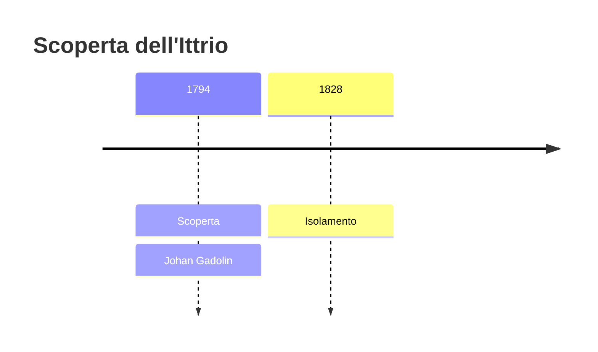
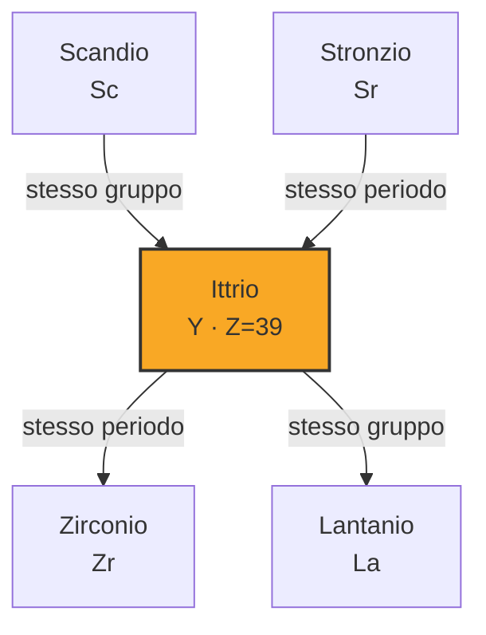
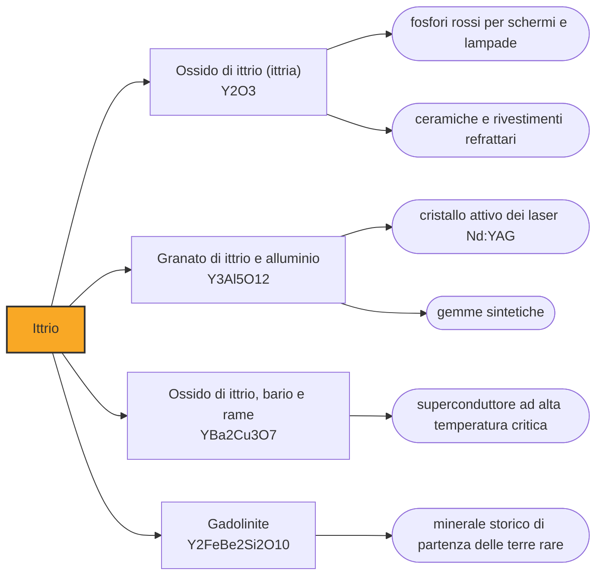

# Ittrio (Y)

> [!abstract] 37° elemento scoperto — 1794
> Una cava abbandonata a poche miglia da Stoccolma ha dato il nome a quattro elementi della tavola periodica, e in tutto ne ha visti nascere nove. Tutto è cominciato da una pietra nera che sembrava carbone.

L'ittrio è un metallo grigio argenteo, leggero, che la chimica classifica fra i metalli di transizione ma che si comporta in tutto e per tutto come una terra rara, e con le terre rare si trova, si estrae e si separa. La sua scoperta è il punto in cui si apre la vicenda più lunga e più intricata della tavola periodica, quella che occuperà i chimici per tutto l'Ottocento.

## Cronologia della scoperta

## Storia della scoperta

Il luogo è una cava di feldspato e quarzo su un'isola dell'arcipelago di Stoccolma, presso il villaggio di Ytterby, da cui si cavava quarzo per le ferriere e più tardi feldspato per le manifatture di porcellana. Nel 1787 un tenente d'artiglieria appassionato di minerali, Carl Axel Arrhenius, vi raccoglie una pietra insolitamente nera e pesante: la prende per un minerale di tungsteno, appena diventato di moda fra i chimici svedesi, e la chiama ytterbite dal nome del posto.

Il campione circola fra i chimici del nord e finisce nelle mani di Johan Gadolin, professore all'accademia di Åbo, in Finlandia, allora parte del regno di Svezia. Gadolin lo smonta con l'analisi per via umida e nel 1794 pubblica il risultato: dentro c'è silice, c'è ossido di ferro, c'è allumina, e poi c'è un buon terzo del campione fatto di una terra che nessun catalogo europeo sa nominare.

Tre anni dopo Anders Gustaf Ekeberg conferma l'analisi e battezza la terra nuova ittria, ancora una volta dal nome del villaggio. Il minerale, per contro, prenderà il nome dello scopritore e si chiamerà gadolinite: uno scambio di intitolazioni che è anche una piccola giustizia, perché ognuno dei due riceve la cosa che l'altro ha trovato.

Come quasi tutte le terre di quell'epoca, l'ittria resiste a lungo a chi vuole vedere il metallo che contiene: il legame con l'ossigeno è troppo saldo per i mezzi disponibili. Ci arriva nel 1828 Friedrich Wöhler, scaldando con il potassio il cloruro che riteneva di ittrio, e ottenendo una polvere grigia impura. È lo stesso anno in cui Wöhler sintetizza l'urea e manda in pezzi l'idea che le sostanze dei viventi richiedano una forza vitale.

Il colpo di scena arriva nel 1843, quando Carl Gustaf Mosander riprende l'ittria e scopre che non è affatto una sostanza sola: cristallizzandone i sali a più riprese la separa in tre ossidi, uno bianco, uno giallo e uno rosato. Al primo resta il nome di ittria; gli altri due diventano erbio e terbio, e i loro nomi escono ancora una volta dalle lettere di Ytterby. Ciò che sembrava un elemento era una famiglia.

Da quella cava, nel corso di un secolo, sarebbero usciti elementi a ripetizione, perché ogni terra che sembrava pura si rivelava una miscela di terre ancora più simili fra loro. Quattro elementi portano oggi nel nome pezzi della parola Ytterby — ittrio, itterbio, terbio ed erbio — e altri cinque — scandio, olmio, tulio, gadolinio e tantalio — furono individuati per la prima volta in minerali di quel giacimento. Nessun altro luogo al mondo ha lasciato un'impronta simile sulla tavola periodica.

## Posizione nella tavola periodica

## Caratteristiche

L'ittrio spiega bene perché le terre rare siano state tanto difficili da separare. In soluzione esiste praticamente solo allo stato più tre, e il suo ione ha dimensioni quasi identiche a quelle di parecchi lantanidi: due specie chimiche così simili si comportano allo stesso modo in ogni reazione, e per distinguerle non resta che ripetere centinaia di volte una separazione che ogni volta le arricchisce di pochissimo. È per questo che l'Ottocento ci ha messo cent'anni.

Il nome collettivo di terre rare, del resto, è ingannevole quanto quello di molti elementi. L'ittrio nella crosta terrestre è più abbondante del piombo, e diverse terre rare sono più comuni dell'argento o del mercurio: rara non è la loro quantità, ma la loro concentrazione. Stanno sparpagliate ovunque in tracce, quasi mai in giacimenti ricchi, e vanno strappate a minerali che le contengono tutte insieme e mescolate.

Un dettaglio curioso riguarda dove si trova. I campioni di roccia riportati dalle missioni lunari contengono ittrio in proporzione sensibilmente maggiore rispetto alle rocce terrestri comuni, il che dice qualcosa su come i due corpi si sono differenziati. Sulla Terra, l'ittrio si accompagna sempre ai lantanidi e si estrae dagli stessi minerali, in particolare dalle argille e dalla monazite.

### Dati fisico-chimici

| Proprietà | Valore |
|---|---|
| Numero atomico | 39 |
| Massa atomica | 88,905842 u |
| Categoria | Metallo di transizione |
| Gruppo | 3 |
| Periodo | 5 |
| Blocco | d |
| Configurazione elettronica | [Kr] 4d¹ 5s² |
| Punto di fusione | 1525,9 °C |
| Punto di ebollizione | 2929,9 °C |
| Densità | 4,472 g/cm³ |
| Stati di ossidazione | +1, +2, +3 |

## Struttura atomica

![[atomo-Ittrio.svg]]

## Usi e presenza in natura

L'impiego che ha toccato più case è quello nei fosfori. Gli ossidi di ittrio drogati con l'europio danno un rosso vivo e stabile che per decenni ha prodotto il rosso di tutti i televisori a tubo catodico, e composti analoghi stanno oggi nei diodi a luce bianca, dove convertono in luce calda parte dell'azzurro emesso dal semiconduttore. Buona parte della luce artificiale che vediamo passa da un composto di ittrio.

L'altro grande impiego è cristallino. Il granato di ittrio e alluminio, drogato con neodimio, è il cristallo attivo del laser da lavoro più diffuso del mondo, quello che taglia e salda i metalli in officina e che in chirurgia coagula e incide i tessuti. L'ittrio compare inoltre nel più noto dei superconduttori ad alta temperatura, che perde ogni resistenza già sotto azoto liquido invece che sotto elio.

## Curiosità

Johan Gadolin è finito sulla tavola periodica per una via traversa. Il gadolinio, separato quasi un secolo dopo il suo lavoro, non porta il suo nome direttamente ma quello della gadolinite, il minerale che gli era stato intitolato: l'elemento è dedicato a una pietra, e la pietra a un uomo. È uno dei pochissimi chimici ad avere insieme un minerale e un elemento, e li deve entrambi a quella stessa cava.

L'ittrio ha anche un uso medico che sfrutta un suo isotopo instabile. L'ittrio-90 emette elettroni molto energetici che percorrono nei tessuti pochi millimetri e poi si fermano: caricato su microsfere di vetro o di resina e iniettato nell'arteria che alimenta un tumore del fegato, si deposita nei capillari della massa e la irradia dall'interno risparmiando quel che sta intorno. È una radioterapia che si porta la sorgente sul posto.

## Nella cronologia

← Precedente: [[Titanio]] (1791)
→ Successivo: [[Cromo]] (1797)

Epoca: [[Chimica pneumatica]] · Scopritore: [[Johan Gadolin]]

## Fonti

- [Yttrium](https://en.wikipedia.org/wiki/Yttrium) — consultata il 07/09/2026
- [Yttrium — Element information, properties and uses (Royal Society of Chemistry)](https://periodic-table.rsc.org/element/39/yttrium) — consultata il 07/09/2026
- [Ytterby](https://en.wikipedia.org/wiki/Ytterby) — consultata il 07/09/2026
- [Carl Gustaf Mosander](https://en.wikipedia.org/wiki/Carl_Gustaf_Mosander) — consultata il 07/09/2026
