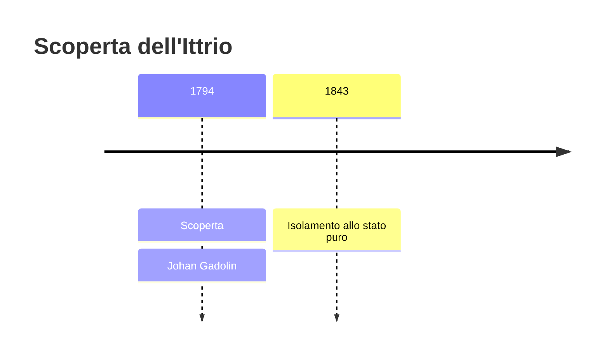
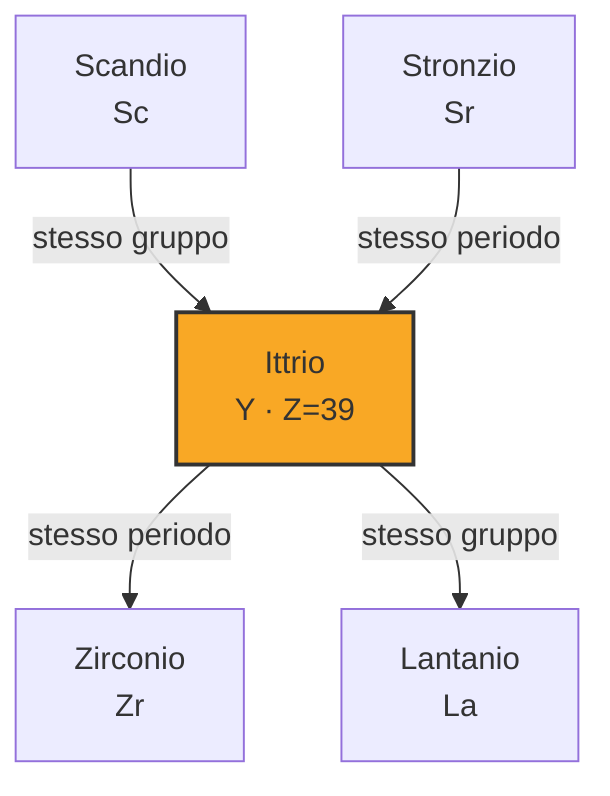

# Ittrio (Y)

> [!abstract] 37° elemento scoperto — 1794
> 

## Cronologia della scoperta

## Storia della scoperta

## Posizione nella tavola periodica

## Caratteristiche

### Dati fisico-chimici

| Proprietà | Valore |
|---|---|
| Numero atomico | 39 |
| Massa atomica | 88,905842 u |
| Categoria | Metallo di transizione |
| Gruppo | 3 |
| Periodo | 5 |
| Blocco | d |
| Configurazione elettronica | [Kr] 4d¹ 5s² |
| Punto di fusione | 1525,9 °C |
| Punto di ebollizione | 2929,9 °C |
| Densità | 4,472 g/cm³ |
| Stati di ossidazione | — |

## Struttura atomica

![[atomo-Ittrio.svg]]

## Usi e presenza in natura

## Nella cronologia

← Precedente: [[Titanio]] (1791)
→ Successivo: [[Cromo]] (1797)

Epoca: [[Chimica pneumatica]] · Scopritore: [[Johan Gadolin]]

## Fonti

