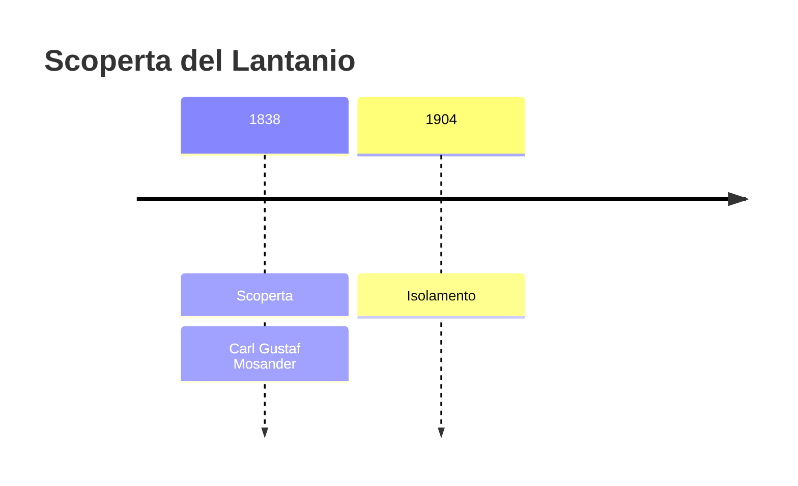
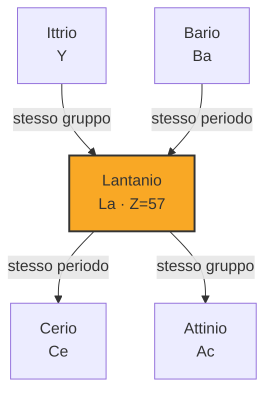

# Lantanio (La)

> [!abstract] 56° elemento scoperto — 1838
> 

## Cronologia della scoperta

## Storia della scoperta

## Posizione nella tavola periodica

## Caratteristiche

### Dati fisico-chimici

| Proprietà | Valore |
|---|---|
| Numero atomico | 57 |
| Massa atomica | 138,905477 u |
| Categoria | Lantanide |
| Gruppo | 3 |
| Periodo | 6 |
| Blocco | f |
| Configurazione elettronica | [Xe] 5d¹⁶s² |
| Punto di fusione | 919,9 °C |
| Punto di ebollizione | 3463,9 °C |
| Densità | 6,162 g/cm³ |
| Stati di ossidazione | — |

## Struttura atomica

![[atomo-Lantanio.svg]]

## Usi e presenza in natura

## Nella cronologia

← Precedente: [[Torio]] (1829)
→ Successivo: [[Neodimio]] (1841)

Epoca: [[L'età dell'elettrolisi]] · Scopritore: [[Carl Gustaf Mosander]]

## Fonti

