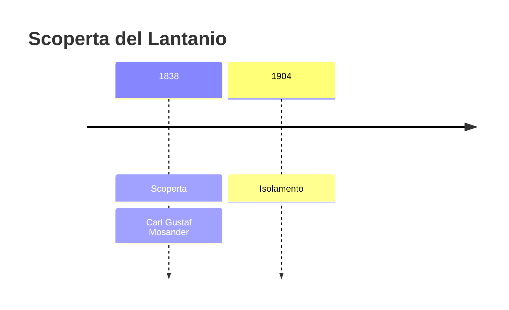
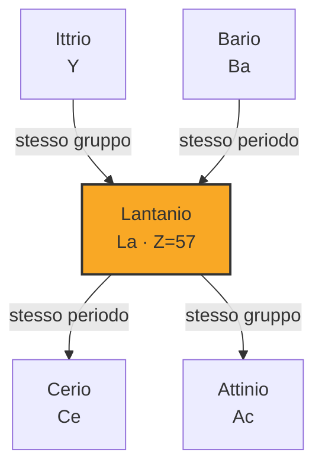
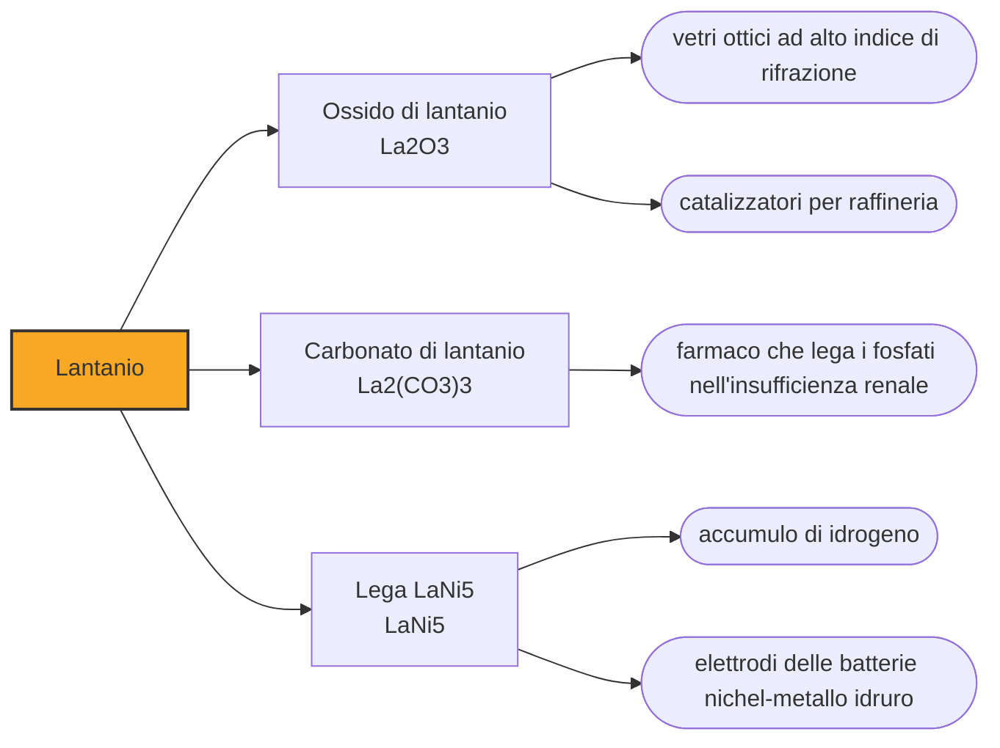

# Lantanio (La)

> [!abstract] 56° elemento scoperto — 1838
> Mosander sospettava che la terra da cui era nato il cerio non fosse una sostanza sola. Ci mise trentasei anni a dargli torto, e all'elemento che ne uscì mise nome «nascosto».

Il lantanio apre la serie dei lantanidi e le dà il nome, ma per la chimica è il più semplice della famiglia: non ha elettroni nel guscio f, si comporta sempre allo stesso modo e forma un solo ione. È tenero come il piombo, si taglia con un coltello, e all'aria si copre di ossido nel giro di qualche ora.

## Cronologia della scoperta

> [!info] Nota sulla cronologia
> Le fonti oscillano fra 1838 e 1839 per l'annuncio di Mosander, che pubblicò a scaglioni. La cronologia di riferimento indica il 1904 per il primo campione metallico, ottenuto da Wilhelm Muthmann e Leopold Weiss; altre fonti datano al 1923 il primo lantanio ragionevolmente puro.

## Storia della scoperta

Negli anni Trenta dell'Ottocento la ceria, la terra ricavata dalla pietra di Bastnäs, era considerata l'ossido di un elemento solo. Carl Gustaf Mosander, chirurgo di formazione e assistente di Berzelius a Stoccolma, non ne era convinto: le proprietà che misurava non tornavano sempre uguali, e le differenze erano troppo sistematiche per essere errori.

Il metodo che usò era di pazienza. Scaldò all'aria il nitrato di cerio fino a decomporlo solo in parte, poi trattò il residuo con acido nitrico diluito: quello che si scioglieva non era cerio. Era una terra nuova, e nel 1839 Mosander la annunciò. Alcune fonti datano l'annuncio al 1839, altre lo anticipano al 1838: la ricerca era in corso da anni e la pubblicazione arrivò a scaglioni.

Dimostrare che una terra è nuova, allora, voleva dire mostrare che non si comportava come nessuna delle note: non c'erano spettri da confrontare né pesi atomici da misurare con precisione, e restavano solo la solubilità dei sali, il colore dei precipitati e la costanza dei risultati ripetuti. È il motivo per cui Mosander andò avanti anni prima di annunciare, e per cui parecchi suoi contemporanei annunciarono elementi che non esistevano.

Fu Berzelius a proporre il nome, dal greco lanthanein, «stare nascosto». Il riferimento è doppio e voluto: la nuova terra si era nascosta dentro quella del cerio per trentasei anni, e continuava a nascondersi perché le sue proprietà erano quasi indistinguibili da quelle del vicino.

La ceria non aveva finito. Due anni dopo, spingendo lo stesso metodo più a fondo, Mosander ne cavò un'altra terra ancora, che chiamò didimio, «gemello», perché accompagnava il lantanio dappertutto; nel 1843 avrebbe fatto lo stesso con l'ittria, ricavandone terbio ed erbio. Un solo uomo, con una sola tecnica, raddoppiò l'elenco delle terre rare.

Il metallo arrivò molto dopo. La cronologia di riferimento colloca il primo campione nel 1904, per mano di Wilhelm Muthmann e Leopold Weiss; altre fonti spostano al 1923 il primo lantanio ragionevolmente puro. È lo scarto tipico di questa famiglia, dove «isolato» ha significato per decenni cose molto diverse a seconda di quanto si riusciva a pulire il campione.

## Posizione nella tavola periodica

## Caratteristiche

In tutti i suoi composti il lantanio cede tre elettroni e resta ione La³⁺, incolore e senza sorprese: non avendo elettroni nel guscio f, gli mancano le transizioni elettroniche che danno colore e magnetismo agli altri lantanidi. È la ragione per cui i suoi sali sono bianchi mentre quelli dei vicini sono rosa, verdi o gialli, ed è anche il motivo per cui, quando serve un lantanide che non interferisca con nient'altro, si sceglie lui.

È uno dei metalli più reattivi fra i lantanidi: si ossida all'aria in poche ore, reagisce lentamente con l'acqua fredda e rapidamente con quella calda liberando idrogeno, e scaldato brucia con facilità. Per questo si conserva sott'olio o in atmosfera inerte, come i metalli alcalini.

Con 39 parti per milione nella crosta terrestre è il ventottesimo elemento per abbondanza, più comune del piombo. Si estrae dalla monazite e dalla bastnäsite, gli stessi minerali del cerio, dai quali esce sempre in compagnia dell'intera famiglia: nessun giacimento contiene un lantanide da solo, ed è questa convivenza, non la scarsità, ad aver reso care le terre rare.

### Dati fisico-chimici

| Proprietà | Valore |
|---|---|
| Numero atomico | 57 |
| Massa atomica | 138,905477 u |
| Categoria | Lantanide |
| Gruppo | 3 |
| Periodo | 6 |
| Blocco | f |
| Configurazione elettronica | [Xe] 5d¹⁶s² |
| Punto di fusione | 919,9 °C |
| Punto di ebollizione | 3463,9 °C |
| Densità | 6,162 g/cm³ |
| Stati di ossidazione | +3 |

## Struttura atomica

![[atomo-Lantanio.svg]]

## Usi e presenza in natura

L'impiego che ne ha consumato di più è metallurgico e invisibile: le leghe che immagazzinano idrogeno negli accumulatori nichel-metallo idruro sono a base di lantanio, e una vettura ibrida di quella generazione ne portava a bordo più di dieci chilogrammi. Sono le batterie che hanno mosso le automobili elettriche prima che il litio prendesse il loro posto, e restano dove conta la robustezza più della leggerezza.

L'ossido di lantanio alza l'indice di rifrazione del vetro senza aumentarne la dispersione, e per questo sta nelle lenti degli obiettivi fotografici e nei vetri per l'infrarosso; nelle raffinerie i catalizzatori di cracking a letto fluido lo usano per stabilizzare le zeoliti che spezzano le molecole del petrolio.

Nel mischmetal, la lega grezza di terre rare che esce dalla separazione, il lantanio sta fra il venticinque e il quarantacinque per cento: serve a disossidare gli acciai e, insieme al cerio, a fare le pietrine degli accendini.

## Curiosità

Prima del cinema digitale, le lampade ad arco dei proiettori bruciavano elettrodi di carbone caricati con ossidi di terre rare, lantanio compreso: davano una luce bianchissima e continua, l'unica abbastanza intensa da attraversare una pellicola e riempire uno schermo di venti metri.

Il lantanio naturale è quasi tutto lantanio-139, stabile, ma un decimo di punto percentuale è lantanio-138, radioattivo con un'emivita di oltre cento miliardi di anni: un orologio che gira così piano da servire a datare i minerali più antichi del sistema solare, e che nel frattempo contribuisce, in misura minima, alla radioattività naturale delle rocce.

## Nella cronologia

← Precedente: [[Torio]] (1829)
→ Successivo: [[Neodimio]] (1841)

Epoca: [[L'età dell'elettrolisi]] · Scopritore: [[Carl Gustaf Mosander]]

## Fonti

- [Lanthanum](https://en.wikipedia.org/wiki/Lanthanum) — consultata il 09/09/2026
- [Lanthanum — Royal Society of Chemistry](https://periodic-table.rsc.org/element/57/lanthanum) — consultata il 09/09/2026
- [Carl Gustaf Mosander](https://en.wikipedia.org/wiki/Carl_Gustaf_Mosander) — consultata il 09/09/2026
